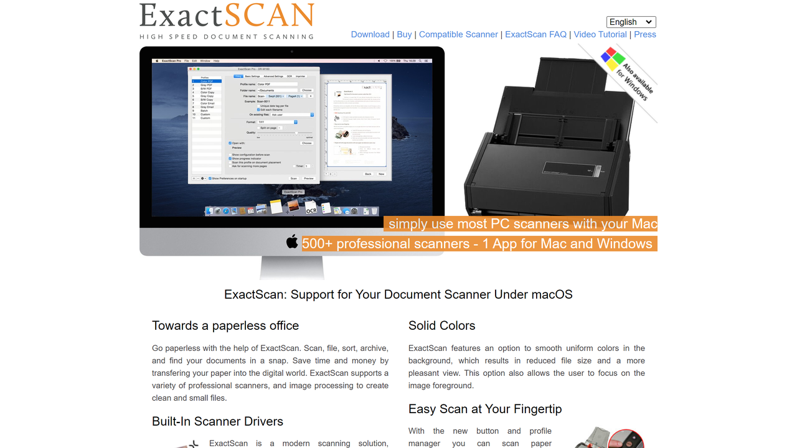

# ExactScan  
  
ExactScan is a leading scanning software solution for macOS, designed to provide high-quality document capture, image processing, and efficient file management for businesses and individuals.  

## Overview  
Founded in 2006, ExactScan is a streamlined, lightweight utility designed for macOS users to simplify the scanning process using high-precision tools. The software is widely recognized for its extensive support of professional document scanners (over 500 models) without the need for additional drivers. 

ExactScan enables efficient document digitization and management for small businesses, legal teams, and individuals looking to maintain an organized, paperless office. Known for its reliable OCR (optical character recognition) capabilities and seamless integration with macOS, it excels in creating searchable PDFs and managing workflows for digital archiving, accounting, and correspondence. Users benefit from ExactScan’s built-in automation features, including auto-rotation, color detection, and intelligent file naming.  

## Key Features  
- **Driver-Free Scanning**: Supports over 500 scanners natively, reducing setup complexity.  
- **OCR Functionality**: Enables creation of searchable PDFs in multiple languages for rapid text extraction and indexing.  
- **Automated Workflow**: Offers file renaming, batch processing, image optimization, and auto-cropping for maximum efficiency.  
- **macOS Integration**: Optimized for macOS, with full compatibility for features like Quick Look and Spotlight Search.  
- **Cloud Integration**: Directly save scanned documents to services like Google Drive, Dropbox, and iCloud.  

## Use Cases  
### Paperless Offices  
ExactScan helps small businesses and home users transition to a paperless environment by digitizing receipts, invoices, and correspondence efficiently.  

### Legal Document Management  
Law firms use ExactScan to quickly scan, organize, and archive client records and case files into searchable formats while ensuring no data loss.  

### Healthcare Administration  
Medical offices digitize patient forms, insurance documents, and reports for easy retrieval and HIPAA-compliant storage.  

### Personal Archiving  
Individuals use ExactScan to scan family photos, bills, and important personal documents, ensuring safe and accessible long-term storage.  

## Technical Specifications  

| Feature              | Specification                         |  
|----------------------|---------------------------------------|  
| Deployment Options   | Native macOS application              |  
| Supported Languages  | 20+ (e.g., English, German, French, Chinese, etc.) |  
| File Formats         | PDF, TIFF, JPEG, PNG                 |  
| Supported Scanners   | 500+ models                          |  
| macOS Compatibility  | macOS Big Sur and later              |  

## Getting Started  
Simple steps to use ExactScan:  
1. Download and install ExactScan on your macOS device.  
2. Connect your scanning device (supported natively or via standard setup).  
3. Configure preferred scanning settings: file format, resolution, and naming rules.  
4. Initiate scanning, with options for automated processing if required.  
5. Export to local folders or integrated cloud services.  
6. Utilize OCR for searchable and indexed document storage.  

## Resources  
- [Vendor Website](https://exactscan.com/)  
