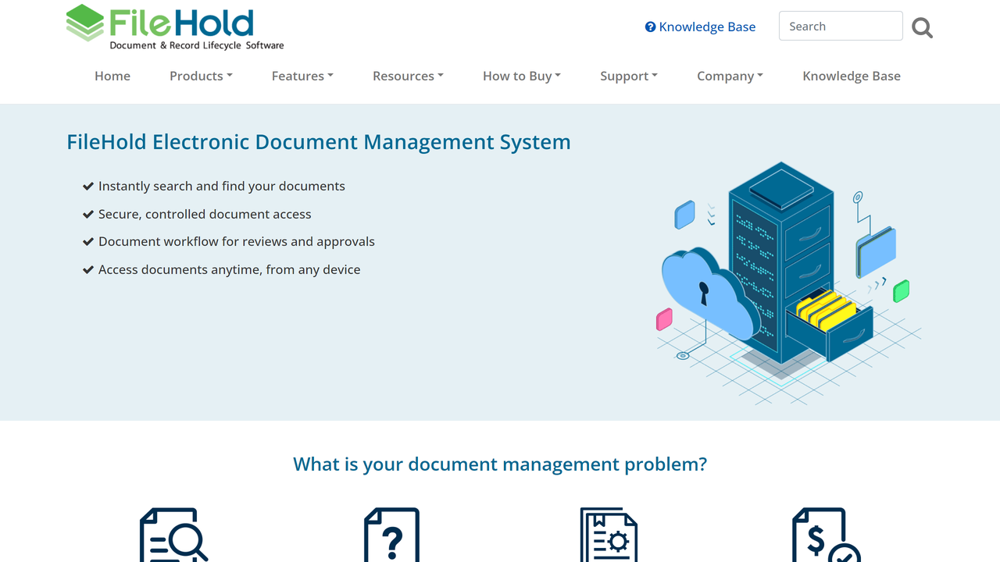

# FileHold

FileHold is a Canadian document management software provider offering enterprise-grade DMS solutions for on-premise, cloud, and hybrid deployments.

## Overview

FileHold Systems ULC, based in Vancouver, Canada, develops document management software for larger organizations requiring enterprise-grade capabilities with flexible deployment options. The platform runs on Microsoft SQL Server and Windows Server, providing document capture, indexing, storage, version control, and workflow automation. FileHold serves Ontario municipalities, corporate enterprises, and government agencies through a partner network. The system ships with 11 security roles from read-only to system administration, supports web browser access globally, and integrates with Microsoft Office and third-party applications via documented Web Services API.

## Key Features

- **Enterprise Document Management**: Full-featured capture, indexing, storage, [classification](../../capabilities/classification/index.md), versioning, and retrieval with audit trails
- **Workflow Automation**: Electronic signature-enabled review and approval workflows (most popular optional module)
- **Automated Import**: Folder watching that automatically moves files from local/network folders into the library with pre-configured tagging
- **Server-Side OCR**: Optional [OCR](../../capabilities/ocr/index.md) processing for PDF and TIFF documents on the server
- **Flexible Deployment**: On-premise, cloud, or hybrid installation options
- **Microsoft Integration**: Deep integration with Microsoft Office and SharePoint environments
- **API Access**: Well-documented Web Services API for custom integrations with back-office systems
- **Mobile Support**: Native mobile device access for remote document management

## Use Cases

### Municipal Records Management

Ontario municipalities implement FileHold with TOMRMS (Toronto Municipal Records Management System) for complete records lifecycle management. Clerks index bylaw documents, council minutes, building permits, and zoning applications with retention schedules. Automated workflows route approvals through department heads while maintaining compliance audit trails. Public records requests retrieve documents by metadata search without accessing physical archives.

### Quality Management Documentation

Manufacturing organizations manage ISO quality system documentation including standard operating procedures, work instructions, inspection reports, and corrective action records. Version control tracks document revisions, electronic signatures capture approvals from quality managers, and automated distribution notifies staff of procedure updates. Search capabilities quickly locate current versions of controlled documents during audits.

### Contract Lifecycle Management

Corporate legal departments store, track, and manage contracts from negotiation through renewal. Metadata extraction during import populates fields for parties, effective dates, terms, and renewal deadlines. Automated workflows route contracts for review by legal, finance, and executive stakeholders. Calendar reminders alert contract managers of upcoming expirations, enabling proactive renegotiation or termination.

## Technical Specifications

| Feature | Specification |
|---------|---------------|
| Platform | Microsoft SQL Server, Windows Server |
| Access Methods | Web browser, Microsoft Office integration, mobile apps |
| Security | 11 pre-configured user roles, customizable permissions |
| Optional Features | Workflow module, server-side OCR for PDF/TIFF |
| API | Web Services API for third-party integration |
| Deployment | On-premise, cloud, hybrid |
| Automation | Folder watching with auto-import and tagging |
| Document Functions | Versioning, check-in/check-out, metadata indexing |
| Integration Partners | TOMRMS (municipal records), Microsoft ecosystem |
| Target Market | Larger organizations, municipalities, enterprises |

## Resources

- [Website](https://www.filehold.com)
- [Standard Features](https://filehold.com/features/standard/)
- [Optional Features](https://www.filehold.com/features/optional)

## Company Information

Headquarters: Vancouver, British Columbia, Canada

Company Type: FileHold Systems ULC (privately owned)

Target Market: Enterprises, municipalities, government agencies

Partner Network: Implementation partners including Image Advantage

Notable Deployments: Multiple Ontario municipalities
