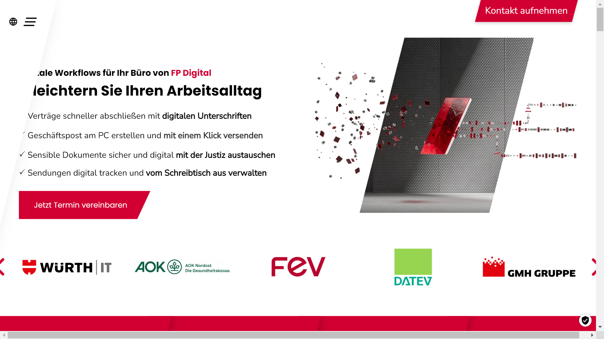

# FP Digital Business Solutions

FP Digital Business Solutions provides digital transformation services and solutions focused on document processing, secure communications, and business process automation.

## Overview

FP Digital Business Solutions (FP DBS) is a division of Francotyp-Postalia (FP), a company with a long heritage in mail processing that has evolved to offer comprehensive digital business solutions. FP DBS specializes in technologies that help organizations digitize, process, and securely manage their documents and communications while automating associated business processes.

With roots in postal and mailing solutions, FP has leveraged its expertise in secure document handling to develop a portfolio of digital services that address modern business needs. Their offerings encompass the entire document lifecycle, from input and processing to output and archiving, with a strong focus on security, compliance, and efficiency.

FP Digital Business Solutions serves clients across various industries including financial services, healthcare, government, manufacturing, and professional services. Their solutions help organizations reduce paper-based processes, enhance data security, improve operational efficiency, and ensure regulatory compliance.

## Key Features

- **Document Capture**: Digitization of paper documents and ingestion of electronic documents
- **Data Extraction**: Automated information retrieval from various document types
- **Digital Signature Solutions**: Secure electronic signing capabilities
- **Output Management**: Centralized control of document distribution across channels
- **Secure Digital Communication**: Encrypted messaging and file transfer
- **Business Process Automation**: Workflow design and implementation
- **Document Management**: Organization and retrieval of digital documents
- **Compliance Solutions**: Tools for meeting regulatory requirements
- **Hybrid Mail Services**: Combined physical and digital mail processing
- **Integration Capabilities**: Connection with existing business systems

## Use Cases

### Digital Mailroom Implementation

Organizations implement FP DBS solutions to transform their traditional mailroom operations into efficient digital processes. The system captures incoming mail and documents through scanning hardware or digital channels, then applies intelligent recognition to classify documents by type and extract key information. Business rules automatically route digitized mail to appropriate recipients or departments based on content, urgency, or organizational structure. The platform maintains a complete audit trail of all document handling while providing secure access to authorized users regardless of location. This approach significantly reduces document processing time from days to hours, enables remote work capabilities by eliminating dependency on physical mail handling, improves tracking and visibility of communications, and enhances security through controlled access and encryption.

### Contract Management Automation

Legal departments and procurement teams utilize FP DBS to streamline their contract lifecycle management processes. The solution digitizes and processes contracts and supporting documentation, extracting key information such as parties, terms, values, and dates. The system implements configurable workflows that guide contracts through various stages including drafting, review, approval, execution, and renewal. Digital signature capabilities enable secure electronic signing while maintaining legal validity. The platform provides a centralized repository for all contracts with powerful search capabilities and automated alerts for important dates and milestones. This comprehensive approach accelerates contract processing by 65%, improves compliance through standardized procedures, enhances visibility into contractual obligations, and reduces risks associated with missed renewal dates or unmonitored terms.

## Technical Specifications

| Feature | Specification |
|---------|---------------|
| Deployment Options | Cloud, On-premises, Hybrid |
| Recognition Technologies | OCR, ICR, pattern recognition |
| Digital Signature Compliance | eIDAS, ESIGN Act compliant |
| Security Features | Encryption, access controls, audit trails |
| Integration Methods | APIs, pre-built connectors, CMIS |
| Process Design | Visual workflow designer, business rules engine |
| Mobile Support | Responsive interfaces for various devices |
| Compliance Capabilities | GDPR, industry-specific regulations |
| Analytics | Processing metrics, performance dashboards |
| Scalability | Enterprise-grade for high-volume processing |

## Getting Started

1. **Process Assessment**: Analysis of current document workflows
2. **Solution Design**: Configuration aligned with business requirements
3. **Implementation**: Deployment and integration with existing systems
4. **Training**: User education on system operations
5. **Optimization**: Continuous improvement of automated processes

## Resources

- [Company Website](https://www.fp-dbs.com/)

