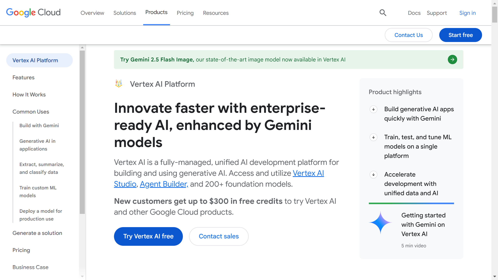

# Google Vertex

Google is a company that specializes in intelligent document processing and cloud-based solutions. The company focuses on creating intelligent automation for document workflows.

## Overview

Google provides intelligent document processing and cloud-based solutions designed to create intelligent automation for document workflows. Their platform focuses on leveraging advanced technology to process, store, and manage documents across various business applications with high scalability and efficiency.

## Key Features

- Intelligent document processing
- Cloud-based solutions
- Document workflow automation
- Intelligent automation platform
- Cloud-based tools
- Document processing automation
- Intelligent data handling

## Use Cases

- Intelligent document processing
- Cloud-based automation
- Document workflow optimization
- Intelligent automation implementation
- Document processing workflows
- Cloud-based optimization
- Intelligent document workflows

## Technical Specifications

Google's platform specializes in intelligent document processing and cloud-based solutions, creating intelligent automation for document workflows that leverage advanced technology to process and store documents with high scalability and efficiency.

## Company Information

Mountain View, United States

Web: [Google Vertex](https://cloud.google.com/vertex-ai) 