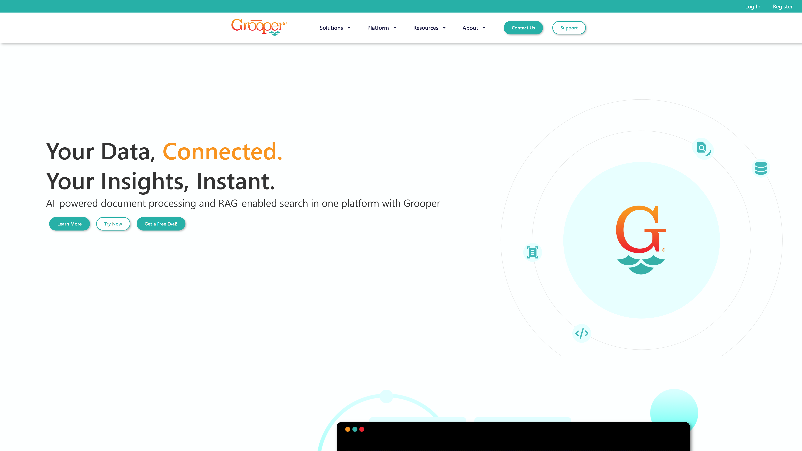

# Grooper

BIS is the creator of Grooper, an intelligent data platform with 35 years of experience. The company specializes in data capture and document processing solutions, though they are noted as potentially not being a real IDP vendor.

## Overview

BIS has been in the document processing industry for over three decades, developing Grooper as their flagship intelligent data platform. The company focuses on data capture and document processing technologies, though their classification as an IDP vendor may be subject to verification.

## Key Features

- Grooper intelligent data platform
- 35 years of industry experience
- Data capture capabilities
- Document processing technology
- Legacy system expertise
- Long-term industry presence

## Use Cases

- Data capture and extraction
- Document processing workflows
- Legacy system integration
- Historical document processing
- Data platform solutions

## Technical Specifications

BIS's Grooper platform represents their core technology offering, built on decades of experience in the document processing industry. The platform is designed to handle various data capture and processing requirements.

## Company Information

Edmond, United States

Web: [https://www.bisok.com/](https://www.bisok.com/)

*Note: This vendor is marked as potentially not being a real IDP vendor in the source documentation.* 