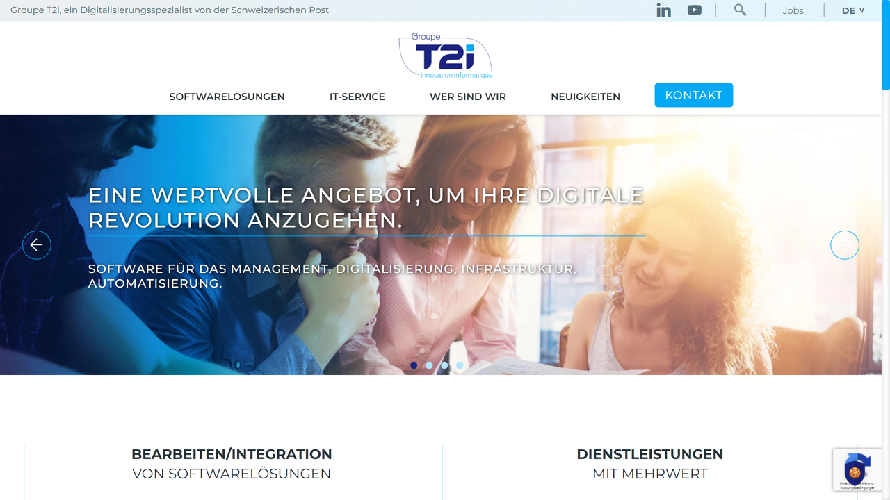

# Groupe T2i

Groupe T2i is a provider of business software solutions, including document management, HR management, and digital transformation services.

## Overview

Groupe T2i offers a range of software solutions and services for document management, human resources management, and digital transformation. Their document management offerings help organizations digitize, store, process, and manage their documents efficiently while ensuring compliance with regulatory requirements and facilitating digital workflows.

## Key Features

- Document management and archiving
- Electronic document processing
- Digital signature integration
- Workflow automation
- HR management solutions
- Cloud hosting services
- Mobile accessibility
- Integration with business applications

## Use Cases

- Enterprise document management
- HR document and process management
- Digital mailroom automation
- Invoice processing and accounts payable
- Contract lifecycle management
- Customer relationship documentation
- Regulatory compliance documentation
- Cross-departmental workflow automation

## Technical Specifications

Groupe T2i provides software solutions that can be deployed in the cloud or on-premises, with options for managed services. Their document management platforms support various document formats and include features for automated classification, indexing, and data extraction. They offer integration capabilities with existing business applications and workflow systems.

## Resources

- [Website](https://www.groupe-t2i.com)
