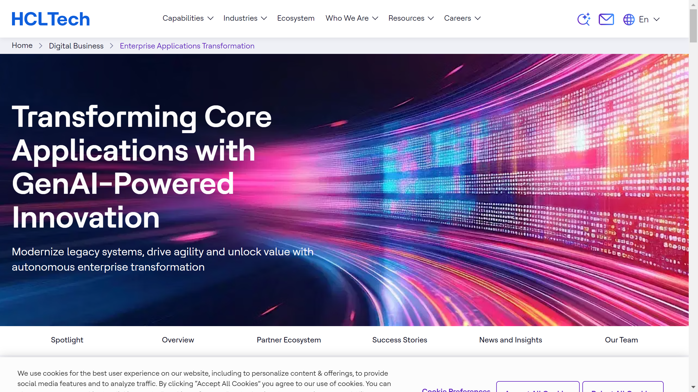

# HCLTech

HCLTech is a company that specializes in intelligent document processing and IT services solutions. The company focuses on creating intelligent automation for document workflows.

## Overview

HCLTech provides intelligent document processing and IT services solutions designed to create intelligent automation for document workflows. Their platform focuses on leveraging advanced technology to process, manage, and optimize documents across various business applications with high efficiency and reliability.

## Key Features

- Intelligent document processing
- IT services solutions
- Document workflow automation
- Intelligent automation platform
- IT services tools
- Document processing automation
- Intelligent data handling

## Use Cases

- Intelligent document processing
- IT services automation
- Document workflow optimization
- Intelligent automation implementation
- Document processing workflows
- IT services optimization
- Intelligent document workflows

## Technical Specifications

HCLTech's platform specializes in intelligent document processing and IT services solutions, creating intelligent automation for document workflows that leverage advanced technology to process and manage documents with high efficiency and reliability.

## Company Information

Noida, India

Web: [https://www.hcltech.com](https://www.hcltech.com/) 