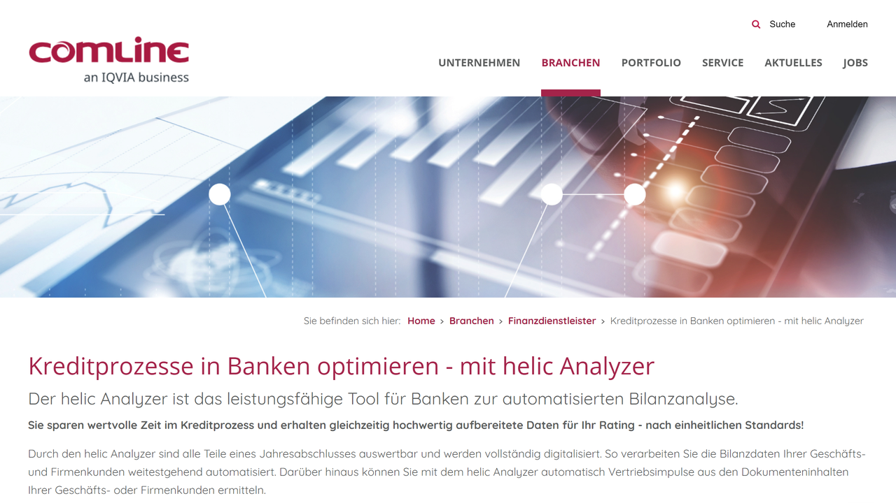

# helic Analyzer by Comline GmbH (acquired by IQVIA)

helic Analyzer is a specialized analytics software solution developed by Comline GmbH, a German technology company, which has been acquired by IQVIA to enhance its healthcare data analytics capabilities.

## Overview

helic Analyzer is a powerful software tool originally developed by Comline GmbH, a technology company based in Dortmund, Germany. While specific details about the acquisition timeline are limited in publicly available sources, the software appears to have been integrated into IQVIA's portfolio of healthcare analytics solutions [[1]](https://www.comline.de/branchen/finanzdienstleister/kreditprozesse-in-banken-optimieren-mit-helic-analyzer.html).

Comline GmbH has developed various software solutions focused on data analysis and process optimization. The helic Analyzer was one of their flagship products, designed to provide automated analysis capabilities for financial and potentially healthcare-related data. The software has been available in various deployment options, including as a Software-as-a-Service (SaaS) solution, allowing users to access it securely online [[2]](https://www.comline.de/aktuelles/web-seminare/helic-analyzer-als-saas-web-seminar.html).

IQVIA, formerly known as Quintiles IMS Holdings, is a leading global provider of advanced analytics, technology solutions, and clinical research services to the life sciences industry. The company has a history of strategic acquisitions to enhance its data analytics capabilities and expand its healthcare intelligence offerings [[3]](https://www.iqvia.com/insights/the-iqvia-institute/available-iqvia-data).

The integration of helic Analyzer into IQVIA's technology stack likely contributes to IQVIA's mission of providing comprehensive healthcare data analysis and insights to its clients in the pharmaceutical and healthcare sectors.

## Key Features

- **Automated Data Analysis**: Efficient processing of complex data sets
- **Financial Document Processing**: Analysis of financial statements and reports
- **Credit Process Optimization**: Streamlined assessment of financial information
- **Cloud-Based Deployment**: Available as Software-as-a-Service (SaaS)
- **Integration Capabilities**: Connection with existing business systems
- **Customizable Analytics**: Tailored analysis for specific business needs
- **Workflow Automation**: Streamlining of data-intensive processes
- **Reporting Functionality**: Generation of comprehensive analytical reports
- **User-Friendly Interface**: Accessible design for non-technical users
- **Secure Data Handling**: Protection of sensitive financial information
- **Healthcare Data Analysis**: Processing of healthcare-related information
- **Multi-Format Support**: Handling of various document and data formats

## Products

### helic Analyzer

helic Analyzer is a powerful data analysis tool designed to automate complex analytical processes and deliver actionable insights. The software is particularly notable for its application in financial analysis, where it helps optimize credit processes by automating balance sheet analysis, saving valuable time while providing comprehensive analytical results [[4]](https://www.comline.de/branchen/finanzdienstleister/kreditprozesse-in-banken-optimieren-mit-helic-analyzer.html). As a flexible solution, helic Analyzer is available in multiple deployment options, including a cloud-based Software-as-a-Service (SaaS) model that enables users to access the application securely online without complex local installations [[5]](https://www.comline.de/aktuelles/web-seminare/helic-analyzer-als-saas-web-seminar.html). The system features an intuitive user interface designed for business users, allowing them to perform sophisticated data analysis without specialized technical knowledge. Advanced integration capabilities enable seamless connection with existing business systems, facilitating the flow of data and insights throughout the organization. The software incorporates customizable analysis parameters that can be tailored to specific business requirements and industry standards, ensuring relevant results for various use cases. Comprehensive reporting functionality automatically generates detailed analytical reports, visualizations, and dashboards based on processed data, making insights accessible and actionable. While initially focused on financial analysis, the software's analytical capabilities may have applications in healthcare data analysis, potentially contributing to its value for IQVIA's healthcare analytics portfolio.

### Healthcare Analytics Integration

Following acquisition by IQVIA, helic Analyzer's capabilities have likely been integrated into IQVIA's broader healthcare analytics ecosystem, enhancing the company's ability to provide comprehensive data analysis for the healthcare and life sciences industries. IQVIA's analytics platform leverages various data sources and advanced technologies to generate insights for healthcare research, clinical trials, and market analysis. The integration may expand helic Analyzer's functionality to include healthcare-specific data processing, such as analysis of clinical data, patient records, and healthcare provider information, aligned with IQVIA's expertise in healthcare intelligence. Advanced visualization capabilities present complex healthcare data in accessible formats, enabling stakeholders to identify trends, patterns, and insights more effectively. AI and machine learning enhancements may augment the original software's capabilities, enabling more sophisticated predictive analytics and pattern recognition in healthcare datasets. Regulatory compliance features ensure that data processing and analysis adhere to healthcare industry standards and regulations, including data privacy requirements. Integration with IQVIA's broader technology stack likely enables seamless connection with other IQVIA solutions and services, creating a more comprehensive healthcare intelligence ecosystem. By incorporating helic Analyzer's analytical engine into its offerings, IQVIA can potentially deliver more robust data processing capabilities to its healthcare and pharmaceutical clients, supporting research, development, and commercial decision-making with enhanced analytical insights.

## Use Cases

### Financial Analysis and Risk Assessment

Financial institutions implement helic Analyzer to streamline the analysis of financial statements and assessment of credit risk, significantly reducing processing time while maintaining analytical rigor. The system automatically processes balance sheets, income statements, and other financial documents, extracting key financial metrics and indicators without manual data entry. Ratio analysis capabilities automatically calculate and interpret important financial ratios such as liquidity, solvency, profitability, and efficiency metrics, providing a comprehensive view of financial health. Trend identification features analyze financial data over time, identifying patterns and changes that may indicate strengthening or deteriorating financial conditions. Risk scoring algorithms assess credit risk based on multiple financial parameters, generating standardized risk assessments that support consistent lending decisions. Integration with existing credit workflow systems enables the seamless flow of analytical results into credit decision processes, accelerating overall processing times. This implementation significantly reduces the time required for financial analysis from hours to minutes through automated data extraction and processing, improves consistency in credit assessments through standardized analytical approaches, enhances risk management with more comprehensive financial analysis, and increases productivity by allowing financial analysts to focus on interpretation and decision-making rather than data processing.

### Healthcare Data Analysis

Healthcare organizations may utilize helic Analyzer's capabilities (potentially enhanced through IQVIA integration) to analyze clinical, operational, and financial healthcare data, generating insights that improve patient care and operational efficiency. The system processes diverse healthcare data sources including electronic health records, claims data, clinical trial information, and operational metrics, creating a comprehensive view of healthcare performance. Patient cohort analysis identifies patterns and trends across patient populations, supporting more targeted treatment approaches and care protocols. Treatment effectiveness assessment analyzes outcomes data to evaluate the effectiveness of different treatment approaches, supporting evidence-based care decisions. Resource utilization analysis examines operational data to identify opportunities for improving efficiency in healthcare delivery and resource allocation. Financial performance monitoring tracks key financial metrics for healthcare organizations, supporting sustainable operations while maintaining quality care. This implementation significantly enhances clinical decision-making with data-driven insights into patient populations and treatment effectiveness, improves operational efficiency through identification of resource utilization patterns and bottlenecks, supports strategic planning with comprehensive analysis of healthcare trends and patterns, and facilitates value-based care initiatives by connecting clinical outcomes with resource utilization and costs.

### Pharmaceutical Market Analysis

Pharmaceutical companies leverage helic Analyzer's analytical capabilities (as part of IQVIA's solutions) to analyze market data, competitive intelligence, and sales performance, supporting strategic decision-making in product development and commercialization. The system processes pharmaceutical market data including sales figures, prescription trends, pricing information, and market share statistics, creating a comprehensive view of market dynamics. Competitive analysis features compare product performance against competitors across multiple parameters, identifying strengths, weaknesses, and market opportunities. Regional performance analysis examines sales and market penetration across different geographic regions, supporting targeted marketing and distribution strategies. Prescriber behavior analysis identifies patterns in physician prescribing habits, enabling more effective engagement strategies and educational initiatives. Market trend forecasting projects future market developments based on historical data and current trends, supporting proactive strategic planning. This implementation significantly enhances product launch planning with comprehensive market intelligence and competitive analysis, improves marketing effectiveness through deeper understanding of prescriber behavior and regional dynamics, supports pricing strategy with detailed analysis of market pricing patterns and elasticity, and facilitates portfolio management by identifying product performance patterns and market opportunities.

## Technical Specifications

| Feature | Specification |
|---------|---------------|
| Deployment Options | On-premises, Cloud/SaaS |
| Integration Methods | APIs, direct database connections |
| Data Input Formats | Various structured and semi-structured formats |
| Analysis Capabilities | Financial, potentially healthcare data analysis |
| User Interface | Web-based, intuitive design |
| Reporting | Customizable reports and dashboards |
| Security | Enterprise-grade data protection |
| Performance | High-volume data processing |
| Customization | Configurable analysis parameters |
| Language Support | German, English |
| Updates | Regular feature and security updates |
| Support | Technical support and training |

## Industries Served

helic Analyzer serves various industries with its data analysis capabilities:

- **Financial Services**: Banks, credit unions, financial advisors
- **Healthcare**: Hospitals, clinics, pharmaceutical companies (via IQVIA integration)
- **Insurance**: Risk assessment and claims analysis
- **Manufacturing**: Financial and operational analysis
- **Retail**: Performance analysis and financial planning
- **Professional Services**: Consulting and advisory services
- **Public Sector**: Government financial analysis
- **Life Sciences**: Research and development, clinical data (via IQVIA integration)

## Resources

- [Comline Website](https://www.comline.de/)
- [IQVIA Website](https://www.iqvia.com/)
- [helic Analyzer SaaS Information](https://www.comline.de/aktuelles/web-seminare/helic-analyzer-als-saas-web-seminar.html)
- [Financial Process Optimization](https://www.comline.de/branchen/finanzdienstleister/kreditprozesse-in-banken-optimieren-mit-helic-analyzer.html)

## Contact Information

- Original Developer: Comline GmbH, Dortmund, Germany
- Current Owner: IQVIA
- IQVIA Headquarters: Durham, North Carolina, USA
- Website: [iqvia.com](https://www.iqvia.com/)
