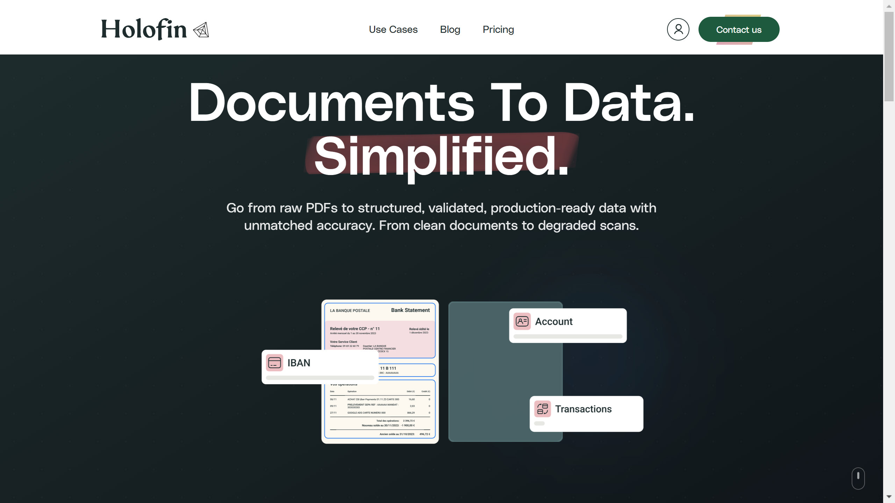

# Holofin

Holofin is an AI-powered financial document processing platform specializing in [data extraction](../../capabilities/extraction/index.md) and analysis of bank statements, invoices, and financial reports.

## Overview

Holofin provides document processing solutions designed for the finance and banking sectors. The platform uses AI to extract data from financial documents and convert them into structured formats. The company targets enterprises in Europe requiring automated financial document workflows.

## Key Features

- **Financial Document Extraction**: AI-driven extraction from bank statements, invoices, and financial reports with claimed 97%+ zero-shot precision
- **[Layout Analysis](../../capabilities/layout-analysis/index.md)**: Detection and understanding of complex document structures
- **Structured Output**: Export to JSON and CSV formats
- **Multi-Document Processing**: Batch processing capabilities for multiple documents
- **RESTful API**: Enterprise integration via API
- **Automatic Scaling**: High-volume document processing
- **Financial Consistency Checks**: Validation rules for financial data
- **Review Mode**: Extraction source grounding for verification

## Use Cases

### Bank Statement Processing

Financial institutions and accounting firms use Holofin to process bank statements at scale. The platform extracts transaction data, account information, and balances from various bank statement formats, converting them into structured JSON or CSV output for integration with accounting systems and financial analysis tools.

### Financial Report Analysis

Enterprises deploy Holofin to automate extraction from financial reports and statements. The system identifies key financial metrics, tables, and data points from complex PDF layouts, validates numerical consistency, and structures the data for downstream financial analysis and reporting workflows.

## Technical Specifications

| Feature | Specification |
|---------|---------------|
| Document Types | Bank statements, invoices, financial reports |
| Input Formats | PDF, office documents |
| Output Formats | JSON, CSV |
| API | RESTful API |
| Deployment | Enterprise integration |
| Processing | Batch and multi-document processing |
| Claimed Accuracy | 97%+ zero-shot precision |

## Resources

- [Website](https://holofin.ai)

## Company Information

Geographic Focus: Europe