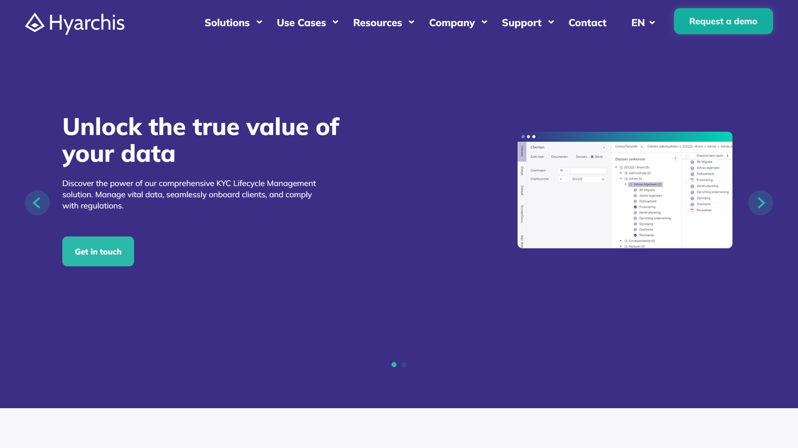

# Hyarchis

Hyarchis provides cloud-based KYC and document processing solutions for financial services, specializing in compliance management and client onboarding automation.

## Overview

Hyarchis offers three integrated platforms targeting financial services: Document Manager for digital archive storage and retrieval, Compliance Manager for PEP and sanctions checks with secure customer data storage, and KYC Lifecycle Management for client onboarding, monitoring, and remediation. The company serves accountancy firms, banks, mortgage lenders, life insurance providers, and pension funds across the Netherlands with offices in Eindhoven and Amsterdam. Their solutions integrate with core financial software systems including Microsoft 365, Davinci, Keylane, and Exact, enabling automated workflows for compliance and document processing operations.

## Key Features

- **Document Manager**: Digital archive storage with AI-powered [data extraction](../../capabilities/extraction/index.md) and document type recognition
- **Compliance Manager**: Automated PEP and sanctions checks with secure customer data storage and regulatory compliance tracking
- **KYC Lifecycle Management**: Client onboarding automation with monitoring and remediation workflows
- **Cloud Architecture**: Cloud-based deployment with ISO 27001, SOC 2 Type II, and ISO 22301 certifications
- **Financial Software Integration**: Native connectors for Microsoft 365, Davinci, Keylane, Intrasurance, Tenzinger, Simplicate, ValidSign, and Exact

## Use Cases

### Financial Institution Onboarding

Banks and mortgage lenders use Hyarchis to automate customer onboarding by processing identity documents, financial statements, and compliance forms. The platform performs automated [document classification](../../capabilities/classification/index.md) and data extraction to populate KYC databases while conducting simultaneous PEP and sanctions checks. Integration with core banking systems enables straight-through processing for approved applications, while flagged cases route to compliance teams for manual review. The system maintains audit trails for regulatory reporting and supports continuous monitoring of existing customer relationships.

### Insurance Document Processing

Life insurance and pension fund administrators process policy applications, beneficiary forms, and claim documents through the Document Manager. The platform extracts policy numbers, coverage amounts, beneficiary details, and medical information from structured and semi-structured documents. Extracted data flows directly into policy administration systems like Keylane and Intrasurance, eliminating manual data entry. Document archives remain searchable and retrievable for claims processing and regulatory audits.

## Technical Specifications

| Feature | Specification |
|---------|---------------|
| Core Products | Document Manager, Compliance Manager, KYC Lifecycle Management |
| Deployment | Cloud-based |
| Integrations | Microsoft 365, Davinci, Keylane, Intrasurance, Tenzinger, Simplicate, ValidSign, Exact |
| Target Industries | Accountancy, Banking, Mortgage, Life Insurance, Pension Funds |
| Certifications | ISO 27001, SOC 2 Type II, ISO 9001, SOC 1, ISO 22301 |
| Support | Atlassian Jira helpdesk system |

## Resources

- [Website](https://www.hyarchis.com)
- [Document Manager](https://www.hyarchis.com/hyarchis-document-management-system/)
- [Compliance Manager](https://www.hyarchis.com/hyarchis-compliance-manager/)
- [KYC Solution](https://www.hyarchis.com/hyarchis-know-your-customer-lifecycle-management-solution/)

## Company Information

Headquarters: Eindhoven and Amsterdam, Netherlands

Phone: +31 (0) 88 007 85 00

Mail: info@hyarchis.com

Notable Clients: ABN AMRO, Akbank, ING, NIBC, PwC, Quion, BCM Global, Link Asset Service
