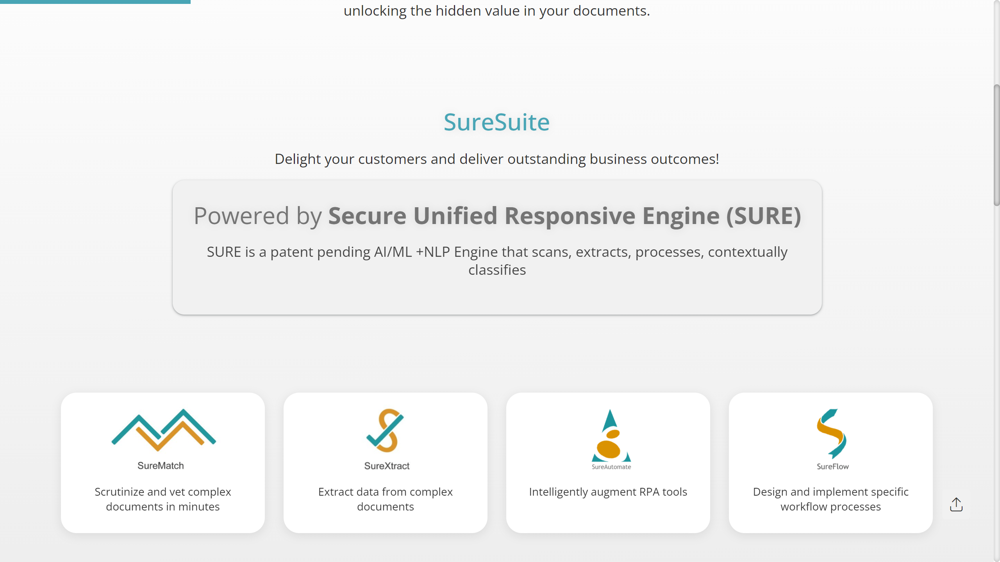

# Impactsure

Impactsure is a Mumbai-based AI/ML-powered intelligent document processing platform specializing in global trade compliance, banking, and financial services document automation.

## Overview

Founded in 2019 by Subramaniyan Neelakandan, Ashish Mohan Jha, and Dharmarajan Sankara Subrahmanian, Impactsure operates as a Web 3.0 SaaS company providing AI-driven solutions for enterprises and BFSIs. The company's core platform, SURE (Secure Unified Responsive Engine), combines AI, machine learning, and NLP to scan, process, classify, and extract data from structured and unstructured documents. Impactsure raised $1.02 million in funding with a current valuation of ₹32.5 crores. In 2024, the company launched SureMatch, a next-generation Agentic AI platform for global trade, at Mumbai's Global Fintech Festival. The platform processes complex documents in under 10 minutes while reducing manual efforts by over 80%.

## Key Features

- **SURE Platform**: Patent-pending AI/ML+NLP engine with 450+ SureTons (microservices) for document processing and automation
- **SureXtract**: [Data extraction](../../capabilities/extraction/index.md) from unstructured documents across multiple formats
- **SureMatch**: Agentic AI for scrutinizing, processing, and vetting documents with compliance validation
- **SureAutomate**: Intelligent RPA solutions augmenting robotic process automation
- **SureFlow**: Customized workflow engines for document-centric business processes
- **Multi-Format Support**: Processes visually rich documents in various file formats
- **10-Minute Processing**: Complex document analysis completed in under 10 minutes

## Use Cases

### Global Trade Document Compliance

Banks and trade finance institutions deploy SureMatch to automate letter of credit verification, bill of lading validation, and certificate of origin processing. The platform extracts shipment details, validates document consistency across multiple trade documents, flags discrepancies against compliance rules, and routes exceptions to trade specialists. Automated validation reduces manual review time by 80% while ensuring Incoterms and UCP 600 compliance.

### Banking KYC Automation

Financial institutions process customer onboarding documents including identity proofs, address verification, financial statements, and corporate registration certificates through SureXtract. The system extracts customer data, validates information against regulatory databases, performs sanctions screening, and populates core banking systems. Integration with existing workflows enables automated KYC updates and periodic customer due diligence reviews.

### Invoice and AP Automation

Enterprises automate accounts payable by processing vendor invoices across formats and languages. SURE's classification engine identifies invoice types, extraction modules capture header and line-item data, validation rules check purchase order matches, and SureFlow routes approvals through customized hierarchies. The platform integrates with ERP systems for automated posting and payment scheduling.

## Technical Specifications

| Feature | Specification |
|---------|---------------|
| Core Platform | SURE (Secure Unified Responsive Engine), patent pending |
| Technology | AI, ML, NLP |
| Microservices | 450+ SureTons (technical and functional modules) |
| Products | SureXtract, SureMatch, SureAutomate, SureFlow |
| Processing Speed | Complex documents in under 10 minutes |
| Manual Effort Reduction | 80%+ |
| Document Types | Structured, unstructured, visually rich documents |
| Deployment | Web 3.0 SaaS |
| Industries | Banking, financial services, global trade, enterprises |

## Resources

- [Website](https://www.impactsure.com)
- [SureMatch Launch](https://cxotoday.com/press-release/impactsure-launches-surematch-a-next-gen-agentic-ai-platform-for-global-trade-at-the-global-fintech-festival-in-mumbai/)

## Company Information

Headquarters: Mumbai, India

Founded: 2019

Founders: Subramaniyan Neelakandan, Ashish Mohan Jha, Dharmarajan Sankara Subrahmanian

Funding: $1.02 million

Valuation: ₹32.5 crores

Key Product Launch: SureMatch (2024 Global Fintech Festival)
