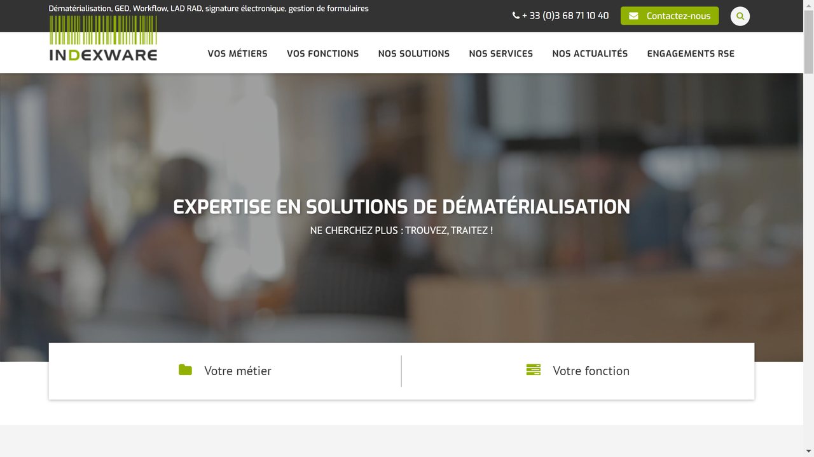

# Indexware

Indexware provides advanced document indexing, search, and content management solutions that help organizations access and utilize their structured and unstructured information more effectively.

## Overview

Indexware specializes in enterprise search and content processing technology designed to enable organizations to effectively manage, search, and extract value from their document repositories. The company offers solutions that combine powerful indexing capabilities with customizable search interfaces and content analysis tools.

Founded with a focus on making information more accessible and actionable, Indexware's technology addresses the challenges organizations face when dealing with large volumes of documents across multiple repositories and formats. Their solutions are particularly valuable for organizations with significant document archives or knowledge bases that require efficient search and retrieval capabilities.

Indexware serves clients across various industries including government, legal, healthcare, and financial services. Their platform is designed to handle enterprise-scale document collections while providing the flexibility to meet specific industry requirements for search precision, content analysis, and security.

## Key Features

- **Advanced Indexing**: High-performance document indexing for rapid search
- **Unified Search**: Single search interface across multiple repositories
- **Content Analysis**: Text analytics and metadata extraction
- **Taxonomy Management**: Organization of content using custom classification schemes
- **Faceted Navigation**: Refined search using multiple content attributes
- **Connector Framework**: Integration with diverse content repositories
- **Natural Language Processing**: Understanding of document context and queries
- **Customizable Interfaces**: Tailored search experiences for different user groups
- **Security Filtering**: Results filtered based on user access rights
- **Document Processing**: Conversion and normalization of various formats

## Use Cases

### Enterprise Knowledge Discovery

Organizations implement Indexware to create a unified search experience across their fragmented content repositories. The system connects to multiple document sources including file shares, content management systems, intranets, and databases to create a comprehensive search index. Users access this information through intuitive search interfaces that support natural language queries and faceted navigation. This approach dramatically improves information discovery, reduces duplicate content creation, and helps employees leverage existing organizational knowledge, ultimately improving productivity and decision-making quality.

### Regulatory Compliance and Information Governance

Regulated industries use Indexware to manage compliance-related content and support information governance initiatives. The platform indexes and analyzes documents to identify sensitive information, classify content according to retention policies, and create audit trails of information access. Advanced search capabilities enable compliance officers to quickly locate relevant documents during regulatory inquiries or investigations. The system helps organizations maintain compliance with regulations like GDPR, HIPAA, or industry-specific requirements by improving content visibility, categorization, and lifecycle management.

## Technical Specifications

| Feature | Specification |
|---------|---------------|
| Deployment Options | On-premises, Cloud, Hybrid |
| Supported Document Formats | 300+ formats including Office, PDF, HTML, email, images |
| Indexing Performance | Millions of documents per day |
| Search Response Time | Sub-second for most queries |
| Repository Connectors | File systems, SharePoint, ECM systems, databases, cloud storage |
| Language Support | Multi-language indexing and search |
| Text Analysis | Entity extraction, topic identification, sentiment analysis |
| Security | Role-based access, document-level security trimming |
| Scalability | Distributed architecture for horizontal scaling |
| Customization | APIs for search interface and processing customization |

## Getting Started

1. **Assessment**: Evaluation of content repositories and search requirements
2. **Architecture Design**: Planning deployment and integration approach
3. **Implementation**: Installation and configuration of indexing and search components
4. **Content Integration**: Connection to repositories and initial indexing
5. **User Interface Setup**: Configuration of search interfaces and user experience

## Resources

- [Company Website](https://www.indexware.fr/)
