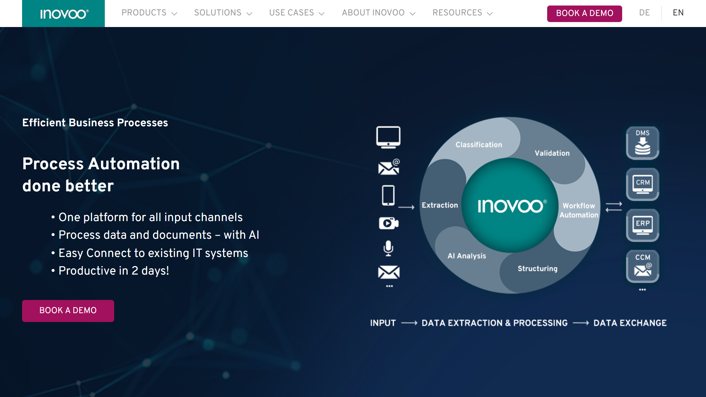

# inovoo

inovoo provides low-code business process automation through its NOVO CxP platform, offering intelligent document processing for healthcare, finance, and government sectors.

## Overview

inovoo delivers process automation and document processing through three integrated products: NOVO CxP for low-code workflow automation, NOVO AI Studio for AI-powered document processing, and NOVO BI Board for process analytics. The platform targets healthcare organizations processing insurance claims, finance departments handling invoices and XRechnung documents, and government agencies digitizing birth records and administrative forms. Operating from offices in Inning am Ammersee and Augsburg, Germany, inovoo provides both cloud and on-premises deployment options with integration capabilities for DMS, CRM, ERP, and CCM systems.

## Key Features

- **NOVO CxP**: Low-code platform for workflow configuration and business process automation without extensive IT requirements
- **NOVO AI Studio**: AI-powered [document classification](../../capabilities/classification/index.md) and [data extraction](../../capabilities/extraction/index.md) from structured and unstructured documents
- **NOVO BI Board**: Process analytics dashboard for monitoring automation performance and throughput metrics
- **Multi-Channel Input**: Document intake from email, scanning systems, and multiple data sources
- **Document Format Support**: Processes forms, text documents, handwriting, email content, and video materials

## Use Cases

### Healthcare Claims Processing

Health insurance companies automate claims processing by routing incoming forms and medical documents through NOVO CxP workflows. The platform classifies claim types, extracts patient information, treatment codes, and cost data from submitted documents including handwritten forms and scanned records. Integration with insurance management systems enables automatic claim validation against policy coverage, while flagged cases route to adjusters for manual review. The system handles multi-channel submissions from email, patient portals, and provider systems.

### Invoice Processing

Finance departments process incoming invoices by extracting vendor details, line items, tax amounts, and payment terms from PDF and email attachments. NOVO AI Studio handles XRechnung electronic invoice formats alongside traditional paper invoices, normalizing data for ERP system integration. The platform validates extracted data against purchase orders and contracts, routes invoices through approval workflows, and exports approved transactions to accounting systems.

## Technical Specifications

| Feature | Specification |
|---------|---------------|
| Core Products | NOVO CxP, NOVO AI Studio, NOVO BI Board |
| Deployment | Cloud or on-premises |
| Integrations | DMS, CRM, ERP, CCM systems |
| Document Types | Forms, text, handwriting, email, video |
| Input Channels | Email, scanning, multiple data sources |
| Target Industries | Healthcare, Finance, Government, Customer Service |

## Resources

- [Website](https://www.inovoo.com)
- [NOVO CxP Platform](https://www.inovoo.com/en/products/business-process-automation-novo-cxp-platform/)
- [NOVO AI Studio](https://www.inovoo.com/en/products/novo-ai-studio/)
- [Use Cases](https://www.inovoo.com/en/use-cases/application-scenarios/)
- [Blog](https://www.inovoo.com/en/resources/blog/)

## Company Information

Headquarters: Inning am Ammersee and Augsburg, Germany

Phone: +49 8143 999 57 0

Contact: [https://www.inovoo.com](https://www.inovoo.com)
