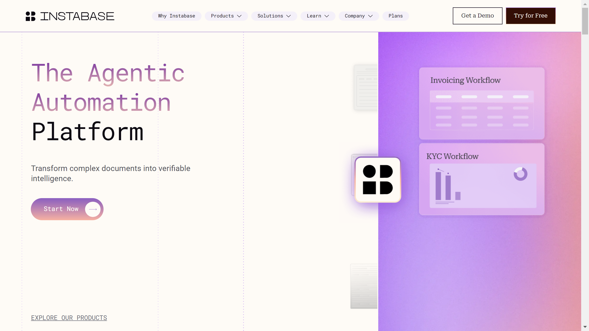

# Instabase

Instabase enables organizations to automate mission-critical processes. The company specializes in mission-critical process automation for enterprise organizations.

## Overview

Instabase provides solutions that enable organizations to automate mission-critical processes. Their platform focuses on handling essential business processes that are critical to organizational operations, offering reliable automation capabilities for high-priority workflows.

## Key Features

- Mission-critical process automation
- Enterprise process automation
- Critical workflow automation
- Mission-critical solutions
- Enterprise automation platform
- Critical process handling
- Reliable automation capabilities

## Use Cases

- Mission-critical process automation
- Enterprise workflow automation
- Critical process handling
- Mission-critical solutions
- Enterprise automation
- Critical workflow management
- Mission-critical automation

## Technical Specifications

Instabase's platform enables organizations to automate mission-critical processes, providing reliable and robust automation capabilities for essential business workflows that are critical to organizational success.

## Company Information

Menlo Park, United States

Web: [https://www.instabase.com](https://www.instabase.com/) 