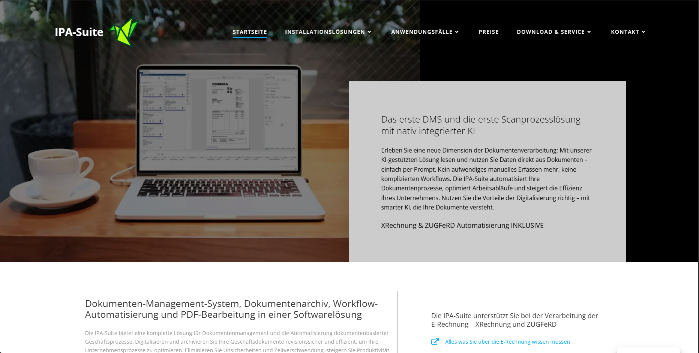

# IPA-Suite

IPA-Suite delivers comprehensive document management and intelligent process automation for German enterprises, featuring GoBD-compliant archiving and AI-powered data extraction.

## Overview

IPA-Suite is a comprehensive German document management and intelligent process automation platform that has been serving over 3,000 customers worldwide for more than 25 years. Based in Germany, the company specializes in providing document management solutions specifically tailored for German and European businesses, with a strong focus on compliance with local regulations such as GoBD (Grundsätze zur ordnungsmäßigen Führung und Aufbewahrung von Büchern, Aufzeichnungen und Unterlagen in elektronischer Form sowie zum Datenzugriff).

The platform combines traditional document management capabilities with modern AI-powered intelligent document processing, offering a complete solution for digitizing and automating document-based business processes. IPA-Suite provides a complete solution for document management and the automation of document-based business processes, helping enterprises digitize and archive their business documents in a revision-safe and efficient manner. The solution is particularly well-suited for medium-sized enterprises and companies with distributed locations, offering up to 50% government funding support for eligible German businesses.

## Key Features

- **AI-Powered Document Processing**: Advanced artificial intelligence capabilities for automatic data extraction from invoices, contracts, and other business documents, with processing occurring locally within the customer environment for enhanced data security
- **GoBD-Compliant Archiving**: Revision-safe document archiving that meets German legal requirements (GoBD guidelines), ensuring documents are stored securely and remain legally compliant
- **E-Invoice Support**: Native support for German e-invoice formats including XRechnung and ZUGFeRD, preparing businesses for the mandatory e-invoice requirements effective January 1, 2025
- **Integrated PDF Processing**: Built-in PDF creation, editing, OCR (Optical Character Recognition) for image-based PDFs, and digital signing capabilities without requiring additional software
- **DATEV Integration**: Seamless integration with DATEV systems to facilitate collaboration with tax advisors and streamline accounting processes

## Use Cases

### Invoice Processing Automation
IPA-Suite digitalizes invoice processing efficiently by automatically processing invoices regardless of format. The platform optimizes the entire process with AI and automated workflows, supporting modern formats like ZUGFeRD and XRechnung while integrating seamlessly with DATEV for tax advisor collaboration.

### Secure Document Archiving
The platform ensures revision-safe archiving according to GoBD regulations, protecting against data loss and unauthorized access. With efficient workflows and a user-friendly interface, organizations can optimize their document management while fulfilling all legal requirements.

### Document Search and Retrieval
IPA-Suite centralizes documents and enables fast, precise search capabilities through powerful AI and automated processing. Users can quickly find needed documents regardless of format, benefiting from an intuitive interface and revision-safe archiving.

## Technical Specifications

| Feature | Specification |
|---------|---------------|
| Deployment Options | On-premise, Cloud, Hybrid |
| Compliance | GoBD, GDPR compliant |
| Supported Languages | German, English, European languages |
| Document Formats | PDF, TIFF, JPG, PNG, Office formats, XRechnung, ZUGFeRD |
| Integrations | DATEV, ERP systems, Email systems |
| AI Processing | Local processing (no external data transmission) |

## Getting Started

IPA-Suite offers a risk-free testing phase for prospective customers to evaluate the platform's capabilities. The company provides personalized consultation to discuss specific requirements and implementation strategies. With 25 years of project experience and numerous successful implementations, IPA-Suite adapts proven solutions to each client's unique needs.

Getting started involves:
1. Scheduling a free demo appointment
2. Discussing specific business requirements
3. Evaluating funding opportunities (up to 50% available for eligible German businesses)
4. Implementing a tailored solution with dedicated support

## Resources

- [Vendor Website](https://www.ipa-suite.com)
- [GoBD Compliance Information](https://www.ipa-suite.com/was-bedeutet-revisionssicherheit-und-gobd-konforme-archivierung)
- [E-Invoice Information](https://www.ipa-suite.com/alles-was-sie-ueber-die-e-rechnungen-wissen-muessen)
- [Document Archiving Solutions](https://www.ipa-suite.com/dokumente-archivieren)

## Contact Information

- Website: [ipa-suite.com](https://www.ipa-suite.com)
- Focus: German and European enterprises
- Experience: 25+ years in document management implementation
- Customer Base: 3,000+ customers worldwide
