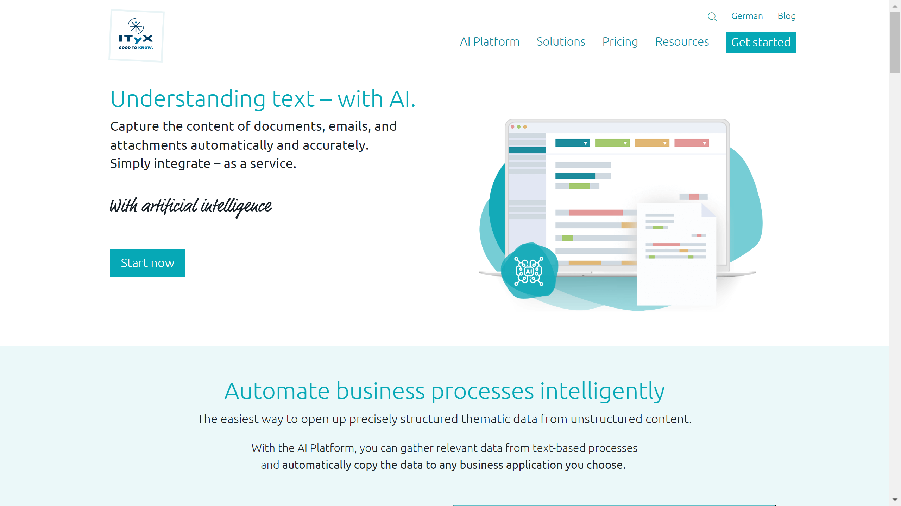

# ITyX Solutions AG

ITyX Solutions AG is a German provider of intelligent document processing solutions offering [OCR](../../capabilities/ocr/index.md), ICR, and AI-based document capture for automating text-based business processes.

## Overview

Founded in 1996, ITyX Solutions AG specializes in intelligent digitization of written communication in companies. The company serves over 200 organizations across 24 countries, providing document processing solutions in 18 languages. Their AI Platform enables automated extraction and processing of unstructured text from documents, emails, and forms through machine learning-based recognition technologies.

## Key Features

- **Machine Learning OCR**: Document recognition and data extraction from structured and unstructured documents
- **Intelligent Character Recognition (ICR)**: Automated extraction of handwritten content from documents and forms
- **Intelligent Document Capture**: AI-based capture of incoming mail and communications
- **Cognitive Capture Software**: Converts unstructured text fragments into structured, contextual information
- **Training Efficiency**: Requires tagging only 250 samples per document category for full deployment
- **Multi-format Support**: Processes content regardless of text structure, format, or source

## Use Cases

### Incoming Mail Processing

Organizations deploy ITyX's intelligent document capture to automate processing of incoming correspondence. The system recognizes document types, extracts relevant data, and routes items automatically. Over 200 companies use this solution to reduce manual mail handling workload.

### Form Data Extraction

ITyX's ICR and OCR capabilities process both printed and handwritten forms. Organizations in regulated industries use the platform to digitize paper forms while maintaining data accuracy. The system can process up to 99% of cases automatically using pure extracted data.

## Technical Specifications

| Feature | Specification |
|---------|---------------|
| Core Products | AI Platform, Cognitive Capture Software |
| Recognition Technology | Machine Learning OCR, ICR |
| Language Support | 18 languages |
| Deployment Options | Cloud, hybrid, on-premises |
| Integration | AI-based OCR SDK, API |
| Training Requirements | 250 tagged samples per document category |
| Claimed Automation Rate | Up to 99% automatic processing |
| Geographic Presence | 24 countries |

## Resources

- [Website](https://www.ityxsolutions.com)
- [Documentation](https://www.ityxsolutions.com/ai-platform)

## Company Information

**Headquarters**: Cologne, Germany

**Founded**: 1996

**Customers**: 200+ organizations in 24 countries
