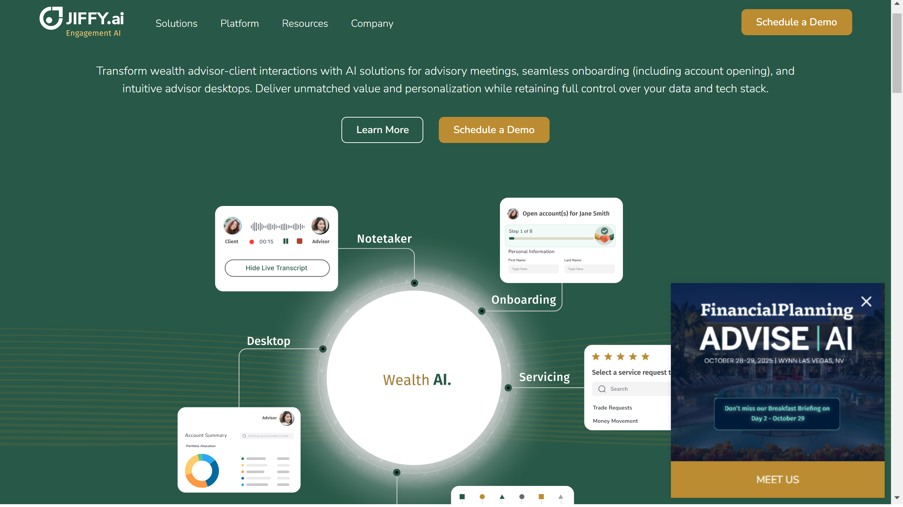

# JIFFY.ai

JIFFY.ai provides a no-code intelligent automation platform focused on financial services, mortgage, and Fortune 500 enterprises, combining RPA, [document processing](../../capabilities/document-understanding/index.md), and AI capabilities.

## Overview

JIFFY.ai delivers cloud-native intelligent automation solutions through its HyperApp platform, specifically designed for financial institutions and large enterprises. The company serves banks, credit unions, wealth management firms, and mortgage providers, focusing on accelerating digital transformation through no-code automation. Recognized by Everest Group as a Major Contender in their 2021 Intelligent Document Processing PEAK Matrix™, JIFFY.ai advanced to 'Star Performer' status by 2023.

In February 2022, JIFFY.ai raised $53 million in Series B funding to expand its platform capabilities and market presence.

## Key Features

- **HyperApp Platform**: No-code environment combining intelligent document processing, RPA, NLP, and machine learning
- **Intelligent Document Processing**: AI-powered extraction and [classification](../../capabilities/classification/index.md) with human-in-the-loop validation
- **Financial Services Specialization**: Pre-built solutions for mortgage origination, loan processing, and account onboarding
- **Cloud-Native Architecture**: Scalable deployment model designed for enterprise workloads
- **Natural Language Processing**: Automated processing of unstructured text from documents and communications
- **Human-in-the-Loop**: Validation workflows for quality control and exception handling

## Use Cases

### Mortgage Origination and Loan Processing

Financial institutions deploy JIFFY.ai's platform for end-to-end automation of mortgage workflows. The system extracts data from loan applications, income verification documents, and property appraisals, routing information to downstream systems. One leading financial institution reduced onboarding costs by over 30% using this solution.

### Clearing and Custody Operations

Wealth management firms use JIFFY.ai to automate back-office processes including document verification, account transfers, and transaction processing. A leading clearing and custody provider boosted advisor productivity by over 40% and reduced service time by up to 50% through JIFFY.ai automation.

## Technical Specifications

| Feature | Specification |
|---------|---------------|
| Core Platform | HyperApp |
| Technology Stack | IDP, RPA, NLP, Machine Learning, AI |
| Deployment | Cloud-native |
| Development Approach | No-code/low-code |
| Industry Focus | Financial services, mortgage, banking, wealth management |
| Integration | API-based connectivity to destination applications |
| Key Partnerships | Cetera Financial Group, Docupace |

## Resources

- [Website](https://jiffy.ai)
- [Documentation](https://jiffy.ai/platform/overview/)

## Company Information

**Headquarters**: Milpitas, California, United States

**Funding**: $53 million Series B (February 2022)

**Recognition**: Everest Group IDP PEAK Matrix™ Star Performer (2023)
