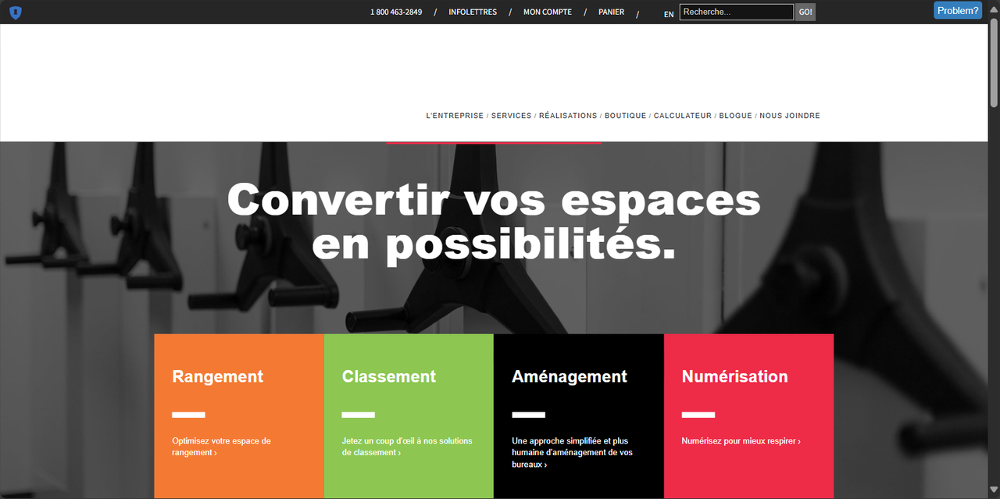

# JUL Solutions

JUL Solutions is a Canadian provider of document management, digitization, and storage services, operating across Quebec, Ontario, and the Maritimes since 1973.

## Overview

Founded in 1973 by Gabriel J. Giguère, JUL Solutions specializes in filing, storage, and digitization services for businesses across various industries. The company transitioned to the second generation under Gabriel's sons, Alain and Stéphane, who expanded the business into comprehensive archive storage and document management solutions. JUL Solutions operates from two locations: Boisbriand (North Shore of Montreal) and Quebec City, with mobile service teams serving Quebec, Ontario, and the Maritime provinces.

## Key Features

- **High-Speed Document Scanning**: Professional digitization equipment capable of scanning up to 600 images per minute
- **[OCR](../../capabilities/ocr/index.md) Processing**: Optical character recognition software for converting scanned documents into searchable text
- **JulMobile Shelving Systems**: Modular mobile shelving units on tracks for space-efficient physical storage
- **Document Management Platform**: Digital systems for organizing, accessing, and managing digitized documents
- **Custom Filing Solutions**: Tailored filing and storage systems for specific organizational needs
- **Compliance Services**: Document processing in compliance with industry regulations

## Use Cases

### Enterprise Records Management

Organizations use JUL Solutions to digitize and manage large volumes of physical records. The company's high-speed scanning equipment processes documents at scale, while OCR technology makes archived materials searchable. Businesses in regulated industries rely on JUL's compliance-focused approach.

### Physical Archive Storage

Companies deploy JUL's JulMobile modular shelving systems to maximize physical storage capacity in warehouses and file rooms. The mobile track-based systems allow organizations to store more materials in less space compared to traditional static shelving.

## Technical Specifications

| Feature | Specification |
|---------|---------------|
| Scanning Speed | Up to 600 images per minute |
| Recognition Technology | OCR software |
| Geographic Coverage | Quebec, Ontario, Maritime provinces |
| Office Locations | Boisbriand (Montreal), Quebec City |
| Physical Products | JulMobile modular shelving systems |
| Service Model | On-site and mobile service teams |

## Resources

- [Website](https://www.julsolutions.ca)
- [Documentation](https://www.julsolutions.ca/resources)

## Company Information

**Headquarters**: Quebec, Canada

**Founded**: 1973

**Founder**: Gabriel J. Giguère

**Current Leadership**: Alain and Stéphane Giguère (second generation)
