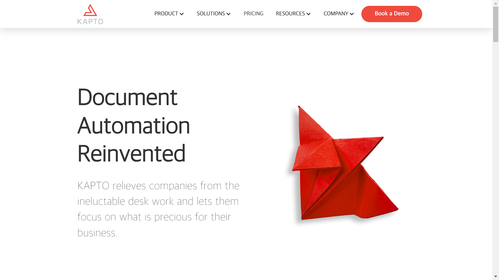

# KAPTO AI Ltd

KAPTO AI provides end-to-end document processing automation using AI to categorize, extract, and analyze data from business documents without template constraints.

## Overview

Founded in 2022 and based in London, KAPTO AI specializes in automated [document understanding](../../capabilities/document-understanding/index.md) for business process automation. The company's platform autonomously reads and analyzes business documents, performing categorization, data extraction, and discrepancy detection across multiple input types including emails, scanned documents, and PDFs. KAPTO operates as a bootstrapped organization with a 7-person team, generating $1.1M in revenue. The company serves industries including insurance, logistics, healthcare, and finance with template-free document processing capabilities.

## Key Features

- **Deep Content Understanding**: AI-driven analysis of document content without requiring predefined templates
- **Multi-Format Input**: Processes emails, scanned documents, and PDFs
- **Automatic Categorization**: Autonomous document classification and routing
- **Data Extraction**: Extracts structured data from unstructured documents
- **Discrepancy Detection**: Flags inconsistencies and missing requirements automatically
- **End-to-End Automation**: Complete workflow automation from document intake to data organization

## Use Cases

### Insurance Claims Processing

Insurance companies deploy KAPTO to automate legal document management for claims workflows. The system processes accident reports, policy documents, and supporting evidence, extracting relevant data and detecting discrepancies. The platform handles varied document formats without requiring templates for each document type.

### Invoice Processing with 3-Way Matching

Organizations use KAPTO for accounts payable automation with three-way matching between purchase orders, receipts, and invoices. The AI system extracts line items and financial data, validates matches across documents, and flags exceptions for review.

### Healthcare Records Management

Healthcare providers implement KAPTO to process medical records and documentation. The system categorizes patient documents, extracts clinical data, and organizes information for electronic health record systems while detecting missing or incomplete documentation.

## Technical Specifications

| Feature | Specification |
|---------|---------------|
| Technology | AI-powered document understanding |
| Input Types | Email, scanned documents, PDF |
| Template Requirements | None (template-free processing) |
| Core Capabilities | Categorization, [extraction](../../capabilities/extraction/index.md), discrepancy detection |
| Industries Served | Insurance, logistics, healthcare, finance, pensions |
| Company Structure | Bootstrapped, 7-person team |
| Revenue | $1.1M |

## Resources

- [Website](https://www.kapto.ai)
- [Product Overview](https://www.kapto.ai/product/end-to-end-processing)

## Company Information

**Headquarters**: London, United Kingdom (Churchill House, 137-139 Brent Street, NW4 4DJ)

**Founded**: 2022

**CEO**: Gabriel De Dominicis

**Team Size**: 7 employees
