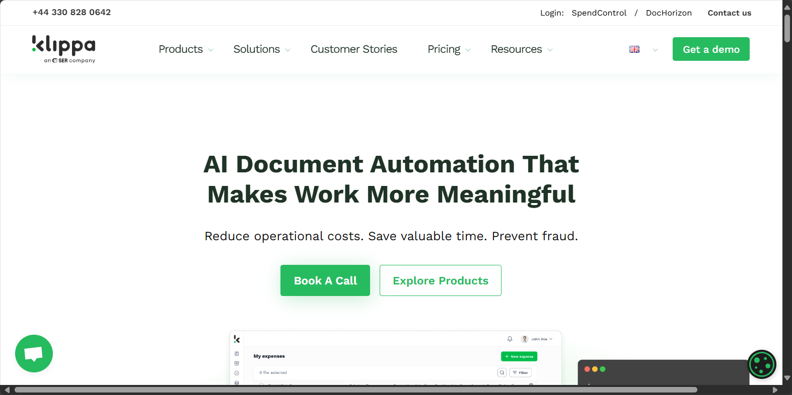

# Klippa (acquired by SER Group)

[Klippa](https://www.klippa.com/en/home-en/) is a technology company specializing in intelligent document processing (IDP) and OCR solutions that automate data extraction from various document types. In 2025, Klippa was acquired by SER Group, a leading provider of intelligent content automation solutions.

## Overview

Klippa offers specialized artificial intelligence and OCR (Optical Character Recognition) solutions designed to help businesses automate document processing and data extraction. The company was founded in 2015 in Groningen, Netherlands, by Bart-Jan Maatman, Robert-Jan Verheggen, Jeroen Bobbeldijk, and Yeelen Knegtering [[1]](https://siliconcanals.com/klippa-acquired-by-ser-group/).

Since its founding, Klippa expanded its operations beyond its Groningen headquarters to establish offices in Amsterdam, Hamburg, San Francisco, and Brasov [[2]](https://northerntimes.nl/groningen-tech-company-klippa-acquired-by-german-group/). The company grew to become one of the fastest-growing Dutch tech companies before its acquisition.

In March 2025, Klippa was acquired by SER Group, a German company specializing in intelligent content automation. Following the acquisition, Klippa's advanced IDP capabilities are being integrated into SER's Doxis Intelligent Content Automation platform, enhancing SER Group's document processing capabilities while expanding Klippa's international reach [[3]](https://www.klippa.com/en/newsroom/ser-group-acquires-klippa/).

Klippa's solutions are particularly valuable for organizations dealing with large volumes of documents that require efficient processing, data extraction, and integration with existing systems. Their technology focuses on making document processing more efficient through automation, reducing manual data entry, and minimizing human error.

## Key Features

- **AI-Powered OCR**: Advanced optical character recognition for accurate text extraction
- **Automated Data Extraction**: Intelligent capture of structured data from documents
- **Multi-Format Support**: Processing of various document formats (JSON, CSV, PDF, etc.)
- **Financial Document Processing**: Specialized handling of invoices, receipts, and statements
- **Identity Document Processing**: Extraction from passports, IDs, and other verification documents
- **Mobile SDK Integration**: Tools for embedding document capture in mobile applications
- **API Accessibility**: RESTful API for integration with existing systems
- **Multi-Language Support**: Processing documents in various languages
- **Cloud Processing**: Scalable cloud-based document processing
- **Customizable Extraction**: Tailored data extraction based on specific needs
- **Real-Time Processing**: Instant document analysis and data extraction
- **High Accuracy Rates**: Precise data capture through advanced AI algorithms

## Products

### OCR API

Klippa's OCR API provides comprehensive capabilities for automatically extracting text and data from images and documents with high accuracy and speed. The solution processes various document formats including JSON, CSV, PDF, XML, XLS, XLSX, UBL, PNG, TIFF, and DOC, providing flexibility for different document sources and integration requirements [[4]](https://www.klippa.com/en/ocr/ocr-api/). Advanced image enhancement features automatically optimize document quality before processing, improving extraction accuracy for poor-quality scans, smartphone photos, or otherwise challenging documents. Multi-language support enables processing of documents in various languages with consistent quality and methodology across linguistic boundaries. The API delivers structured, machine-readable output that can be easily integrated with existing systems and workflows, transforming unstructured document content into usable data. Fast processing capabilities ensure quick turnaround times even for complex documents, with rapid extraction of relevant text and data. Integration options include comprehensive documentation, client libraries, and implementation support to facilitate connection with existing business systems. By implementing the OCR API, organizations can dramatically reduce manual data entry through automated text extraction, improve data accuracy by eliminating error-prone transcription, accelerate document processing workflows with immediate text recognition, and extend automation capabilities to previously unstructured document formats.

### Invoice OCR

Klippa's Invoice OCR solution specializes in automating the extraction of critical data from invoice documents, turning manual invoice processing into a streamlined, efficient workflow. The system automatically identifies and extracts key invoice data including invoice numbers, dates, due dates, vendor information, line items, subtotals, tax amounts, and payment details without template configuration for different suppliers [[5]](https://www.klippa.com/en/ocr/financial-documents/invoices/). Global vendor support enables processing of invoices from suppliers worldwide with recognition of different formats, languages, and compliance requirements across regions. Multi-format capabilities handle various invoice formats including PDFs, scanned documents, images, and digital invoices with consistent extraction quality. Integration with accounting and ERP systems allows automatic transfer of extracted invoice data to financial software, streamlining the accounts payable process end-to-end. Validation features automatically check extracted data for consistency and completeness, flagging potential issues for review before processing. The solution delivers structured output in formats compatible with financial systems, enabling automated posting and reconciliation. By implementing Invoice OCR, organizations can significantly reduce invoice processing costs through automation of manual data entry, accelerate payment cycles by reducing invoice processing time from days to minutes, improve accuracy through elimination of manual keying errors, and enhance financial visibility with faster access to invoice data for reporting and analysis.

### Receipt OCR

Klippa's Receipt OCR solution provides specialized capabilities for automating the extraction of data from receipts, streamlining expense management and reimbursement processes. The system automatically captures key receipt information including merchant details, transaction date and time, purchase items, total amount, tax information, and payment method with high accuracy regardless of receipt format or quality [[6]](https://www.klippa.com/en/ocr/financial-documents/receipts/). Mobile optimization ensures excellent performance with smartphone-captured receipt images, compensating for common issues like poor lighting, skewed angles, and varying image quality. Global receipt support handles receipts from different countries with recognition of varying formats, languages, currencies, and tax systems worldwide. Integration capabilities connect with expense management systems, accounting software, and ERP platforms through APIs and SDKs, enabling seamless flow of receipt data into financial processes. Fraud detection features identify potential issues such as duplicates, altered amounts, or suspicious patterns, helping organizations maintain compliance and control over expenses. Fast processing ensures quick turnaround times even during peak submission periods, keeping expense workflows moving efficiently. By implementing Receipt OCR, organizations can dramatically reduce expense processing time through automated data extraction, improve employee experience by eliminating manual receipt data entry, enhance expense policy compliance through consistent validation of receipt information, and gain better visibility into spending patterns through structured, analyzable receipt data.

### Document Scanning SDK

Klippa's Document Scanning SDK transforms mobile devices into powerful document capture tools, enabling organizations to integrate sophisticated scanning capabilities directly into their own applications. The SDK provides high-quality document capture that automatically detects document edges, corrects perspective, enhances image quality, and optimizes the capture for subsequent processing, ensuring excellent results even in challenging lighting conditions [[7]](https://www.klippa.com/en/ocr/ocr-sdk/). Real-time feedback guides users during the capture process with frame detection, blur detection, and lighting assessment to help them take the best possible document image on the first attempt. On-device processing performs initial optimization locally on the mobile device before sending to the cloud, reducing bandwidth requirements and improving performance. Integration with Klippa's OCR capabilities enables immediate extraction of document data following capture, creating end-to-end document processing workflows within custom applications. The SDK supports both iOS and Android platforms with native performance and consistent user experience across operating systems. Customization options allow adaptation of the capture interface to match application branding and specific document requirements. By implementing the Document Scanning SDK, organizations can significantly improve document image quality through guided capture and automatic enhancement, reduce support issues related to poor document images, accelerate document processing by starting with optimized captures, and deliver a seamless, branded experience for users capturing documents in mobile applications.

## Use Cases

### Expense Management Automation

Finance departments and business travelers implement Klippa's OCR technology to transform expense reporting processes, dramatically reducing the time and effort required to submit and process expense claims. Employees use Klippa's mobile capture capabilities to photograph receipts immediately after purchases, with the system automatically extracting merchant information, date, amount, and other relevant details without manual entry. Integration with expense management systems enables automatic population of expense reports with the extracted data, eliminating manual form filling and accelerating submission. Policy compliance checking automatically validates expenses against company policies, flagging potential violations or requiring additional information when necessary. Multi-currency and international receipt support ensures consistent performance for global organizations with employees traveling across different countries. Approval workflow integration routes completed expense reports with attached receipt images and extracted data to appropriate approvers, streamlining the review process. This implementation significantly reduces the time employees spend on expense administration from hours to minutes, accelerates reimbursement cycles through faster processing and approval, improves accuracy by eliminating manual data entry errors, and enhances compliance through consistent application of expense policies.

### Accounts Payable Optimization

Finance departments leverage Klippa's Invoice OCR to streamline accounts payable processes, reducing manual effort while improving accuracy and processing speed. The system automatically extracts key data from incoming invoices including vendor information, invoice numbers, dates, line items, and payment details regardless of format or layout differences between suppliers. Validation against purchase orders and vendor master data automatically checks for discrepancies, flagging potential issues for review while allowing straight-through processing of matching invoices. Integration with accounting systems and ERP platforms enables automatic posting of verified invoices to the appropriate accounts, eliminating manual data entry into financial systems. Workflow routing directs invoices requiring attention to the appropriate personnel based on amount, department, exceptions, or approval requirements. Digital archiving maintains searchable records of all processed invoices with both the extracted data and original documents accessible for audit or reference purposes. This approach dramatically reduces invoice processing costs through elimination of manual data entry, accelerates payment cycles enabling capture of early payment discounts, improves supplier relationships through faster, more accurate payments, and enhances financial control through consistent processing and validation of all invoices.

### KYC and Identity Verification

Financial institutions, fintech companies, and regulated businesses implement Klippa's identity document processing capabilities to streamline customer onboarding while maintaining robust verification standards. The system automatically extracts key information from identity documents including passports, driver's licenses, and national ID cards, capturing personal details, document numbers, issuance and expiration dates, and other relevant information without manual transcription. Authenticity verification checks security features and document patterns to help identify potentially fraudulent documents, adding an additional layer of protection beyond simple data extraction. Face matching capabilities compare the photograph on the identity document with a selfie or live video of the applicant, verifying that the document belongs to the person submitting it. Integration with customer onboarding systems enables the automatic population of account creation forms with verified identity information, eliminating duplicate data entry. Compliant storage maintains secure, encrypted records of verification processes including extracted data and document images to satisfy regulatory requirements. This implementation significantly accelerates customer onboarding times from days to minutes through automated document processing, improves conversion rates by reducing abandonment during lengthy manual verification processes, strengthens fraud prevention through consistent, objective document verification, and enhances compliance with KYC regulations through standardized, documented verification procedures.

## Technical Specifications

| Feature | Specification |
|---------|---------------|
| Deployment Options | Cloud API, on-premise (enterprise) |
| Document Types | Invoices, receipts, IDs, contracts, more |
| Supported Formats | PDF, JPG, PNG, TIFF, DOC, XLS, CSV, XML |
| API Type | RESTful with JSON responses |
| SDK Platforms | iOS, Android |
| Processing Speed | 1-3 seconds (typical document) |
| Accuracy Rates | >95% for standard fields |
| Output Formats | JSON, CSV, XML, structured data |
| Language Support | Multiple languages |
| Integration Options | API, SDK, webhooks, direct system connectors |
| Security Features | Data encryption, secure processing |
| Scalability | Enterprise-grade, high-volume capability |

## SER Group Integration

Following the 2025 acquisition by SER Group, Klippa's intelligent document processing technology is being integrated into SER's Doxis Intelligent Content Automation platform. This integration brings together Klippa's advanced document extraction capabilities with SER Group's comprehensive content management and workflow automation solutions [[8]](https://www.intelligentdocumentprocessing.com/idp-vendor-klippa-is-acquired-by-ser-group/).

The combined solution aims to deliver a more comprehensive approach to document-centric processes, enabling organizations to not only extract data from documents more effectively but also to automate the subsequent workflows and integrate the information with various business systems. This creates end-to-end automation possibilities that extend beyond the initial document capture phase.

For existing Klippa customers, the acquisition promises expanded capabilities and resources, while SER Group customers gain access to enhanced document extraction technology that complements the existing Doxis platform.

## Resources

- [Company Website](https://www.klippa.com/en/)
- [OCR API Documentation](https://www.klippa.com/en/ocr/ocr-api/)
- [SDK Information](https://www.klippa.com/en/ocr/ocr-sdk/)
- [SER Group Website](https://www.sergroup.com/)

## Contact Information

- Headquarters: Groningen, Netherlands
- Additional Offices: Amsterdam, Hamburg, San Francisco, Brasov
- Website: [klippa.com](https://www.klippa.com/en/)
- Parent Company: [SER Group](https://www.sergroup.com/)
- Email: support@klippa.com
- Tel: +31 50 2111631
