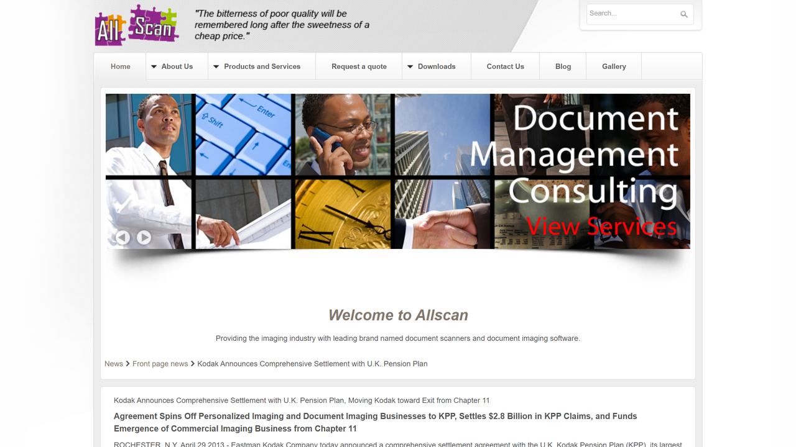

# Kodak Alaris

Kodak Alaris is a global provider of information capture solutions and intelligent document processing technologies, specializing in high-quality document scanners, software, and services that help organizations transform paper documents into actionable digital data.

## Overview

Kodak Alaris offers specialized hardware and software solutions designed to help businesses digitize, process, and manage documents and information. The company was formed in 2013 as part of a settlement agreement between Eastman Kodak Company and the UK Kodak Pension Plan (KPP), following Eastman Kodak's bankruptcy proceedings [[1]](https://www.allscan.co.za/7-news/front-page-news/27-kodak-announces-comprehensive-settlement-with-u-k-pension-plan/).

This unique formation saw the UK Kodak Pension Plan acquire several of Kodak's businesses to establish a new company, Kodak Alaris, which would generate income to help meet the pension obligations of KPP members. In 2020, ownership was transferred to the UK Pension Protection Fund (PPF), a government agency designed to protect pensioners [[2]](https://www.deep-analysis.net/kodak-alaris-free-at-last/). More recently, Kodak Alaris was acquired by Kingswood Capital Management from the United Kingdom Pension Protection Fund [[3]](https://www.lincolninternational.com/transactions/the-united-kingdom-pension-protection-fund-has-sold-kodak-alaris-to-kingswood-capital-management/).

Headquartered in Rochester, New York, with operations worldwide, Kodak Alaris focuses on document scanning, information management, and imaging solutions. The company has become a leader in document capture technology, with a comprehensive portfolio of scanners and software that cater to various business needs and industries.

Today, Kodak Alaris is structured primarily around two main divisions: Alaris, which handles hardware and software for digital imaging and information management; and Kodak Moments, which focuses on retail photo printing kiosks and the sales and marketing of traditional photographic film [[4]](https://en.wikipedia.org/wiki/Kodak_Alaris).

## Key Features

- **High-Performance Document Scanners**: Range of devices from desktop to production-level
- **Intelligent Document Processing Software**: Advanced data extraction and workflow automation
- **Image Enhancement Technology**: Superior image quality and processing capabilities
- **Automatic Document Feeding**: Reliable paper handling for diverse document types
- **Intelligent Document Protection**: Safeguards against document damage during scanning
- **Enhanced Jam Recovery**: Minimizes disruptions in scanning workflows
- **Controlled Stacking**: Organized output of scanned documents
- **OCR and Data Capture**: Accurate text recognition and data extraction
- **Barcode Reading**: Automated document identification and routing
- **Multi-Feed Detection**: Prevents scanning errors and missed pages
- **Network Connectivity**: Direct integration with enterprise systems
- **Mobile Scanning Solutions**: Capture documents from anywhere
- **Professional Services**: Implementation, training, and support offerings
- **Cloud Integration**: Connectivity with cloud storage and processing services

## Products

### Document Scanners

Kodak Alaris offers a comprehensive range of document scanners designed to meet diverse business needs, from small office applications to high-volume production environments. The scanner portfolio includes desktop scanners like the S2000 Series that deliver exceptional productivity with speeds up to 80 pages per minute and features such as integrated flatbed options for handling bound materials and fragile documents [[5]](https://www.alarisworld.com/en-us/solutions/document-scanners/desktop/s2070-scanner). Connected scanners including the S2060w provide wireless networking capabilities, enabling flexible deployment options and direct integration with mobile devices and cloud services. Production scanners such as the i4000 and i5000 Series handle high-volume scanning environments with input capacities up to 500 sheets, speeds reaching 210 pages per minute, and robust paper handling mechanisms designed for continuous operation [[6]](https://www.kodakalaris.com/en/scanners/i4650-scanner). All scanner models feature Kodak Alaris' signature technologies including Perfect Page image processing for superior image quality, Intelligent Document Protection to prevent document damage, and advanced paper handling capabilities that minimize jams and misfeeds even with mixed document batches. Integration with Kodak Alaris software solutions provides a complete capture-to-process workflow, enabling automated data extraction and seamless connection with enterprise content management systems. By implementing Kodak Alaris scanners, organizations can significantly accelerate document digitization processes, improve data accuracy through high-quality image capture, reduce operational costs associated with document handling and storage, and enhance compliance with information management regulations through consistent, reliable document processing.

### KODAK Info Input Solution

KODAK Info Input Solution is Kodak Alaris' flagship intelligent document processing (IDP) software that automates and streamlines the capture, classification, and extraction of data from documents across an organization. The platform provides comprehensive document onboarding capabilities that enable capture from multiple sources including scanners, mobile devices, email, and existing repositories, supporting a wide range of document formats and types regardless of complexity [[7]](https://www.kodakalaris.com/en/software/kodak-info-input-solution). Advanced AI-powered classification automatically identifies document types and routes them to appropriate processing workflows without manual sorting, accelerating document handling and reducing errors. Intelligent data extraction leverages machine learning and advanced recognition technologies to automatically identify and capture key information from documents, transforming unstructured content into structured, usable data. The solution incorporates validation and verification features that ensure data accuracy through automated checks and user-friendly interfaces for handling exceptions and corrections. Seamless integration capabilities connect with existing business systems including ERP, CRM, ECM, and line-of-business applications through standard APIs and connectors, enabling straight-through processing of document data. The latest version, Info Input Solution 7.1, incorporates Open Intelligence technology that leverages advanced document AI and generative AI capabilities to further enhance document processing automation and accuracy [[8]](https://www.kodakalaris.com/en/insights/articles/introducing-kodak-info-input-solution-71-better-data-better-decisions-better-outcomes). By implementing KODAK Info Input Solution, organizations can dramatically reduce manual data entry through automated document classification and extraction, accelerate document processing workflows from hours to minutes, improve data accuracy through AI-assisted capture and validation, and enhance integration between document-centric processes and core business systems.

### Capture Pro Software

Kodak Alaris' Capture Pro Software provides robust document capture capabilities specifically designed to maximize the performance and productivity of Kodak Alaris scanners in production scanning environments. The software delivers high-volume batch scanning capabilities that efficiently process large document volumes with features like background image processing and multi-thread scanning to maximize throughput. Advanced image enhancement automatically optimizes captured images with features such as deskew, despeckling, hole fill, and blank page detection, ensuring consistently high-quality results even from challenging original documents. Intelligent indexing features enable efficient document classification and data capture through barcode recognition, OCR, pattern matching, and database lookups, accelerating the conversion of paper documents into searchable, usable information. Output flexibility provides multiple export options including searchable PDF, PDF/A, TIFF, JPEG, and various database and content management system formats, supporting diverse business requirements. Integration capabilities connect with enterprise content management systems, business applications, and cloud services through standard interfaces and dedicated connectors. By implementing Capture Pro Software, organizations can significantly increase scanning productivity through optimized workflows and high-speed processing, improve document image quality through sophisticated enhancement technologies, accelerate document indexing and retrieval through automated data extraction, and enhance system integration with flexible output options tailored to downstream processes.

### Professional Services

Kodak Alaris offers comprehensive Professional Services designed to help customers maximize the value of their document capture and information management investments across the entire solution lifecycle. Implementation services include expert installation, configuration, and deployment assistance that ensures optimal setup of scanner hardware and software components based on specific business requirements and technical environments. Workflow design and optimization services analyze existing document processes and design efficient capture workflows that reduce manual handling, accelerate processing, and improve data accuracy. Integration services connect Kodak Alaris solutions with existing business systems including content management, ERP, and line-of-business applications, creating seamless information flows across the organization. Training programs provide comprehensive education for end-users, administrators, and technical staff, ensuring proper operation and maintenance of Kodak Alaris solutions. Ongoing support options include flexible service plans, technical assistance, and regular maintenance to maximize system availability and performance. By engaging Kodak Alaris Professional Services, organizations can accelerate time-to-value through expert implementation and configuration, optimize document workflows based on industry best practices and experience, ensure seamless integration with existing business systems and processes, and maintain peak system performance through proper training and support.

## Use Cases

### Financial Services Document Processing

Banking and financial services institutions implement Kodak Alaris solutions to transform how they process critical financial documents including loan applications, account opening forms, checks, and supporting documentation. The system captures documents from multiple channels including branch offices, mail centers, and digital submissions, consolidating them into a unified processing workflow. High-speed production scanners with reliable paper handling capabilities process large volumes of diverse document types while maintaining image quality and data accuracy. Intelligent Document Protection technology prevents damage to original documents, which is crucial for legal compliance and customer service in financial environments. Automated data extraction identifies and captures key information from financial documents including personal details, account numbers, transaction amounts, and signatures, reducing manual keying and associated errors. Integration with core banking systems and customer relationship management platforms enables straight-through processing of captured information, updating customer records and initiating appropriate workflows. This implementation significantly accelerates account opening and loan processing times from days to hours through streamlined document capture and data extraction. It improves customer experience with faster service and reduced document handling requirements. The approach enhances regulatory compliance through consistent, auditable document capture and processing workflows. It also reduces operational costs associated with document handling, storage, and manual data entry.

### Healthcare Records Management

Healthcare providers implement Kodak Alaris scanning and information management solutions to digitize and manage patient records efficiently while maintaining compliance with regulatory requirements. The system captures medical documents from various sources including patient intake forms, referrals, test results, and historical records, creating comprehensive electronic patient files. Distributed capture capabilities enable document scanning at various points of service including registration desks, nursing stations, and medical records departments, reducing document transportation and processing delays. High-quality image capture ensures the legibility of critical medical information including handwritten notes, charts, and diagnostic images, which is essential for proper patient care. Automated indexing links captured documents to the correct patient records through barcode recognition, OCR of patient identifiers, or integration with electronic health record systems. Secure integration with electronic health record (EHR) systems makes digitized documents immediately available to authorized healthcare providers through their familiar clinical interfaces. This approach dramatically improves access to patient information by making complete medical records available electronically from any authorized location. It enhances patient care through more comprehensive information access during consultations and treatment planning. The implementation strengthens compliance with records management regulations including HIPAA through consistent, secure document handling processes. It also reduces physical storage costs and space requirements by transitioning from paper to electronic records.

### Government Document Management

Government agencies at federal, state, and local levels implement Kodak Alaris solutions to manage the large volumes of documents required for constituent services, internal operations, and regulatory compliance. The system processes diverse document types including applications, forms, correspondence, identification documents, and supporting materials, handling both current processing and backfile conversion of historical records. High-volume production scanning capabilities efficiently digitize large document backlogs and ongoing paper submissions, addressing the substantial document volumes typical in government operations. Intelligent document classification automatically identifies document types and routes them to appropriate processing workflows, accelerating handling while ensuring proper procedures are followed. Security features protect sensitive information through encryption, access controls, and audit trails that maintain chain of custody and comply with government information security requirements. Integration with case management systems and government databases enables automatic updating of constituent records and initiation of appropriate service workflows based on captured information. This implementation significantly improves constituent service through faster document processing and reduced waiting times for government services. It enhances transparency and accountability with better tracking of documents throughout their lifecycle. The approach increases operational efficiency by reducing manual document handling and physical storage requirements. It also strengthens disaster recovery capabilities by securing critical information in digital format with appropriate backup systems.

## Technical Specifications

| Feature | Specification |
|---------|---------------|
| Scanner Types | Desktop, Departmental, Production |
| Scanning Speeds | 20-210 pages per minute (model dependent) |
| Daily Duty Cycles | 1,500-100,000+ pages (model dependent) |
| Document Feeding | 20-500 sheet capacity (model dependent) |
| Paper Handling | Multiple sizes, weights, types in same batch |
| Connectivity | USB, Ethernet, Wireless (model dependent) |
| Image Processing | Perfect Page technology for optimal quality |
| Output Formats | TIFF, JPEG, PDF, searchable PDF, PDF/A |
| Software Compatibility | TWAIN, ISIS, RESTful Web API |
| OS Support | Windows, Mac OS, Linux |
| OCR Capability | Built-in or via bundled software |
| Barcode Reading | 1D and 2D barcode recognition |
| Security Features | Image encryption, secure boot, audit trails |
| Cloud Integration | Compatible with major cloud platforms |
| Mobile Support | iOS and Android compatible |

## Industries Served

Kodak Alaris serves a wide range of industries with its document capture and information management solutions:

- **Financial Services**: Banks, credit unions, insurance companies
- **Healthcare**: Hospitals, clinics, medical practices
- **Government**: Federal, state, and local agencies
- **Business Process Outsourcing**: Service providers handling document processing
- **Legal**: Law firms, corporate legal departments
- **Manufacturing**: Quality control, inventory management
- **Transportation & Logistics**: Shipping documentation, customs forms
- **Education**: Student records, administrative documents
- **Retail**: Invoice processing, customer records
- **Energy & Utilities**: Service records, compliance documentation

## Resources

- [Company Website](https://www.kodakalaris.com/)
- [Product Information](https://www.kodakalaris.com/en/scanners)
- [Software Solutions](https://www.kodakalaris.com/en/software)
- [Support & Downloads](https://www.kodakalaris.com/en/support)

## Address

336 Initiative Drive

14624 Rochester, United States

Web: [https://www.alarisworld.com](https://www.alarisworld.com/)

Email: contact-us@kodakalaris.com

Tel: 888-242-2424
