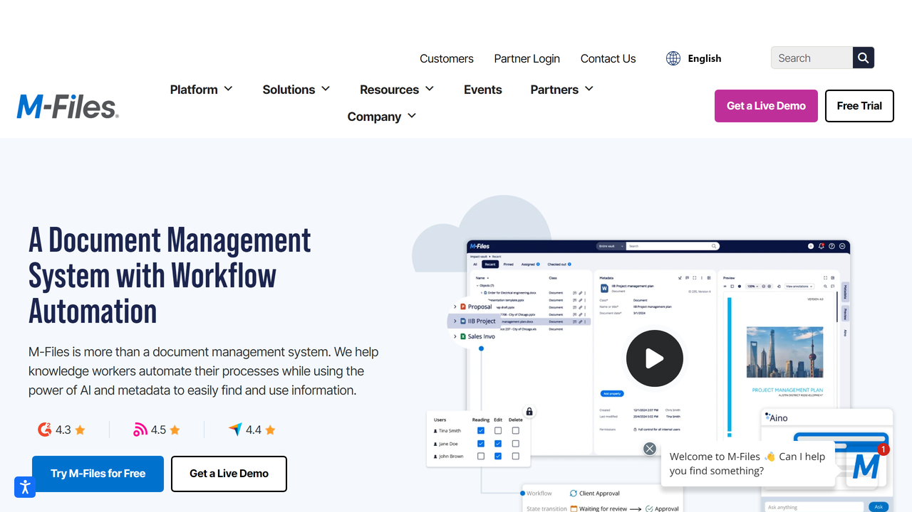

# M-Files

M-Files is an intelligent information management platform that uses metadata-driven architecture to organize content based on what it is rather than where it's stored, enabling organizations to find, manage, and secure information across the enterprise.

## Overview

M-Files provides a next-generation intelligent information management platform that improves business performance by helping people find and use information more effectively. Unlike traditional systems that organize documents by location, M-Files uses a unique metadata-driven approach that organizes content based on what it is, not where it's stored.

Founded in 2001 and headquartered in Finland, M-Files has established itself as an innovative leader in content services and intelligent information management. Their platform is distinguished by its flexibility, user-friendly interface, and ability to connect to existing repositories without migration, making it particularly suitable for organizations with complex document management needs.

M-Files serves organizations across various industries, including manufacturing, professional services, finance, and AEC (architecture, engineering, construction). Their solutions help these organizations streamline document-intensive processes, ensure compliance with regulations, enhance collaboration, and leverage their information assets more effectively.

## Key Features

- **Metadata-Driven Architecture**: Content organization based on what documents are, not where they're stored
- **Intelligent Information Management**: AI-powered classification and metadata extraction
- **Dynamic Views**: Personalized content views based on metadata, not folder structures
- **Repository Neutral Approach**: Connection to existing systems without migration
- **Workflow Automation**: Configurable business process automation
- **Version Control**: Comprehensive document history management
- **Access Control**: Context-sensitive security based on document attributes
- **Mobile Access**: Full-featured mobile applications
- **Offline Mode**: Work with documents without internet connection
- **Cloud, On-Premises, or Hybrid**: Flexible deployment options

## Use Cases

### Enterprise Document Management

Organizations implement M-Files to establish unified access to information across multiple repositories and systems. The platform's repository neutral approach connects to existing network folders, SharePoint, CRM, ERP systems, and other content sources without requiring migration. Documents remain in their original locations while M-Files provides a single interface for finding and managing information based on what it is, not where it's stored. Intelligent metadata extraction automatically categorizes and tags documents using AI, while dynamic views organize content based on user roles and needs rather than rigid folder structures. Version control maintains complete document history regardless of source repository. This implementation eliminates information silos by connecting disparate systems, reduces time wasted searching for documents through powerful metadata-based search, improves governance through consistent policies across repositories, and enhances user adoption through intuitive interfaces that don't require changing existing work habits.

### Quality Management System

Manufacturing and regulated organizations utilize M-Files as their electronic quality management system (eQMS). The platform centralizes standard operating procedures, work instructions, and quality manuals with automated version control and approval workflows. Document change management processes include electronic signatures, review cycles, and detailed audit trails for compliance with ISO, FDA, and other regulatory requirements. Training management ensures employees are assigned and complete required reading of procedures, with automatic notifications for retraining when documents change. Nonconformance and CAPA (Corrective and Preventive Action) workflows manage quality incidents from identification through investigation and resolution. This approach streamlines audit preparation through comprehensive documentation and records, ensures procedural compliance through controlled document distribution, reduces quality incidents through systematic process management, and maintains regulatory compliance through validatable systems and processes.

## Technical Specifications

| Feature | Specification |
|---------|---------------|
| Architecture | Metadata-driven, repository neutral |
| Deployment Options | Cloud, on-premises, hybrid |
| Intelligence Features | AI-powered metadata extraction, classification |
| Integration Methods | REST API, COM API, extensive connectors |
| Mobile Support | iOS, Android, Windows mobile applications |
| Compliance Support | FDA 21 CFR Part 11, ISO 9001, GDPR, HIPAA |
| Workflow Engine | Visual workflow designer, task management |
| Search Capabilities | Metadata, full-text, combined queries |
| UI Technologies | Windows client, web client, mobile apps |
| Authentication | AD/LDAP, Azure AD, multi-factor authentication |

## Getting Started

1. **Assessment**: Evaluation of information management needs
2. **Implementation**: Configuration of metadata structure and workflows
3. **Connection**: Integration with existing repositories and systems
4. **User Training**: Knowledge transfer and adoption support
5. **Expansion**: Ongoing enhancement of information processes

## Resources

- [Company Website](https://www.m-files.com/)
- [Vendor Profile 2024 created by Deep Analysis](https://web.archive.org/web/20250728182357/https://www.m-files.com/wp-content/uploads/2024/12/Deep-Analysis-Vendor-Vignette.pdf)
