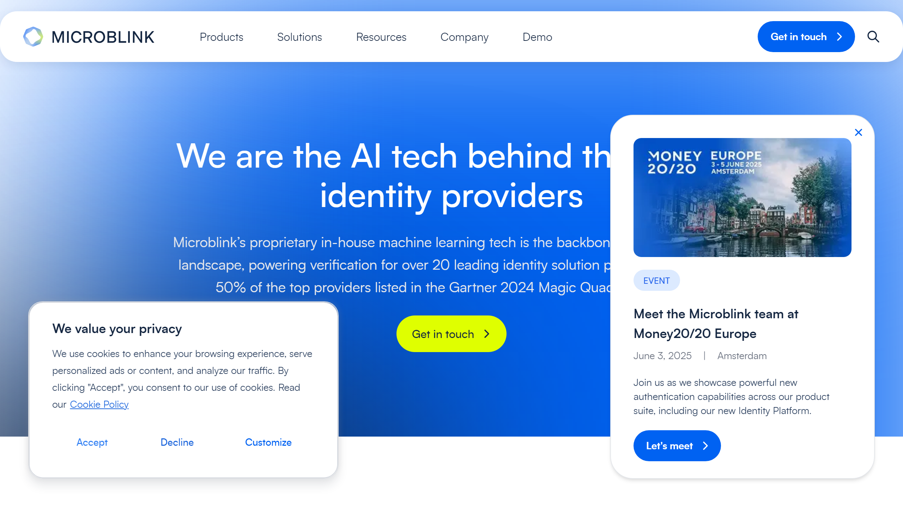

# Microblink  

Microblink delivers advanced AI and machine learning solutions for identity verification, document scanning, and intelligent data extraction, empowering businesses to enhance digital onboarding, authentication, and operational efficiency.  

## Overview  
Founded in 2014, Microblink is a global innovator in AI-powered solutions that combine modern computer vision and machine learning technologies to create seamless experiences for identity verification and data processing. The company specializes in providing lightweight, fast, and robust software solutions that empower businesses to automate the processing of identity documents like passports, driving licenses, and other forms of personal identification.  

Microblink serves industries such as financial services, retail, healthcare, travel, and government entities by focusing on improving customer experiences, streamlining verification processes, and enhancing operational compliance with KYC (Know Your Customer) and AML (Anti-Money Laundering) regulations. Its offerings are designed to integrate with existing systems, providing flexibility and scalability for businesses around the world.  

## Key Features  
- **AI-Powered OCR**: Industry-leading optical character recognition technology for extracting data from IDs, documents, and forms with unmatched speed and accuracy.  
- **Global ID Verification**: Supports over 6,000 document types from 230+ countries and regions, ensuring global reach and compliance.  
- **Mobile Integration**: Lightweight and powerful SDKs designed for deployment on mobile devices, enabling seamless real-time data capture.  
- **Edge Processing**: Processes data directly on devices to enhance speed and security, reducing dependence on cloud solutions.  
- **Customizable Workflows**: Tailor identity verification or data processing workflows to specific business and industry requirements.  

## Use Cases  
### Digital Onboarding  
Microblink helps banks and financial institutions digitize KYC by automating ID scanning and extracting customer data in seconds for seamless onboarding.  

### Retail and Loyalty Programs  
Retailers utilize Microblink’s mobile technology to instantly scan IDs or customer information for loyalty program registrations or age verification.  

### Travel and Hospitality Check-Ins  
Airlines, hotels, and rental services leverage Microblink’s solutions to speed up passenger or guest identification processes during check-ins.  

### Healthcare Document Digitization  
Healthcare providers deploy Microblink’s OCR technology to process insurance cards and patient IDs, reducing data entry errors and improving care delivery.  

## Technical Specifications  

| Feature              | Specification                         |  
|----------------------|---------------------------------------|  
| Deployment Options   | On-Device Edge Processing, Cloud, Hybrid |  
| Supported Languages  | 100+ (multi-language OCR support)      |  
| Supported Formats    | Passports, National IDs, Driver’s Licenses, Custom Forms |  
| SDKs                 | iOS, Android, Web, React Native, Cordova |  
| Security Standards   | GDPR-Compliant, End-to-End Encryption |  

## Getting Started  
Microblink provides a streamlined path for integration:  
1. Choose the product that fits your use case (e.g., Identity Verification, Data Capture SDK).  
2. Download the SDK or API documentation to integrate Microblink’s technology into your system.  
3. Configure and customize parameters like document types and data fields as per your requirements.  
4. Perform a test run with sample documents to validate accuracy and speed.  
5. Deploy the solution to production and train internal teams on application handling.  
6. Utilize ongoing support for feature enhancements and scaling.  

## Resources  
- [Vendor Website](https://microblink.com/)  
- [Documentation Hub](https://microblink.com/docs)  
- [Case Studies](https://microblink.com/customers)  

## Contact Information  
- Website: [microblink.com](https://www.microblink.com/)  
- Email: support@microblink.com  
- Phone: +1-347-817-7654  
