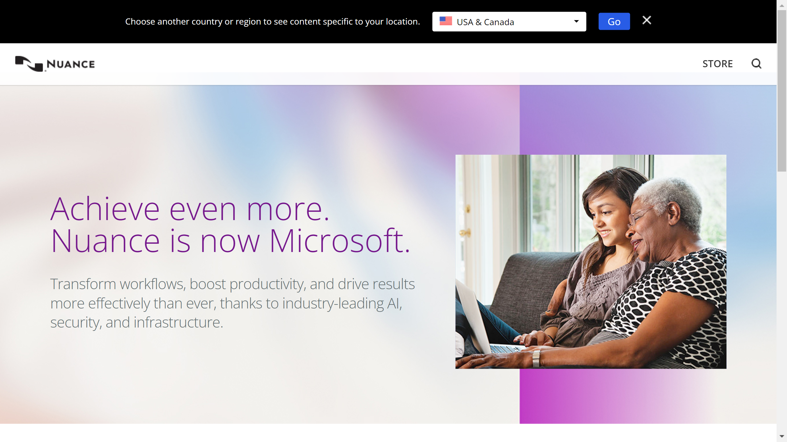

# Nuance by Microsoft

As Microsoft offers verious IDP solutions we start with Nuance. Nuance, now a part of Microsoft, delivers cutting-edge conversational AI, speech recognition, and ambient intelligence solutions tailored to healthcare, finance, customer service, and other industries.  

## Overview  
Nuance, originally founded in 1992 and acquired by Microsoft in 2021 for its expertise in conversational AI and speech technologies, has become a pillar of Microsoft's AI and industry cloud initiatives. The company's dominance in speech-to-text, natural language understanding, and AI-powered workflows has been particularly transformative for healthcare, enabling clinicians to focus on patient care rather than administrative tasks. With a focus on ambient intelligence and enterprise automation, Nuance integrates seamlessly with Microsoft’s powerful cloud platforms, such as Azure and Microsoft 365, empowering organizations to leverage scalable, secure, and innovative AI solutions.  

The signature offering, Dragon, remains a flagship product for dictation and documentation automation, while industry-specific integrations like DAX lead the way in healthcare automation.  

## Key Features  
- **Dragon Speech Recognition**: Provides world-leading dictation capabilities that convert speech into text with high accuracy.  
- **Dragon Ambient eXperience (DAX)**: Transforms patient-doctor conversations into clinical documentation without manual input.  
- **Conversational AI**: Delivers personalized, intelligent, and automated interactions for customer and employee communication.  
- **Healthcare AI Solutions**: Optimizes clinical workflows, enhances patient experiences, and reduces physician burnout.  
- **Fraud Prevention Tools**: Offers voice biometrics and AI-driven fraud detection for call centers and digital channels.  

## Use Cases  
### Healthcare Clinical Documentation  
Nuance’s AI-powered solutions, such as DAX, automatically transcribe and support clinical discussions in real time, enabling healthcare professionals to spend more time with patients and less on administrative tasks.  

### Customer Service Automation  
Call centers use Nuance's conversational AI to automate voice and digital communication, providing 24/7 support through personalized virtual agents and reducing operational costs.  

### Fraud Prevention and Voice Biometrics  
Financial services rely on Nuance’s voice biometrics to accurately identify callers, provide seamless authentication, and reduce the risk of identity fraud.  

### Productivity Enhancement in Enterprises  
Organizations integrate Dragon speech recognition tools into their workflows to automate document creation, streamline communication, and improve operational efficiency.  

## Technical Specifications  

| Feature              | Specification                        |  
|----------------------|--------------------------------------|  
| Deployment Options   | Cloud, On-Premises, Hybrid           |  
| Supported Languages  | Over 20 (including English, German, French, Spanish, etc.) |  
| Integrations         | Microsoft Teams, Azure, Microsoft 365, EHR systems (e.g., Epic, Cerner) |  
| Supported Platforms  | Windows, macOS, iOS, Android         |  

## Getting Started  
Microsoft ensures a streamlined onboarding process for Nuance solutions:  
1. Initial consultation to understand your organization’s workflow and automation needs.  
2. Deployment of the relevant Nuance solutions, such as Dragon or DAX, tailored to industry-specific requirements.  
3. Integration with Microsoft cloud platforms or existing IT environments.  
4. System testing and user training to maximize ROI.  
5. Go-live with robust support and continuous updates from Microsoft.  

## Resources  
- [Vendor Website](https://www.nuance.com/de-de/index.html)
