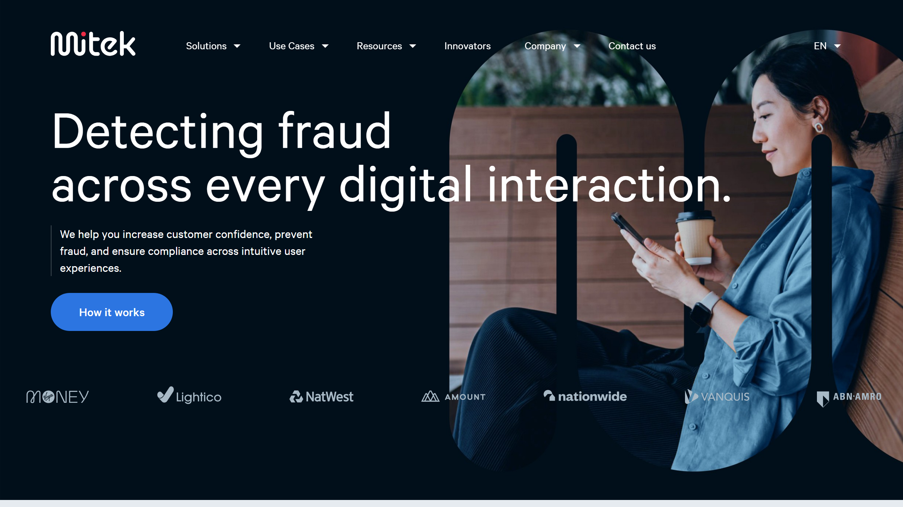

# Mitek Systems

Mitek Systems is a digital identity verification and fraud prevention provider serving over 7,000 organizations worldwide with products including MiVIP, MiPass, and Mobile Deposit.

## Overview

Mitek Systems specializes in AI-driven identity verification, biometric authentication, and fraud detection for banking, fintech, digital marketplaces, and iGaming sectors. The company invented the first Mobile Deposit solution in 2008 and acquired A2iA in May 2018, combining expertise in digital identity verification with document recognition technologies including [OCR](../../capabilities/ocr/index.md), ICR, and IWR. The acquisition brought together the largest private research group of PhD scientists in computer vision and machine learning for the identity verification industry.

## Key Features

- **MiVIP**: Identity verification platform combining document and biometric authentication
- **MiPass**: Multi-modal biometric authentication system
- **Digital Fraud Defender**: GenAI-powered fraud detection for identity verification
- **Check Fraud Defender**: Fraud detection specifically for check processing
- **Mobile Deposit**: Mobile check capture and processing solution
- **IDLive Face**: Passive face liveness detection technology
- **IDLive Doc**: Document liveness detection to prevent spoofing
- **IDLive Voice**: Anti-spoofing voice liveness verification
- **CheckReader**: Check recognition and processing with 80-90% straight-through processing
- **FieldReader**: Forms processing with intelligent character recognition
- **DocumentReader**: Digital mailroom and document automation

## Use Cases

### Banking and Financial Services
Financial institutions deploy Mitek's identity verification and check processing solutions for digital account opening, mobile deposit, and fraud prevention. The Mobile Deposit solution processes millions of checks globally, while MiVIP verifies customer identities during onboarding with document [classification](../../capabilities/classification/index.md) and biometric checks.

### Fintech Onboarding
Fintech companies use MiPass for biometric authentication and MiVIP for identity verification during customer registration. The platform combines document verification, facial recognition, and liveness detection to meet KYC compliance requirements while maintaining user experience.

### Fraud Prevention
Organizations implement Digital Fraud Defender and Check Fraud Defender to detect synthetic identities, document tampering, and presentation attacks. The systems use GenAI models to identify sophisticated fraud attempts in real-time during identity verification workflows.

## Technical Specifications

| Feature | Specification |
|---------|---------------|
| Core Products | MiVIP, MiPass, Digital Fraud Defender, Check Fraud Defender, Mobile Deposit, IDLive Face/Doc/Voice, CheckReader, FieldReader, DocumentReader |
| Recognition Technology | OCR, ICR, IWR (Intelligent Word Recognition) |
| Biometrics | Passive face liveness, voice liveness, document liveness |
| Fraud Detection | GenAI-powered synthetic identity detection |
| Deployment | SDKs, APIs, cloud services |
| Integration | Mobile apps, web applications |

## Resources

- [Website](https://www.miteksystems.com)
- [A2iA Products](https://www.a2ia.com)
- [Documentation](https://www.miteksystems.com/resources)

## Company Information

Headquarters: San Diego, California, United States

Founded: 1986

A2iA Acquisition: May 2018
