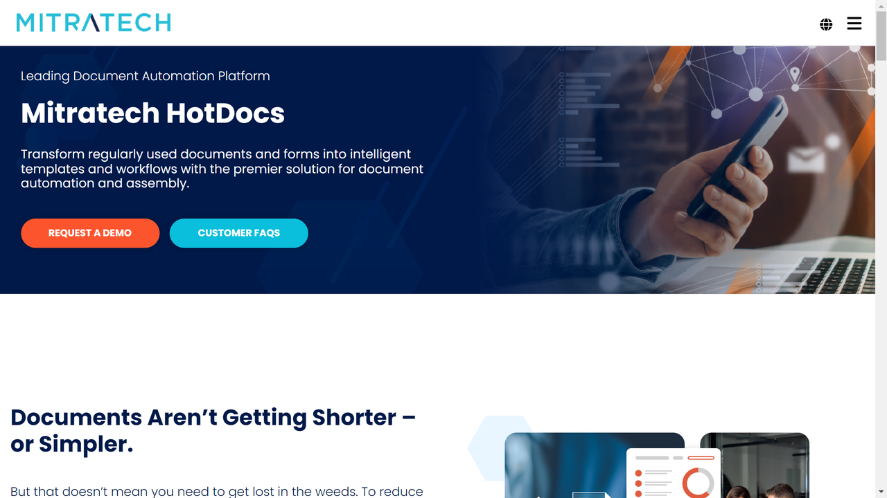

# Mobiltron  
  
[Mobiltron HotDocs](https://mitratech.com/products/hotdocs/) offers a centralized platform for managing customer interactions, automating business processes, and enhancing engagement through advanced customer relationship management (CRM), mobile solutions, and AI-driven tools.  

## Overview  
Mobiltron, established in 2015, provides a robust suite of solutions designed to enable businesses to engage effectively with their customers, automate customer-facing workflows, and centralize communications across channels. The company's emphasis on delivering seamless mobile experiences combined with its AI-driven analytics empowers organizations to boost customer retention, create personalized engagement strategies, and optimize overall operations.  

Industries ranging from telecommunications and retail to banking and SaaS leverage Mobiltron’s dynamic tools to gain a competitive edge in customer communication and engagement. Flexible deployment options, an easy-to-navigate interface, and compatibility with third-party enterprise applications make Mobiltron a preferred choice for businesses modernizing their customer journey.  

## Key Features  
- **Omnichannel Communication**: Centralize customer interactions across email, SMS, mobile apps, and social media for consistent messaging.  
- **AI-Powered Engagement**: Use AI-driven analytics to predict customer preferences and automate personalized marketing campaigns.  
- **Mobile CRM Integration**: Integrate mobile-optimized tools into existing CRMs to provide a seamless mobile-first user experience.  
- **Automation Workflows**: Automate customer support and marketing workflows to reduce manual work and improve responsiveness.  
- **Customizable Engagement Journeys**: Design tailored engagement strategies that adapt dynamically to customer behavior.  

## Use Cases  
### Telecom Customer Engagement  
Mobiltron helps telecom operators automate billing reminders, strengthen customer loyalty programs, and resolve service inquiries seamlessly across channels.  

### Retail Marketing Automation  
Retailers use Mobiltron’s AI analytics to automate the delivery of personalized promotions, increasing conversion rates for new product launches.  

### SaaS User Onboarding  
SaaS companies deploy Mobiltron to optimize customer onboarding, retention, and proactive support workflows, ensuring higher subscription renewals.  

### Banking Notifications & Alerts  
Banks leverage Mobiltron’s secure communication tools to send fraud alerts, transaction updates, and personalized financial product recommendations to clients.  

## Technical Specifications  

| Feature              | Specification                         |  
|----------------------|---------------------------------------|  
| Deployment Options   | Cloud, Hybrid, On-Premises            |  
| Supported Channels   | Email, SMS, Mobile Push Notifications, In-App Messaging, Social Media |  
| Integration Options  | APIs, Salesforce, Microsoft Dynamics, SAP CRMs |  
| AI & Analytics       | Predictive Analytics, Sentiment Analysis, Real-Time Reporting |  
| Compliance Standards | GDPR, HIPAA, ISO Certifications       |  

## Getting Started  
Mobiltron offers a guided implementation process:  
1. Schedule a discovery session to outline customer engagement goals and integration needs.  
2. Deploy Mobiltron’s omnichannel platform and configure workflows tailored to your industry.  
3. Integrate the platform with your existing CRM, ERP, and data systems via APIs or connectors.  
4. Launch pilot projects to test automation workflows and refine engagement strategies.  
5. Scale the platform across teams and monitor customer insights using Mobiltron's analytics dashboard.  
6. Access ongoing support and updates to adapt to evolving market and business needs.  

## Resources  
- [Vendor Website](https://www.mobiltron.com/)  
- [Case Studies](https://www.mobiltron.com/resources)  
- [Technical Documentation](https://www.mobiltron.com/docs)  

## Contact Information  
- Website: [mobiltron.com](https://www.mobiltron.com/)  
- Email: info@mobiltron.com  
