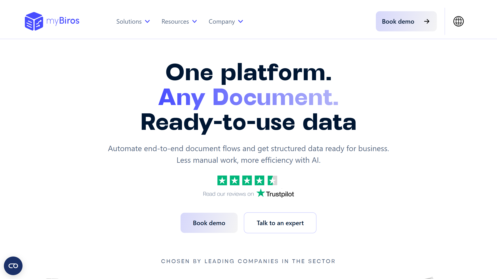

# myBiros

myBiros provides cloud-based intelligent document processing for insurance, financial services, and utilities, combining small language models with OCR and computer vision.

## Overview

myBiros operates a cloud-only IDP platform that automates end-to-end document workflows through a four-stage pipeline: Carica (Upload), Analizza (Analyze), Valida (Validate), and Integra (Integrate). Based in Rome, Italy, the company focuses on European markets with servers located in the EU and support for 20 languages including Italian, English, French, Spanish, German, and Portuguese. The platform serves insurance companies for customer onboarding and claims management, financial institutions for lending and debt recovery, and utility providers for offer subscription and comparison workflows. With over 10 years of AI research and development, myBiros processes structured, semi-structured, and unstructured documents including bills, payslips, identity documents, receipts, and custom document types.

## Key Features

- **Technology Stack**: Combines small language models with [OCR](../../capabilities/ocr/index.md) and computer vision for document analysis
- **Automatic Document Recognition**: Identifies document types without configuration and performs key-value pair [extraction](../../capabilities/extraction/index.md)
- **Table Processing**: Line-item extraction and table structure recognition for complex layouts
- **Validation System**: Confidence scoring, anomaly flagging, and signature detection for quality assurance
- **Language Support**: Processes documents in 20 European languages with server infrastructure in the EU
- **Integration Capabilities**: API access with exports to ERP, CRM, and RPA systems in multiple formats

## Use Cases

### Insurance Claims Management

Insurance companies process claim submissions by automatically extracting policy numbers, claim amounts, incident details, and supporting documentation from photos, repair estimates, and medical reports. The platform identifies document types from mixed submissions, extracts line items from invoices and receipts, and validates consistency across related documents. Confidence scores on extracted fields enable automated processing of high-confidence claims while routing uncertain cases for human review. Integration with claims management systems populates case files and triggers approval workflows.

### Financial Services Onboarding

Banks and lenders streamline customer onboarding by processing identity documents, income verification, and financial statements. The platform extracts personal information from passports and ID cards with signature detection for authentication, pulls salary data and employment details from payslips, and identifies bank account information from statements. Multi-document validation checks consistency across submitted materials to detect potential fraud or errors. Extracted data flows directly into CRM systems and triggers credit assessment workflows.

## Technical Specifications

| Feature | Specification |
|---------|---------------|
| Core Technology | Small language models, OCR, computer vision |
| Processing Pipeline | Four-stage: Upload, Analyze, Validate, Integrate |
| Deployment | Cloud-only (European servers) |
| Languages Supported | 20 languages including Italian, English, French, Spanish, German, Portuguese, Czech, Danish, Dutch, Finnish, Hungarian, Lithuanian, Norwegian, Polish, Romanian, Slovak, Slovene, Catalan, Swedish |
| Document Types | Bills, payslips, ID cards, passports, receipts, custom documents |
| Integration | API, ERP/CRM/RPA exports, multiple format support |
| Target Industries | Insurance, Financial Services, Utilities |
| Compliance | GDPR compliant, EU server infrastructure |

## Resources

- [Website](https://www.mybiros.com/en/)
- [API Documentation](https://docs-platform.mybiros.com/v1/)
- [All Documents](https://www.mybiros.com/en/soluzioni)

## Company Information

Headquarters: Rome, Italy

Email: info@mybiros.com

Contact: [Book Demo](https://www.mybiros.com/prenota-demo)

Clients: 50+ enterprise clients served
