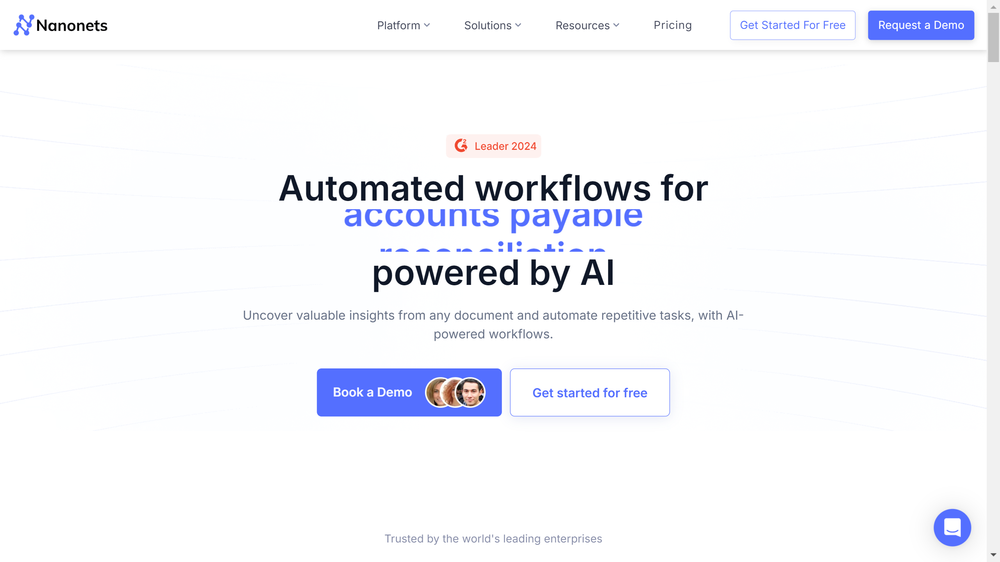

# Nanonets

[Nanonets]](https://nanonets.com/) is an AI-powered intelligent document processing and workflow automation cloud platform that leverages advanced OCR and machine learning to extract data from unstructured documents and automate document-intensive business processes.

## Overview

Nanonets provides a comprehensive suite of document automation solutions designed to transform how businesses handle document processing and data extraction. Using artificial intelligence, machine learning, and advanced OCR technology, Nanonets enables organizations to automate manual document workflows, extract structured data from unstructured sources, and streamline operations across various business functions.

Founded in 2016 by Sarthak Jain and Prathamesh Juvatkar [[1]](https://yourstory.com/2024/08/nanonets-helps-business-drive-efficiency-ai-driven-data-processing-automation), Nanonets has experienced significant growth, reportedly doubling its revenue year-over-year. The company recently secured $29 million in Series B funding led by Accel to further develop its autonomous AI agents for back-office operations [[2]](https://nanonets.com/blog/nanonets-raises-29-million-in-series-b/). Nanonets has an impressive customer base that includes over 34% of Global Fortune 500 companies [[3]](https://www.outlookbusiness.com/companies/nanonets-raises-29-million-in-series-b-from-accel-to-create-autonomous-ai-agent).

Nanonets serves organizations across various industries, with particular focus on finance, healthcare, real estate, and retail sectors where document-intensive processes are common. Their no-code platform approach makes their solutions accessible to businesses of all sizes, from small enterprises to large corporations looking to optimize document workflows and reduce manual data entry.

## Key Features

- **AI-Powered OCR**: High-accuracy text extraction from images and scanned documents
- **Template-Free Processing**: Automatic data extraction without predefined templates
- **Intelligent Document Classification**: Automatic categorization of incoming documents
- **Data Capture & Extraction**: Pulling structured data from unstructured documents
- **Workflow Automation**: End-to-end process automation for document-based tasks
- **Integration Capabilities**: Seamless connection with existing business systems
- **No-Code Platform**: User-friendly interface requiring minimal technical expertise
- **Machine Learning Models**: Continuously improving accuracy through AI learning
- **Multi-Format Support**: Processing diverse document types including invoices, receipts, forms
- **Validation Rules**: Customizable data verification to ensure accuracy
- **Batch Processing**: High-volume document handling capabilities
- **Analytics Dashboard**: Insights into document processing metrics and performance

## Products

### Intelligent Document Processing

Nanonets' core document processing solution combines advanced OCR technology with machine learning to automatically extract data from various document types with high accuracy. The platform can handle both structured and unstructured documents, automatically identifying relevant information without requiring predefined templates [[4]](https://nanonets.com/buyers-guide/ocr-software). This makes it particularly valuable for processing variable-format documents such as invoices from different vendors or forms with inconsistent layouts. The system's machine learning models continuously improve over time, learning from each processed document to enhance accuracy. With reported accuracy rates of up to 99% [[5]](https://jimcarter.me/ai-tools/nanonets/), the solution significantly reduces manual data entry requirements and associated errors. The platform supports multiple languages and can extract both text-based data and tabular information, making it versatile for various document processing needs across different industries and use cases.

### AP Automation

Nanonets' Accounts Payable Automation solution streamlines the entire AP workflow from invoice receipt to payment processing. The system automatically captures incoming invoices from various channels including email, scanned documents, and electronic formats. AI-powered extraction identifies and captures all relevant invoice data including header information, line items, payment terms, and tax details with minimal human intervention. Three-way matching functionality automatically compares invoice data against purchase orders and receiving documents to validate accuracy and prevent fraud or errors. The platform integrates with popular ERP and accounting systems including NetSuite, QuickBooks, Sage, and SAP to enable seamless data transfer and payment processing [[6]](https://nanonets.com/blog/netsuite-rest-api/). Customizable approval workflows route invoices to appropriate stakeholders based on predefined rules, with automated notifications to prevent processing delays. By automating the AP process, organizations can reduce processing costs, capture early payment discounts, eliminate duplicate payments, and gain better visibility into financial obligations.

### Receipt Processing

Nanonets' receipt processing solution automates the extraction and organization of data from expense receipts and related documents. The system captures receipts through multiple channels including mobile photos, email attachments, and scanned batches. AI-powered OCR technology extracts key information including merchant details, purchase date, itemized expenses, payment method, and tax information even from poorly scanned or photographed receipts. Automated classification organizes receipts by expense category, department, project, or other custom taxonomies to streamline expense management. Integration with popular expense management platforms such as Expensify, SAP Concur, and accounting systems allows seamless data transfer for reimbursement processing. The solution includes built-in compliance checks to flag potential policy violations or unusual spending patterns. By automating receipt processing, organizations can accelerate reimbursement cycles, improve expense policy compliance, reduce fraudulent claims through consistent verification, and gain better visibility into spending patterns for budget management.

## Use Cases

### Financial Document Processing

Financial institutions implement Nanonets to automate the processing of diverse financial documents including loan applications, account opening forms, and supporting documentation. The system automatically classifies incoming documents by type and extracts relevant customer information, financial data, and application details. Integration with core banking systems enables direct population of extracted data into customer records and processing systems. Validation rules automatically check for completeness, consistency, and compliance with regulatory requirements, flagging exceptions for human review. Workflow automation routes documents to appropriate departments and stakeholders based on document type and content. This implementation reduces application processing times from days to hours, improves data accuracy through elimination of manual entry errors, enhances customer experience through faster service delivery, and increases staff productivity by focusing human resources on exception handling and customer interaction rather than routine data entry.

### Healthcare Records Management

Healthcare providers utilize Nanonets to streamline the processing and management of patient documentation and medical records. The system automatically processes various healthcare documents including insurance cards, patient intake forms, medical history questionnaires, and test results. OCR technology extracts patient demographics, insurance information, medical history, and clinical data with high accuracy. Integration with electronic health record (EHR) systems enables direct population of extracted data, eliminating manual transcription. Automated classification organizes documents within the appropriate patient records and medical categories. Compliance features ensure proper handling of protected health information (PHI) in accordance with HIPAA regulations. This approach accelerates patient onboarding through faster document processing, reduces administrative burden on medical staff, improves data accuracy for better clinical decision-making, and enhances compliance through consistent documentation practices.

### Supply Chain Document Automation

Manufacturing and logistics companies implement Nanonets to automate the processing of supply chain documentation including purchase orders, packing lists, bills of lading, and customs forms. The system captures documents from various sources including email, EDI, and scanned paper documents. Intelligent extraction identifies and captures key information including order details, product specifications, quantities, shipping information, and customs classifications. Integration with ERP and warehouse management systems enables automated data transfer to operational systems. Validation rules automatically compare document data against expected values based on business rules, flagging discrepancies for review. This implementation reduces order processing times and associated delays, improves inventory accuracy through timely and accurate documentation processing, enhances compliance with customs and regulatory requirements, and provides better visibility into supply chain documentation for improved planning and management.

## Technical Specifications

| Feature | Specification |
|---------|---------------|
| Deployment | Cloud-based SaaS solution |
| OCR Accuracy | Up to 99% on clear documents |
| API Availability | RESTful API for custom integrations |
| Document Formats | PDF, JPEG, PNG, TIFF, BMP, Microsoft Office formats |
| Languages Supported | Multiple languages for text extraction |
| Integration Capabilities | Pre-built connectors for ERPs, CRMs, and accounting systems |
| Processing Speed | Variable based on document complexity and volume |
| Security | SOC 2 compliance, encryption for data in transit and at rest |
| Machine Learning | Self-improving models that learn from corrections |
| User Interface | No-code web interface for configuration and management |
| Scalability | Enterprise-grade for high-volume processing |
| Mobile Support | Mobile capture capabilities via dedicated apps |

## Getting Started

1. **Requirements Analysis**: Assessment of document processing needs
2. **Solution Design**: Configuration based on document types and workflows
3. **Model Training**: Optimization for specific document formats (if needed)
4. **System Integration**: Connection with existing business systems
5. **Workflow Configuration**: Setup of automated processing rules and paths

## Resources

- [Company Website](https://nanonets.com/)
- [Product Documentation](https://nanonets.com/documentation/)
- [AP Automation Information](https://nanonets.com/ap-automation)
- [Document OCR Capabilities](https://nanonets.com/document-ocr)

## Contact Information

- Website: [nanonets.com](https://nanonets.com/)
- Founded: 2016
- Founders: Sarthak Jain and Prathamesh Juvatkar
- Recent Funding: $29 million Series B (2024)
