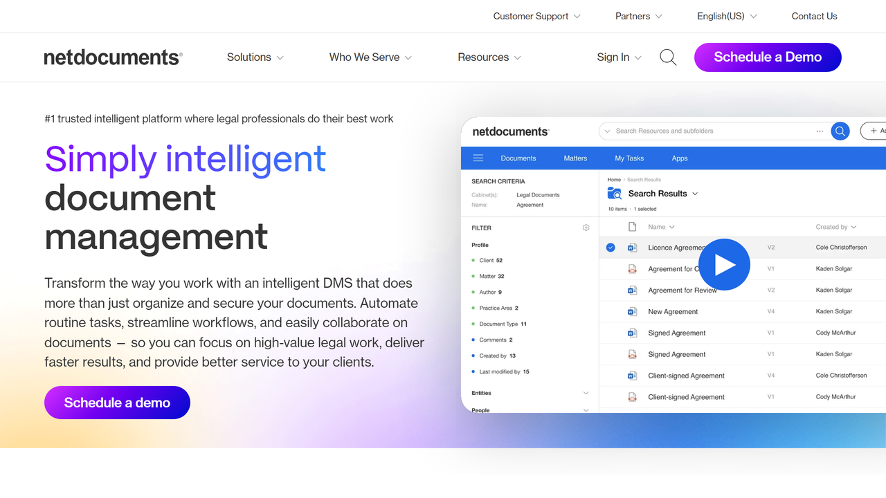

# NetDocuments

NetDocuments is a Utah-based cloud-native document and email management platform provider specializing in secure content management solutions for legal professionals and organizations.

## Overview

NetDocuments, founded in 1999 and headquartered in Lehi, Utah, operates a cloud-based document management system designed specifically for legal organizations including law firms, corporate legal departments, and government agencies. The platform serves thousands of customers globally, including many Am Law 100 firms, providing document storage, email management, collaboration tools, and workflow automation built for legal compliance and security requirements.

The company pioneered the cloud-first approach to legal document management, offering a true SaaS solution with no on-premise infrastructure. NetDocuments integrates with Microsoft 365, Salesforce, DocuSign, and other legal technology platforms, enabling matter-centric organization of documents and communications. In 2024, NetDocuments expanded its platform with AI profiling for documents and agentic AI tools for editing within Microsoft Word.

## Key Features

- **Cloud-Native DMS**: True SaaS document management without on-premise infrastructure
- **Email Management**: Outlook integration for filing and organizing legal communications
- **Matter-Centric Workspaces**: Content organization by client, matter, or practice area
- **Version Control**: Complete document history with comparison and restoration
- **AI-Powered Search**: Advanced content discovery across document repositories
- **Legal AI Assistant**: Document analysis, information extraction, and summarization
- **Agentic AI Tools**: AI-powered editing assistance within Microsoft Word
- **Collaboration Features**: Secure sharing, co-authoring, and commenting
- **Microsoft 365 Integration**: Seamless Office and Teams connections
- **Client Portals**: Secure external stakeholder access to matter documents
- **Records Management**: Retention policies and compliance controls
- **Mobile Applications**: iOS and Android access to documents

## Use Cases

### Law Firm Document Management

Law firms organize client documents, emails, and work product within matter-centric workspaces. Attorneys file Outlook communications directly into appropriate matters, search across complete repositories for precedents, and maintain version history with document comparison capabilities. Secure collaboration features enable sharing with clients through ClientPortal and co-authoring with colleagues.

### Corporate Legal Department Governance

Corporate legal departments manage contracts, litigation documents, legal opinions, and corporate records with role-based security controls. Workflow automation streamlines contract review and approval processes, while integration with CRM, ERP, and HR systems creates unified legal information management. Records retention policies enforce compliance with regulatory requirements while maintaining audit trails.

### Matter Collaboration

Legal teams collaborate on transactions and cases by sharing documents within secure workspaces. Multiple attorneys edit documents with version control tracking all changes, while client portals provide external stakeholders controlled access to relevant materials. Advanced search locates precedents and research across organizational knowledge bases.

## Technical Specifications

| Feature | Specification |
|---------|---------------|
| Deployment Model | Cloud-native SaaS (no on-premise option) |
| Security Certifications | ISO 27001, SOC 2 Type 2, FedRAMP Authorization |
| Encryption | AES 256-bit with multi-layered key management |
| Integration Ecosystem | Microsoft 365, Salesforce, DocuSign, iManage, legal practice management |
| Mobile Support | iOS and Android native applications |
| Search Technology | Full-text, metadata, Boolean operators, AI-enhanced |
| Email Management | Outlook integration, PDF conversion, filing automation |
| AI Capabilities | Document analysis, extraction, summarization, agentic editing |
| Collaboration Tools | Co-authoring, secure sharing, commenting, client portals |
| Compliance Features | Ethical walls, need-to-know security, audit trails, retention policies |
| Geographic Reach | North America, Europe, Asia, Australia, South America |

## Getting Started

1. **Needs Assessment**: Evaluate document management and collaboration requirements
2. **Configuration**: Set up workspace structure and security policies
3. **Data Migration**: Transfer existing documents and emails to cloud platform
4. **Training**: User education for attorneys, paralegals, and support staff
5. **Integration**: Connect with practice management and enterprise systems

## Resources

- [Website](https://www.netdocuments.com/)
- [Document Management Solutions](https://www.netdocuments.com/solutions/document-management-software/)
- [Support Center](https://support.netdocuments.com/)

## Company Information

Headquarters: Lehi, Utah, United States

Founded: 1999

Address: 2500 W Executive Parkway, Lehi, UT 84043

Target Markets: Law firms (all sizes), corporate legal departments, government agencies, public sector

Notable Clients: Many Am Law 100 firms

Contact: [Sales Contact Page](https://www.netdocuments.com/contact/)
