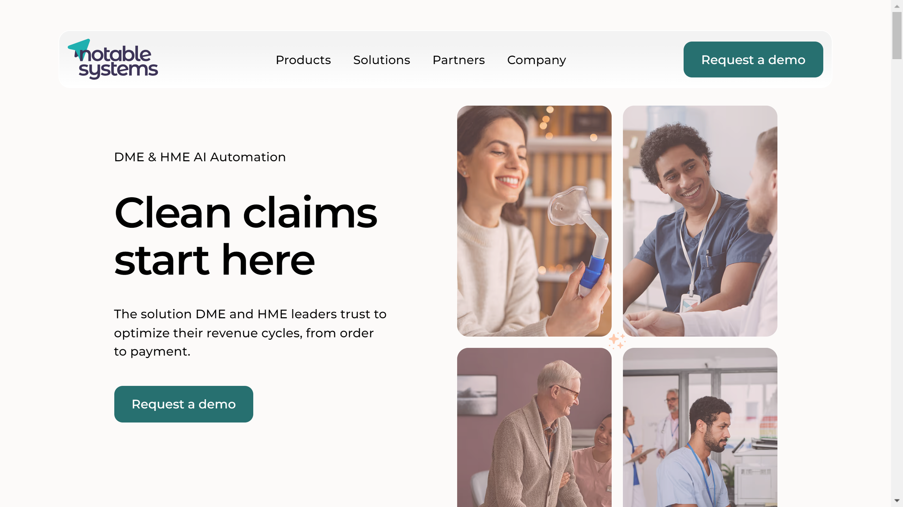

# Notable Systems

Notable Systems is a healthcare automation company providing AI-powered document processing for DME and HME revenue cycle management, reducing manual data entry costs.

## Overview

Notable Systems specializes in automating healthcare revenue cycle workflows for durable medical equipment (DME) and home medical equipment (HME) providers. Founded in 2015, the company uses proprietary AI and machine learning models to extract patient, provider, payor, and diagnosis information from healthcare documents. The platform handles handwritten and unstructured documents with HIPAA-compliant technology, serving healthcare organizations, manufacturers, hospital systems, and revenue cycle management providers. Notable Systems raised $8.8 million in Series A funding in July 2024.

## Key Features

- **Intelligent Data Extraction**: Proprietary AI and ML models for healthcare document [extraction](../../capabilities/extraction/index.md)
- **Automatic Document Classification**: Machine learning-based document identification and categorization
- **Handwriting Recognition**: Processing of handwritten healthcare forms and prescriptions
- **Order Intake Automation**: Automated processing from document intake to qualification
- **HIPAA-Compliant Processing**: Healthcare data security and privacy compliance
- **Revenue Cycle Integration**: Direct workflow integration for billing and claims processing
- **Structured Data Output**: Clean, formatted data delivery to downstream systems

## Use Cases

### DME/HME Order Processing
DME and HME providers use Notable Systems to automate order intake by extracting patient information, prescriptions, and insurance details from referral documents. The system processes handwritten physician orders and unstructured faxes, delivering structured data directly to order management systems to accelerate fulfillment.

### Healthcare Claims Automation
Revenue cycle management companies implement Notable Systems for claims processing automation. The platform extracts diagnosis codes, procedure information, and billing details from clinical documents, reducing denials through accurate data capture and accelerating reimbursement timelines.

### Patient Data Collection
Healthcare organizations automate clinical data collection by processing patient intake forms, medical history documents, and insurance cards. The system extracts demographic information, medical history, and coverage details while maintaining HIPAA compliance for electronic health record integration.

## Technical Specifications

| Feature | Specification |
|---------|---------------|
| Core Technology | Proprietary AI and machine learning models |
| Document Processing | [OCR](../../capabilities/ocr/index.md), handwriting recognition, unstructured data extraction |
| Automation | Document classification, data extraction, workflow integration |
| Compliance | HIPAA-compliant |
| Data Output | Structured, clean data for direct workflow integration |
| Target Sector | Healthcare (DME/HME providers, hospitals, RCM providers) |
| Use Cases | Order intake, claims processing, clinical data collection |

## Resources

- [Website](https://notablesystems.com)
- [Order Intake Automation](https://notablesystems.com/order-intake)
- [Axios Funding Announcement](https://www.axios.com/pro/health-tech-deals/2024/07/18/noteable-systems-automated-document-processing)

## Company Information

Headquarters: Denver, Colorado, United States (35 Eudora St, Denver, CO 80220)

Founded: 2015

CEO: Steve Johnson

Recent Executives: Brian Nannie (SVP Client Strategy & Innovation), Gaurav Nukala (SVP Product) - June 2025 