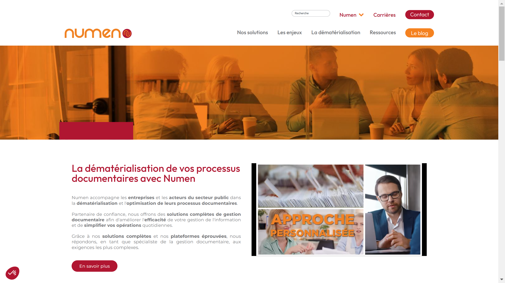

# Numen  
  
[Numen](https://www.numen.fr/) delivers comprehensive digital transformation and document management solutions, leveraging cutting-edge technology to help businesses optimize their information systems, automate workflows, and ensure compliance with regulatory standards.  

## Overview  
With over 50 years of expertise, Numen is a European leader in digital and document transformation services. The company specializes in handling large-scale document digitization, electronic archiving, data processing, and business process outsourcing (BPO) to enable efficient management of enterprise information.  

Headquartered in France, Numen offers tailored solutions across industries like finance, healthcare, legal, and government, focusing on compliance, security, and operational optimization. It delivers end-to-end services, from capturing and indexing physical documents to deploying sophisticated digital workflows that facilitate the seamless exchange of information.  

By integrating advanced technologies like AI, OCR, and electronic certification, Numen empowers businesses to transition to paperless operations, enhance productivity, and ensure regulatory compliance in an increasingly digital age.  

## Key Features  
- **Document Digitization**: Offers high-volume scanning and OCR solutions to convert paper records into digital formats.  
- **Electronic Archiving**: Provides secure, GDPR-compliant, long-term digital storage with advanced retrieval options.  
- **AI-Enhanced Automation**: Utilizes AI to categorize, analyze, and process documents intelligently for faster workflows.  
- **Workflow Optimization**: Designs workflow automation solutions to streamline document-heavy processes efficiently.  
- **Regulatory Compliance Services**: Ensures adherence to legal and industry-specific standards, including GDPR and EU eIDAS.  

## Use Cases  
### Financial Records Processing  
Numen helps financial institutions digitize and manage loan applications, invoices, and compliance documents, reducing processing times and operational costs.  

### Healthcare Document Management  
Hospitals and healthcare providers rely on Numen to digitize patient records, lab results, and insurance claims for secure and efficient access.  

### Legal Compliance in Documentation  
Law firms use Numen’s solutions to ensure document traceability, digital signatures, and compliance with legal archival standards.  

### Government Records Digitization  
Public administrations work with Numen to digitize archives, enhance citizen services, and deploy governance-focused document workflows.  

## Technical Specifications  

| Feature              | Specification                         |  
|----------------------|---------------------------------------|  
| Deployment Options   | SaaS, On-Premises, Hybrid             |  
| Digitization Capacity| High-volume (millions of pages/month) |  
| Supported Formats    | PDF/A, XML, TIFF, JPEG               |  
| Integrations         | ERP, CRM, DMS, Custom APIs           |  
| Compliance Standards | GDPR, eIDAS, ISO 27001               |  

## Getting Started  
Numen's tailored approach ensures a seamless transition to its solutions:  
1. Consultation with Numen experts to assess document processing needs and goals.  
2. Audit of existing systems and workflows to design a customized implementation plan.  
3. Deployment of digitization technology and workflow automation tools.  
4. Integration with enterprise systems like ERPs or CRMs for end-to-end data flow.  
5. User training and initial system testing for quality assurance and process refinement.  
6. Continuous support and service updates to optimize system performance over time.  
  

