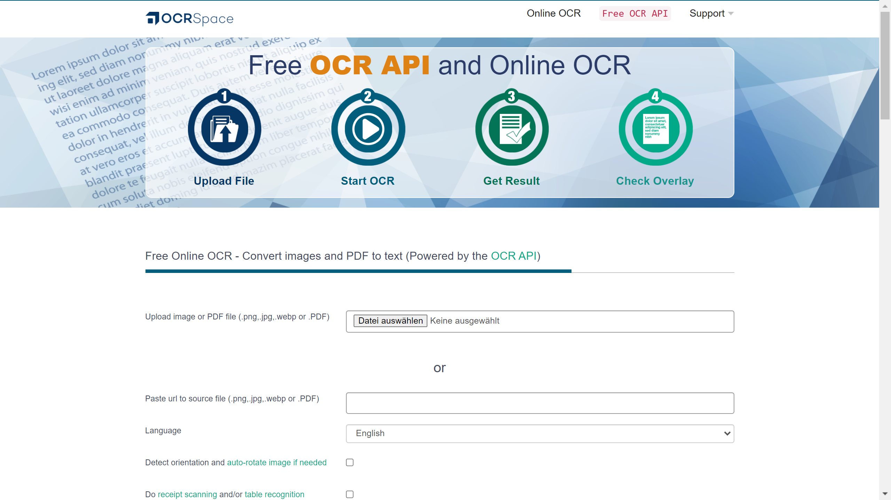

# OCR.space

OCR.space is a free online OCR service and API operated by a9t9 software GmbH, converting images and PDFs to text with support for 100+ languages.

## Overview

OCR.space provides web-based and API access to [OCR](../../capabilities/ocr/index.md) services for converting scanned documents, images, and PDFs into editable text. The service requires no registration for basic use and offers both free and PRO tiers. Operated by a9t9 software GmbH, OCR.space supports over 100 languages across two OCR engines optimized for different text types. The platform integrates with the Ui.Vision RPA ecosystem and provides developer-friendly API access with support for multiple programming languages including Python, Java, and .NET.

## Key Features

- **Dual OCR Engines**: Engine 1 optimized for speed and language coverage, Engine 2 specialized for numbers and special characters
- **100+ Language Support**: Full support for major languages including English, Chinese, Japanese, Korean, Arabic, Russian, and European languages
- **Free API Access**: 25,000 requests per month on free tier without registration
- **Multiple File Formats**: JPG, PNG, GIF, PDF support with 5MB file size limit for free tier
- **Searchable PDF Creation**: Output with visible or invisible text layers
- **Receipt and Table Recognition**: Specialized processing for structured documents
- **Image Auto-Rotation**: Automatic orientation detection and correction
- **Browser Extension**: Direct browser integration for OCR processing
- **RPA Integration**: Part of Ui.Vision RPA automation toolkit

## Use Cases

### Document Digitization
Organizations use OCR.space's free API to digitize scanned documents and legacy paper records. The service processes batches of images up to the monthly limit, extracting text for archival systems and making historical documents searchable without upfront costs.

### Receipt Processing
Applications integrate OCR.space for receipt scanning by leveraging the specialized receipt recognition feature. The dual-engine approach handles both printed text and numerical data extraction from various receipt formats across different languages.

### Multilingual Content Extraction
Companies with international operations use OCR.space to extract text from documents in 100+ languages. The system processes mixed-language documents and automatically handles character sets from Latin, Cyrillic, Asian, and Arabic scripts.

## Technical Specifications

| Feature | Specification |
|---------|---------------|
| Operator | a9t9 software GmbH |
| OCR Engines | Engine 1 (speed-optimized), Engine 2 (numbers/special characters) |
| Language Support | 100+ languages |
| Free Tier | 25,000 requests/month, no registration |
| File Formats | JPG, PNG, GIF, PDF |
| File Size Limit | 5MB (free tier) |
| Output Formats | Text, searchable PDF |
| Special Features | Receipt recognition, table recognition, auto-rotation |
| API Support | REST API with Python, Java, .NET libraries |
| Integration | Ui.Vision RPA, browser extension |
| PRO Features | Faster processing, no PDF watermark, higher limits |
| PDF Watermark | Free tier adds "Generated by OCR.space" watermark |

## Resources

- [Website](https://ocr.space)
- [Free OCR API](https://ocr.space/ocrapi)
- [API Documentation](https://ocr.space/about)
- [OCR Comparison](https://ocr.space/compare-ocr-software)

## Company Information

Operator: a9t9 software GmbH 