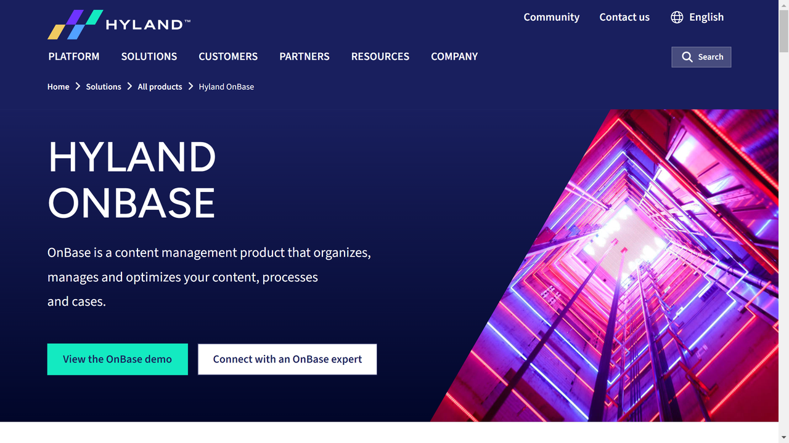

# OnBase - Hyland

OnBase by Hyland is a comprehensive enterprise content management (ECM) and process management platform that combines document management, case management, business process automation, records management, and capture capabilities in a single integrated solution.

## Overview

OnBase is a leading enterprise content services platform developed by Hyland Software. It provides a complete suite of content and process management capabilities designed to manage the entire lifecycle of content across an organization. The platform combines document management, workflow automation, electronic forms, case management, and integration tools in a unified system.

Founded in 1991, Hyland's OnBase platform has evolved into a robust solution serving thousands of organizations worldwide. The technology enables organizations to digitize paper-based processes, automate routine tasks, manage critical content, and connect systems and data sources while ensuring security and compliance.

OnBase serves organizations across various industries, with particular strength in healthcare, financial services, government, higher education, insurance, and manufacturing. Their solutions help these enterprises streamline operations, enhance customer service, improve decision-making, and reduce costs associated with managing information and processes.

## Key Features

- **Document Management**: Secure storage, retrieval, and version control
- **Workflow Automation**: Rules-based process routing and approvals
- **Case Management**: Comprehensive view of related content and activities
- **Records Management**: Lifecycle management with retention policies
- **Capture Solutions**: Multi-channel document and data capture
- **Electronic Forms**: Web-based forms with automated processing
- **Business Process Management**: Process modeling and optimization
- **Enterprise File Sync and Share**: Secure content collaboration
- **Integration Capabilities**: Connections with enterprise applications
- **Mobile Access**: Content and process interaction on any device

## Use Cases

### Enterprise-Wide Content Management

Organizations implement OnBase as their central content repository to consolidate information across departments and systems. The platform captures documents from multiple sources (scanners, email, fax, electronic forms) and automatically classifies and indexes them using OCR, barcode recognition, and machine learning technologies. Users access documents through intuitive interfaces, with permissions controlled by role-based security. Integration with line-of-business applications provides content in context, allowing users to retrieve related documents directly from familiar systems like ERP, CRM, or EMR. Advanced search capabilities enable quick location of information across millions of documents using metadata, full-text, or combination searches. This approach eliminates information silos, reduces storage costs through elimination of duplicate content, improves security through centralized access controls and audit trails, and enhances productivity by providing immediate access to critical information regardless of location or device.

### Accounts Payable Automation

Finance departments utilize OnBase to transform invoice processing operations. The solution captures incoming invoices from multiple channels and automatically extracts key data including vendor information, invoice numbers, line items, amounts, and payment terms. Workflow automation routes invoices through configurable approval processes based on amount thresholds, departments, GL codes, or other business rules. Integration with ERP systems enables three-way matching against purchase orders and receiving documents, while exception handling workflows direct discrepancies to appropriate personnel for resolution. Dashboards provide real-time visibility into invoice status, bottlenecks, and processing metrics. This implementation reduces invoice processing costs by up to 80%, shortens cycle times from weeks to days, improves visibility into financial obligations, captures early payment discounts, and strengthens vendor relationships through timely, accurate payments.

## Technical Specifications

| Feature | Specification |
|---------|---------------|
| Deployment Options | Cloud, On-premises, Hybrid |
| Capture Technologies | OCR, ICR, OMR, barcode, machine learning |
| Document Storage | Content-addressed storage with checksums |
| Security Features | Encryption, role-based access, audit trails |
| Workflow Engine | Visual configuration, parallel/serial processing |
| Integration Methods | APIs, pre-built connectors, screen-level integration |
| Search Capabilities | Full-text, metadata, Boolean, proximity |
| Mobile Support | Native iOS and Android applications |
| Scalability | Enterprise-grade, high-volume processing |
| Compliance Support | GDPR, HIPAA, SOX, FDA, and industry-specific regulations |

## Getting Started

1. **Solution Planning**: Assessment of content and process requirements
2. **Configuration**: Tailoring the system to organizational needs
3. **Integration**: Connection with existing business systems
4. **Training**: User education and knowledge transfer
5. **Go-Live Support**: Transition assistance and optimization

## Resources

- [Company Website](https://www.hyland.com/en/platform/product-suite/onbase)
