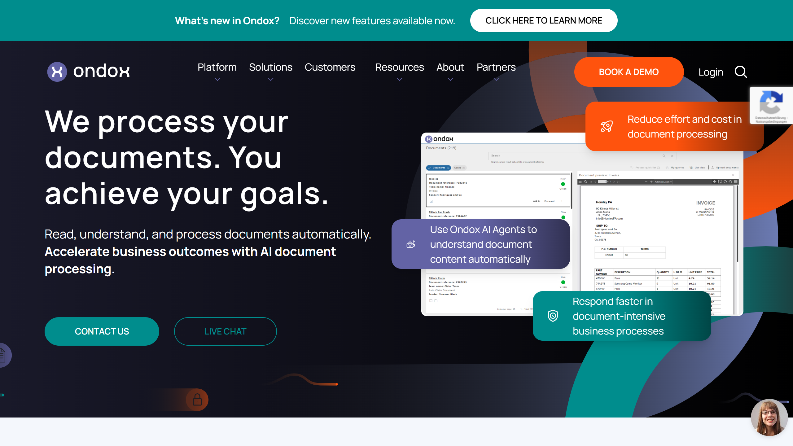

# Ondox

Ondox provides AI-powered document processing for insurance, financial services, and government agencies using large language models including OpenAI GPT and Anthropic Claude.

## Overview

Ondox operates a cloud-based document processing platform that automates intake, extraction, routing, and distribution workflows for unstructured documents. The platform integrates OpenAI GPT and Anthropic Claude language models to process documents in real-time, handling paper mail, email attachments, forms, and invoices without requiring templates or pre-configuration. Serving over 1 million users across insurance, banking, government, logistics, healthcare, and BPO sectors, Ondox provides regional deployments in the EU and North America with SOC2, GDPR, and HIPAA compliance. The platform includes digital mailroom automation, inbox management, case management workspaces, and analytics dashboards with no-code workflow configuration for operations teams.

## Key Features

- **Large Language Models**: Integrates OpenAI GPT and Anthropic Claude for [document understanding](../../capabilities/document-understanding/index.md) and [extraction](../../capabilities/extraction/index.md)
- **Document Processing Pipeline**: Automated labeling, routing, extraction, and distribution without template configuration
- **Case Management**: Document and case workspaces with external sharing capabilities and collaboration tools
- **No-Code Interface**: Operations teams configure workflows and routing rules without developer support
- **Real-Time Processing**: Document stream processing with analytics and monitoring dashboards
- **Security Architecture**: Data encryption at rest and in transit, role-based access controls, and audit trails

## Use Cases

### Insurance Claims Processing

Insurance carriers automate claims intake by processing submissions from email, mobile apps, and customer portals. Ondox classifies incoming documents as policies, claims forms, photos, repair estimates, or medical records, then extracts relevant policy numbers, claim amounts, incident dates, and loss details. The platform routes complete submissions to adjusters while flagging incomplete cases for follow-up. Case workspaces aggregate all documents related to a claim number, enabling adjusters to review materials and share information with external repair shops or medical providers. Analytics dashboards track processing volumes and turnaround times across claim types.

### Digital Mailroom Automation

Organizations process physical mail and email by digitizing incoming correspondence and routing documents to appropriate departments. Ondox identifies document types from scanned mail batches, extracts sender information and reference numbers, and distributes items to case management workspaces or employee inboxes based on routing rules. The system handles invoices by extracting vendor details and amounts for accounts payable, routes customer inquiries to service teams with extracted contact information, and archives correspondence for compliance. External sharing enables collaboration with vendors and partners without granting system access.

## Technical Specifications

| Feature | Specification |
|---------|---------------|
| Core Technology | OpenAI GPT, Anthropic Claude large language models |
| Processing Capabilities | Document labeling, routing, extraction, case management, analytics |
| Document Types | Paper mail, email attachments, forms, invoices |
| Deployment | Cloud-based with EU and North America regional instances |
| Security | Data encryption at rest/in transit, role-based access, audit trails |
| Compliance | SOC2, GDPR, HIPAA ready |
| Interface | No-code workflow configuration |
| Target Industries | Insurance, Financial Services, Banking, Government, Logistics, Healthcare, BPO |
| User Base | 1+ million users |

## Resources

- [Website](https://www.ondox.ai)
- [Case Studies](https://www.ondox.ai/case-studies/)
- [Resources Hub](https://www.ondox.ai/resources/)
- [Pricing](https://www.ondox.ai/document-processing-pricing/)

## Company Information

Company: Ondox Limited

Regional Coverage: EU and North America deployments

Contact: [https://www.ondox.ai/contact](https://www.ondox.ai/contact)
