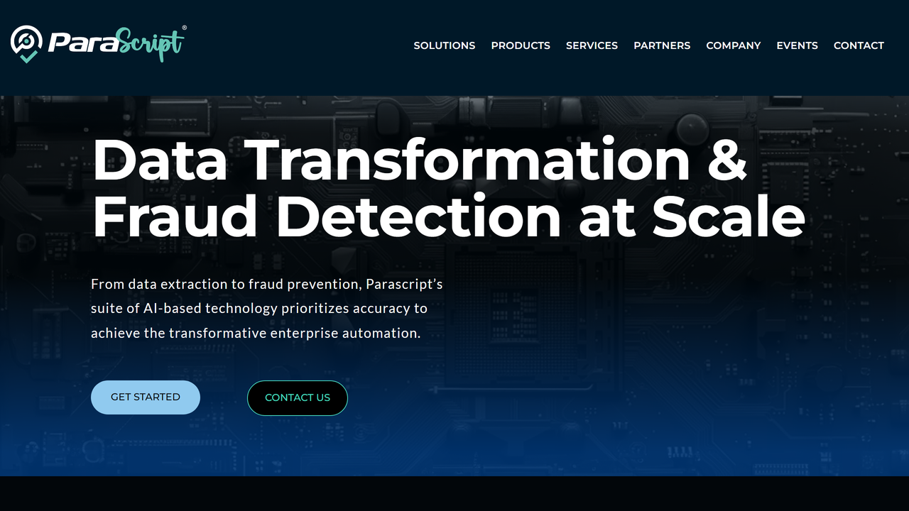

# Parascript

Parascript is a Colorado-based intelligent document processing provider specializing in advanced OCR, handwriting recognition, and automated data extraction for complex documents.

## Overview

Parascript, founded in 1996 and headquartered in Longmont, Colorado with an office in Paris, France, develops intelligent document recognition software combining machine learning, [OCR](../../capabilities/ocr/index.md), ICR (intelligent character recognition), and IWR (intelligent word recognition). The company's solutions process over 100 billion documents annually across financial services, healthcare, government, insurance, and logistics sectors.

The flagship product, FormXtra.AI, extracts both handwritten and machine-printed text from structured, semi-structured, and unstructured documents without requiring predefined templates. Parascript's technology handles machine print, constrained handprint, unconstrained handprint, and cursive handwriting within unified applications, offering self-learning capabilities that continuously improve accuracy through machine learning algorithms.

## Key Features

- **Advanced [OCR/ICR/IWR](../../capabilities/ocr/index.md)**: Recognition of machine print, all handwriting forms including cursive
- **Template-Free Processing**: Automated [document classification](../../capabilities/classification/index.md) and extraction without predefined templates
- **[Signature Verification](../../capabilities/extraction/index.md)**: Authentication of signatures on forms and checks
- **Check Processing**: MICR line reading with check information extraction
- **FormXtra.AI Platform**: Unified capture software for diverse document types
- **Self-Learning Technology**: Continuous accuracy improvement through machine learning
- **Unstructured Document Handling**: Processing of free-form documents with varied layouts
- **Validation Engine**: Configurable business rules and database lookups for data verification
- **API/SDK Integration**: Deployment through APIs and software development kits

## Use Cases

### Banking Document Automation

Financial institutions process loan applications, account forms, and checks through Parascript's recognition technology. The system classifies document types automatically and extracts customer details, account numbers, and handwritten entries with signature verification for authentication. Integration with core banking systems enables straight-through processing while flagging exceptions for review.

### Healthcare Claims Processing

Healthcare organizations automate claims forms, explanation of benefits documents, and medical records processing. Parascript extracts patient information, procedure codes, diagnostic data, and payment details regardless of form layout variations, understanding medical terminology and coding structures. Validation rules verify code combinations and identify compliance issues before submission.

### Insurance Form Processing

Insurance carriers process application forms, claims documents, and policy changes containing both structured fields and free-form handwritten sections. The technology extracts policyholder information, coverage details, and claim specifics from varied document formats, routing complete documents for automated processing and exceptions to adjusters.

## Technical Specifications

| Feature | Specification |
|---------|---------------|
| Recognition Technologies | Advanced OCR, ICR, IWR, OMR, barcode |
| Machine Learning | Supervised and unsupervised learning algorithms |
| Document Types | Forms, checks, unstructured documents, mixed batches |
| Processing Volume | 100+ billion documents annually |
| Accuracy Rates | Up to 99% for structured, 90%+ for semi-structured (claimed) |
| Integration Methods | REST APIs, SDKs, pre-built connectors |
| Deployment Options | On-premises, private cloud, hybrid |
| Language Support | Multilingual recognition |
| Output Formats | XML, JSON, CSV, searchable PDF |
| Validation Features | Business rules engine, database lookups, field-level verification |
| Handwriting Types | Constrained handprint, unconstrained handprint, cursive |

## Getting Started

1. **Document Analysis**: Assess document types and data extraction requirements
2. **Solution Design**: Configure recognition models and extraction rules
3. **Integration**: Deploy with APIs or SDKs connecting to business systems
4. **Optimization**: Fine-tune accuracy for specific document workflows
5. **Production**: Launch with ongoing monitoring and continuous improvement

## Resources

- [Website](https://www.parascript.com/)
- [FormXtra.AI Capture](https://www.parascript.com/formxtra-capture/)
- [FormXtra.AI SDK](https://www.parascript.com/formxtra-ai-sdk-document-automation/)
- [Intelligent OCR Software](https://www.parascript.com/intelligent-ocr-software/)

## Company Information

Headquarters: Longmont, Colorado, United States

Founded: 1996

Offices: Longmont (Colorado, USA), Paris (France)

Annual Processing Volume: 100+ billion documents

Industries: Financial services, healthcare, government, insurance, logistics

Specializations: Handwriting recognition, signature verification, check processing, complex document analysis
