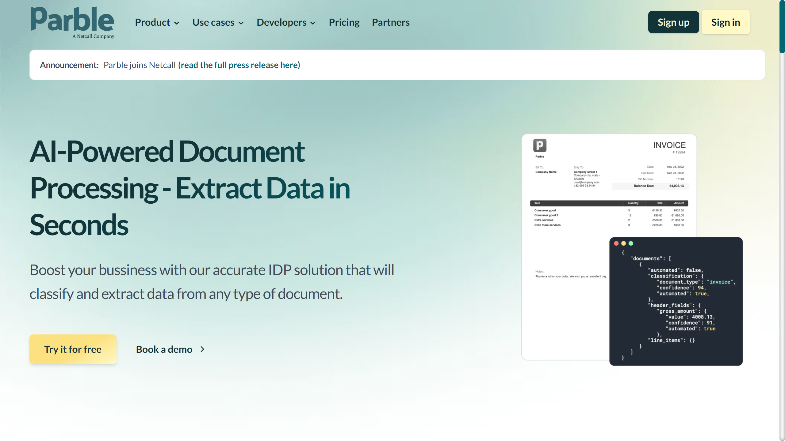

# Parble

Parble is a GenAI-powered IDP platform specializing in financial services automation, acquired by Netcall in September 2024.

## Overview

Parble (operated by Contract.fit) provides cloud-native intelligent document processing specifically designed for banking and insurance sectors. Founded in 2016 in Brussels, the platform automates claims handling, client onboarding, customer support documentation, and email indexation workflows using generative AI technology. The company serves major European financial institutions including Generali, Baloise, and Vanbreda Risk & Benefits. Netcall acquired Contract.fit in September 2024 for up to €8.7 million to integrate Parble's GenAI capabilities into its Liberty platform and establish a stronger presence in European financial services markets.

## Key Features

- **GenAI-Powered Processing**: Generative AI capabilities for document understanding
- **Cloud-Native Architecture**: Built for cloud deployment and scalability
- **High-Volume Automation**: Processing of enterprise-scale document volumes
- **Claims Handling**: Specialized workflows for insurance claims processing
- **Client Onboarding**: Automated document collection and verification
- **Email Indexation and Routing**: Automatic email classification and distribution
- **Financial Services Focus**: Purpose-built for banking and insurance sectors

## Use Cases

### Insurance Claims Processing
Insurance companies including Generali and Baloise use Parble to automate claims document handling. The system processes claim forms, supporting documents, and correspondence using GenAI to extract claim details, validate information, and route documents to appropriate claims handlers, achieving relevant time savings.

### Banking Client Onboarding
Banks implement Parble for customer onboarding by automating KYC document collection and verification. The platform processes identity documents, proof of address, and financial statements, extracting data for compliance systems and flagging incomplete applications for review.

### Email Management for Financial Services
Financial institutions use Parble's email indexation and routing to automatically categorize and distribute incoming correspondence. The system classifies emails by type and urgency, extracts key information, and routes messages to appropriate departments for faster response times.

## Technical Specifications

| Feature | Specification |
|---------|---------------|
| Platform Type | Cloud-native IDP |
| AI Technology | GenAI-powered |
| Document Volume | 58+ million processed to date |
| Time Savings | ~97% reported by customers |
| Target Industries | Financial services, insurance, banking |
| Customers | Generali, Baloise, Vanbreda Risk & Benefits |
| Use Cases | Claims handling, client onboarding, client support, email indexation/routing |

## Resources

- [Website](https://parble.com)
- [Netcall Acquisition Announcement](https://www.netcall.com/news/netcall-acquires-belgium-based-intelligent-document-processing-solution-parble/)

## Company Information

Headquarters: Brussels, Belgium

Founded: 2016

Acquisition: Netcall (September 2024, €8.7 million + €1.1M net debt)

Initial Consideration: €4.7 million

Status: Operating as part of Netcall with founders and employees remaining in Belgium 