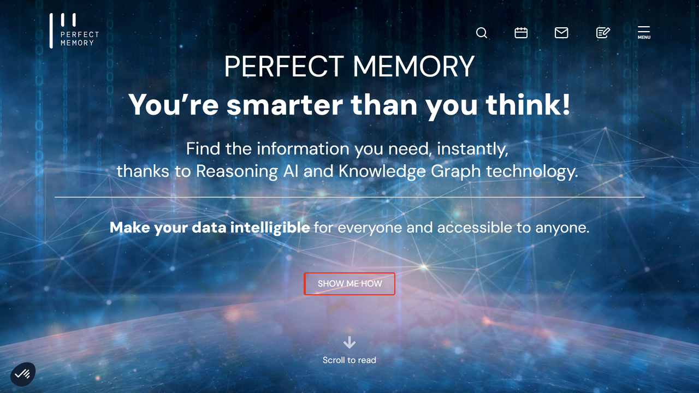

# Perfect Memory

Perfect Memory is a pioneering artificial intelligence company specializing in semantic asset management and knowledge engineering solutions that help organizations transform unstructured multimedia content into structured, searchable, and actionable knowledge assets.

## Overview

Perfect Memory offers advanced AI-powered solutions for managing, analyzing, and extracting value from complex multimedia content and knowledge assets. Founded in 2008 in Clermont-Ferrand, France, the company has developed proprietary technology that combines semantic analysis, knowledge graphs, and machine learning to transform how organizations interact with their multimedia collections.

The company's approach focuses on creating intelligent content management systems that understand the semantic meaning and relationships within diverse media types including video, audio, text, and images. Their solutions are particularly valuable for organizations with large multimedia archives or complex knowledge repositories that require sophisticated organization, search, and exploitation capabilities.

Perfect Memory serves clients across various sectors including media and broadcasting, cultural heritage institutions, sports organizations, and enterprise knowledge management. Their technology enables these organizations to unlock the full value of their content libraries and knowledge assets through improved discoverability, enhanced metadata, and intelligent content connections.

## Key Features

- **Semantic Asset Management**: Context-aware organization of multimedia content
- **Automated Metadata Generation**: AI-powered extraction of descriptive information
- **Knowledge Graph Technology**: Relationship mapping between content elements
- **Multi-format Media Processing**: Handling of video, audio, images, and text
- **Content Discovery Engine**: Advanced search across complex media libraries
- **Media Fingerprinting**: Content identification and rights management
- **Temporal Navigation**: Time-based exploration of audiovisual content
- **Entity Recognition**: Identification of people, places, objects, and concepts
- **Customizable Ontologies**: Domain-specific knowledge organization
- **API-based Architecture**: Integration with existing content workflows
- **Scalable Processing**: Handling of large media archives
- **Rights Management**: Content usage tracking and compliance

## Products

### Cortex Intelligent Asset Management

Cortex Intelligent Asset Management is Perfect Memory's flagship platform for transforming large multimedia archives into structured, searchable knowledge repositories. The solution employs advanced AI to automatically analyze content across video, audio, images, and text, extracting meaningful metadata without extensive manual tagging. At its core, the platform utilizes knowledge graph technology to establish relationships between content elements, creating a rich network of connections that enables context-aware search and discovery. Temporal analysis capabilities provide precise navigation within time-based media, allowing users to locate specific moments or segments within audiovisual content. The system's configurable ontology framework adapts to specific industry terminologies and knowledge structures, ensuring that content organization aligns with domain-specific requirements. Sophisticated search functions enable users to find content based on concepts, relationships, and contextual meaning rather than just keywords. Integration capabilities connect with existing MAM (Media Asset Management) systems, production tools, and distribution platforms through comprehensive APIs. By implementing Cortex, organizations can dramatically improve content discoverability, enhance production efficiency through faster content retrieval, create new monetization opportunities for archival content, and preserve institutional knowledge through structured organization of media assets.

### Fingerprint Recognition System

Perfect Memory's Fingerprint Recognition System provides advanced content identification and rights management capabilities for audiovisual content. The solution creates unique digital signatures (fingerprints) of media content that enable automatic recognition regardless of format conversions, quality changes, or partial modifications. Real-time monitoring capabilities identify matches across broadcast channels, streaming platforms, and web content to track content usage and detect unauthorized distribution. Rights management functionality maintains detailed records of content ownership, usage permissions, and licensing terms, automatically flagging potential compliance issues. The system integrates with content protection workflows and distribution platforms to ensure proper content attribution and monetization. Historical analysis provides comprehensive reporting on content usage patterns, helping rights holders understand how their assets are being utilized across different channels and territories. By implementing the Fingerprint Recognition System, organizations can protect intellectual property through improved content tracking, ensure proper monetization of assets across distribution channels, automate compliance with complex licensing agreements, and gather valuable intelligence about content usage and audience engagement.

### Semantic Metadata Enrichment

Perfect Memory's Semantic Metadata Enrichment solution transforms basic content catalogs into rich, contextually aware knowledge bases through automated analysis and tagging. The system employs multiple AI technologies including computer vision, speech recognition, natural language processing, and pattern recognition to extract comprehensive metadata from multimedia content. Entity recognition identifies people, places, objects, brands, and concepts appearing in content, while sentiment analysis determines emotional tones and contexts. Temporal segmentation divides continuous media into meaningful scenes or segments based on content changes, topics, or narrative structure. The platform includes domain-specific knowledge models pre-configured for various industries including news, sports, entertainment, and corporate knowledge management. Integration with external knowledge sources enriches internal content with additional context from trusted databases, knowledge bases, or proprietary information repositories. By implementing Semantic Metadata Enrichment, organizations can dramatically improve content searchability through detailed and accurate metadata, enable sophisticated content recommendations based on semantic relationships, repurpose content more efficiently by identifying relevant segments for new productions, and derive deeper insights from content analytics through richer contextual information.

## Use Cases

### Broadcast Media Archive Management

Media organizations implement Perfect Memory's solutions to transform their extensive audiovisual archives into searchable, exploitable assets that support production, monetization, and heritage preservation. The system processes decades of archival footage, automatically generating rich metadata describing visual content, spoken words, topics, personalities, and events without requiring extensive manual tagging. Knowledge graph technology establishes connections between related content across the archive, enabling producers to discover thematically linked material spanning different time periods and programs. Temporal navigation allows precise location of specific moments within lengthy recordings based on spoken phrases, visual elements, or topic changes. Integration with production systems enables editors to directly incorporate discovered archival content into new productions through frame-accurate references. Rights management capabilities track usage permissions and licensing requirements to ensure compliance when repurposing content. This implementation dramatically accelerates content discovery for production teams who can find relevant archival content in minutes rather than hours, creates new monetization opportunities by making previously unutilized archive content discoverable and licensable, preserves institutional knowledge through structured organization of historical content, and enhances storytelling by enabling producers to incorporate rich historical context from the archives.

### Sports Content Exploitation

Sports organizations and broadcasters leverage Perfect Memory's technology to maximize the value of their extensive sports content libraries across production, fan engagement, and commercial applications. The system processes live and archival sports footage, automatically identifying key moments, players, plays, statistics, and contextual information without manual tagging requirements. Advanced player recognition tracks individuals throughout footage regardless of camera angle, distance, or partial visibility. Play classification automatically categorizes game sequences based on type (goals, penalties, specific formations, etc.) to enable rapid retrieval of relevant content. Integration with statistical databases enriches visual content with performance metrics, historical context, and player information. Custom sports-specific ontologies organize content according to the unique terminology and structures of each sport. This implementation accelerates highlights production through automated identification of key moments, enhances fan engagement platforms with personalized content recommendations based on favorite players or memorable moments, supports coaching and performance analysis by making specific play types easily retrievable, and creates new commercial opportunities through improved content discoverability for sponsors and licensees.

### Cultural Heritage Preservation

Museums, libraries, and cultural institutions implement Perfect Memory's solutions to digitize, organize, and make accessible their multimedia collections and cultural artifacts. The system processes diverse heritage materials including historical films, photographs, audio recordings, manuscripts, and object documentation, extracting meaningful metadata while respecting the specific vocabulary and knowledge structures of cultural domains. Knowledge graph capabilities establish connections between related artifacts, contextual historical information, geographical locations, and cultural movements to create rich networks of cultural knowledge. Temporal and geographical contextualization places items within their historical and spatial context, creating meaningful narratives around collection items. Multilingual support enables descriptions and search across different languages to serve international audiences and researchers. Public-facing interfaces provide engaging ways for visitors and researchers to explore collections through semantic relationships rather than just hierarchical browsing. This implementation dramatically improves discovery of previously hidden collection items through enhanced searchability, creates richer educational experiences by revealing connections between artifacts and their historical context, supports scholarly research through more sophisticated content relationships and contextual information, and preserves institutional knowledge by structuring the relationships between collection items and their cultural significance.

## Technical Specifications

| Feature | Specification |
|---------|---------------|
| Deployment Options | Cloud, on-premises, hybrid |
| AI Technologies | Computer vision, NLP, speech recognition, knowledge graphs |
| Media Processing | Video, audio, images, text in multiple formats |
| Analysis Depth | Multi-level content analysis (visual, audio, semantic) |
| Scalability | Enterprise-grade for large media libraries |
| Integration Methods | REST APIs, webhooks, direct integrations |
| Ontology Framework | Customizable knowledge structures and vocabularies |
| Search Capabilities | Semantic, conceptual, and relationship-based |
| Fingerprinting | Proprietary media identification technology |
| Language Support | Multi-language processing and interface |
| Security Features | Role-based access, encryption, audit trails |
| Processing Performance | Real-time and batch processing options |

## Getting Started

1. **Content Assessment**: Evaluation of media collection and knowledge requirements
2. **Ontology Design**: Development of domain-specific knowledge structures
3. **System Configuration**: Setup based on organizational workflow needs
4. **Initial Processing**: Analysis and enrichment of core content collection
5. **Integration**: Connection with existing content management systems

## Resources

- [Company Website](https://www.perfect-memory.com/)
- [Solution Information](https://www.perfect-memory.com/solutions)
- [Case Studies](https://www.perfect-memory.com/case-studies)

## Contact Information

- Website: [perfect-memory.com](https://www.perfect-memory.com/)
- Headquarters: Clermont-Ferrand, France
