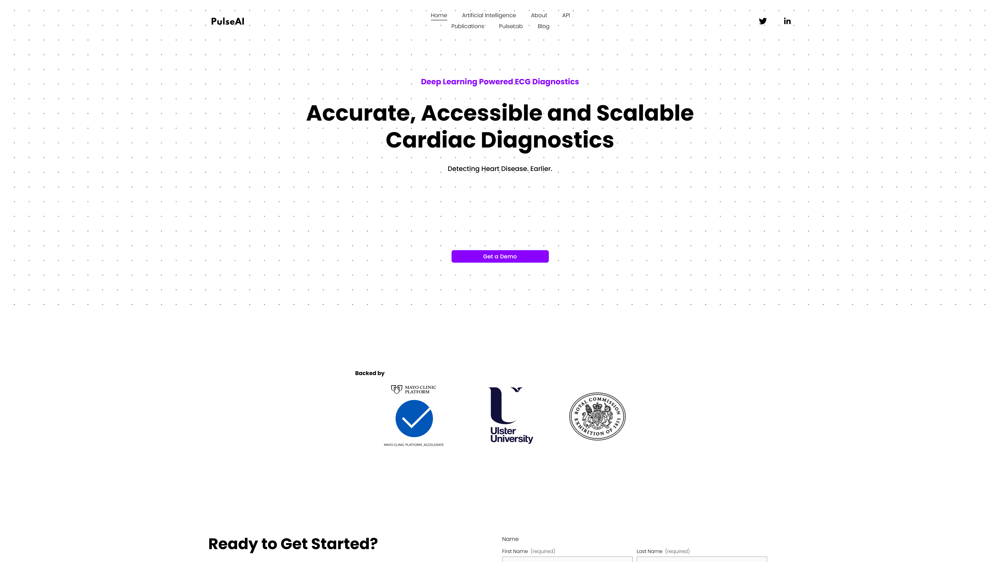

# Pulse

Pulse provides document processing and OCR infrastructure for financial services, healthcare, insurance, and legal sectors through layout-aware vision models.

## Overview

Pulse operates a document processing platform that converts complex scans and PDFs into structured data using a combination of [OCR](../../capabilities/ocr/index.md), layout analysis, and vision language models. The platform processes documents through five stages: layout understanding with component detection, low-latency OCR for text extraction, reading order algorithms for document structure, table recognition and parsing, and fine-tuned vision models for charts and figures. Having processed over 1 billion documents, Pulse serves financial services, healthcare, insurance, legal, logistics, and manufacturing sectors with deployment options including cloud, private VPC, on-premises, and containerized environments. The platform maintains SOC 2 Type II, ISO 27001, and GDPR compliance with HIPAA BAA available for enterprise plans.

## Key Features

- **Layout Understanding**: Component detection models identify document structure, regions, and element types
- **Specialized OCR**: Low-latency [text recognition](../../capabilities/ocr/index.md) optimized for individual component extraction rather than full-page processing
- **Reading Order Intelligence**: Algorithms determine logical document flow across various layout types and formats
- **Table Structure Recognition**: Parsing and structure analysis for complex table layouts with nested headers and merged cells
- **Vision Language Models**: Fine-tuned models extract information from charts, graphs, tables, and figures
- **Deployment Flexibility**: Cloud, private VPC, on-premises, Docker, and Kubernetes support with multi-cloud and hybrid architectures

## Use Cases

### Financial Document Processing

Financial institutions process loan applications, bank statements, tax returns, and investment documents by extracting structured data from complex multi-column layouts. Pulse's layout understanding identifies form fields, statement tables, and signature blocks regardless of template variations across banks and years. The platform handles historical statement formats where column structures and account naming conventions changed over time, maintaining extraction accuracy through layout-aware processing. Table recognition parses transaction histories with varying column counts and nested headers, while vision models extract data from embedded charts showing account performance or asset allocation.

### Healthcare Records Extraction

Healthcare providers and insurers extract clinical information from medical records, lab reports, and insurance forms submitted in diverse formats. The reading order algorithms process multi-column physician notes and forms where information flows across sections in non-linear patterns. Pulse identifies and extracts tabular lab results where test names, values, reference ranges, and flags appear in complex layouts with merged cells and multi-level headers. Vision models interpret diagnostic charts and graphs embedded in reports, extracting quantitative measurements for clinical systems. HIPAA BAA coverage enables processing of protected health information in enterprise deployments.

### Legal Document Analysis

Law firms and legal departments process contracts, court filings, and discovery documents by extracting clauses, dates, parties, and financial terms from lengthy multi-page documents. The platform handles varying document formats from different jurisdictions and time periods, identifying signature blocks, exhibits, and attachments within complex document structures. Table recognition extracts financial schedules and term sheets embedded in contracts, while reading order algorithms correctly sequence clauses and subclauses across multi-column layouts. Layout understanding distinguishes headers, footers, page numbers, and body text for accurate content extraction.

## Technical Specifications

| Feature | Specification |
|---------|---------------|
| Processing Pipeline | Five-stage: Layout understanding, OCR, reading order, table recognition, vision models |
| Core Technologies | Component detection models, low-latency OCR, vision language models |
| Deployment Options | Cloud, private VPC, on-premises, Docker, Kubernetes |
| Architecture Support | Multi-cloud, hybrid cloud |
| Compliance | SOC 2 Type II, ISO 27001, GDPR, HIPAA BAA (enterprise) |
| Document Processing | 1+ billion documents processed |
| Target Industries | Financial Services, Healthcare, Insurance, Legal, Logistics, Manufacturing |
| Notable Clients | Samsung, Fountain, Cloudera, UC Berkeley, Fortune 500 companies |

## Getting Started

1. **Contact**: Reach out via email at hello@trypulse.ai
2. **Deployment Selection**: Choose cloud, private VPC, or on-premises deployment
3. **Integration**: Implement using Docker/Kubernetes or direct API integration
4. **Testing**: Process sample documents to validate extraction accuracy
5. **Production**: Deploy with selected compliance certifications (SOC 2, ISO 27001, HIPAA)

## Resources

- [Website](https://www.runpulse.com)
- [Documentation](https://docs.runpulse.com)
- [Pricing](https://www.runpulse.com/pricing)
- [Security & Trust Center](https://trust.runpulse.com/)
- [Blog](https://www.runpulse.com/blog)

## Company Information

Company: Pulse AI Corp

Email: hello@trypulse.ai

Contact: [Sales Contact](https://www.runpulse.com/contact-sales)

Social: [LinkedIn](https://www.linkedin.com/company/pulse-ai-corp/), [X/Twitter](https://x.com/Pulse__AI)
