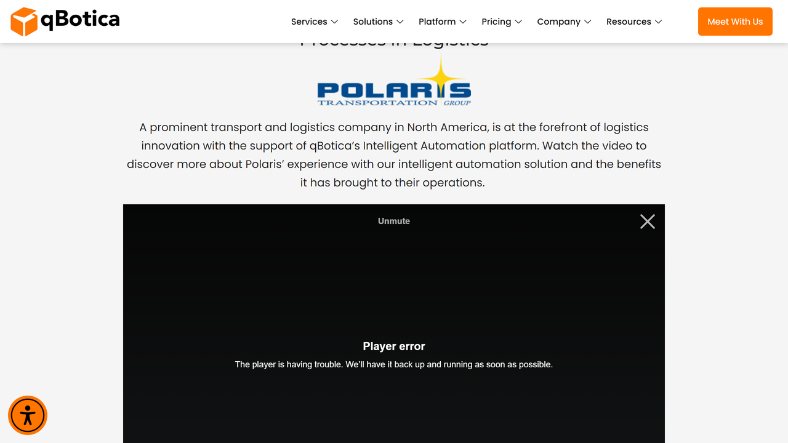

# Qbotica

Qbotica is an intelligent document processing and robotic process automation provider offering AI-powered data extraction and workflow automation solutions for document-intensive business operations.

## Overview

Qbotica develops intelligent document processing and RPA solutions combining [OCR](../../capabilities/ocr/index.md), machine learning, and robotic process automation to automate document-centric workflows. The platform serves organizations across financial services, healthcare, insurance, government, and professional services sectors, processing structured and unstructured documents through AI-powered classification and extraction capabilities.

The company's flagship products include QBot Document Intelligence for automated data extraction, QBot Process Automation for end-to-end workflow automation, and QBot Analytics for performance monitoring. Qbotica's solutions deploy in cloud, on-premise, and hybrid environments, integrating with ERP, CRM, and enterprise applications through APIs and pre-built connectors.

## Key Features

- **[Intelligent Document Processing](../../capabilities/document-understanding/index.md)**: AI-powered data extraction from complex documents
- **[Automatic Classification](../../capabilities/classification/index.md)**: Document categorization without predefined templates
- **Machine Learning Models**: Self-improving recognition accuracy through continuous learning
- **RPA Integration**: Robotic process automation for end-to-end workflow orchestration
- **[Data Validation](../../capabilities/validation/index.md)**: Automated verification against business rules and reference databases
- **Exception Handling**: Intelligent routing for cases requiring human review
- **Multi-Channel Capture**: Document intake via email, scan, and digital submissions
- **Low-Code Configuration**: Visual process designers for business users
- **Analytics Dashboards**: Real-time performance metrics and trend analysis
- **Enterprise Integration**: APIs and pre-built connectors for business systems

## Use Cases

### Invoice Processing Automation

Finance teams automate supplier invoice capture, validation, and processing across multiple formats and channels. Qbotica extracts header information, line items, tax details, and payment terms without requiring vendor-specific templates, then validates data against purchase orders and receiving documents. Clean invoices route through approval workflows while exceptions flag for review, with ERP integration enabling automated posting and payment initiation.

### Healthcare Claims Processing

Healthcare organizations automate medical claims extraction and validation from various form types. The platform captures patient demographics, diagnosis codes, procedure codes, and billing amounts, identifying coding errors and compliance issues before payer submission. Integration with EHR systems ensures clinical documentation consistency while analytics track claim volumes, rejection rates, and reimbursement patterns.

### Customer Onboarding

Financial institutions process new customer applications by automating extraction from forms, identity documents, and supporting documentation. Document intelligence verifies authenticity and consistency while automated workflows route applications through KYC, AML, and credit checks. Integration with core banking systems enables straight-through processing for standard applications with exception handling for complex cases.

## Technical Specifications

| Feature | Specification |
|---------|---------------|
| Deployment Options | Cloud, on-premises, hybrid |
| Document Recognition | AI-based with continuous learning |
| OCR Accuracy | 95-99% depending on document quality (claimed) |
| Supported Formats | PDF, TIFF, JPEG, PNG, Microsoft Office formats |
| Processing Capacity | Scalable from hundreds to millions of pages monthly |
| Integration Methods | REST APIs, web services, RPA connectors, pre-built adapters |
| Machine Learning | Supervised and unsupervised learning |
| Security | Role-based access, encryption, audit logging |
| Language Support | Multilingual document processing |
| Automation Tools | Visual designers, reusable components, bot scheduling |
| Analytics | Real-time dashboards, custom reports, trend analysis |

## Getting Started

1. **Process Assessment**: Evaluate document workflows and automation opportunities
2. **Solution Design**: Configure extraction rules and workflow automation
3. **Pilot Implementation**: Deploy for specific document types or processes
4. **Integration**: Connect with enterprise systems and applications
5. **Production Rollout**: Scale automation across organization

## Resources

- [Website](https://www.qbotica.com/)

## Company Information

Headquarters: Phoenix, Arizona, United States

Founded: 2017

Founder: Mahesh Vinayagam (CEO)

Products: DoqumentAI (IDP Platform), QBot Document Intelligence, QBot Process Automation, QBot Analytics

Partnerships: UiPath Diamond Partner, Kognitos Strategic Partner

Industries: Healthcare, real estate, energy, banking, insurance, manufacturing

Specializations: Invoice processing, claims automation, customer onboarding, RPA services
