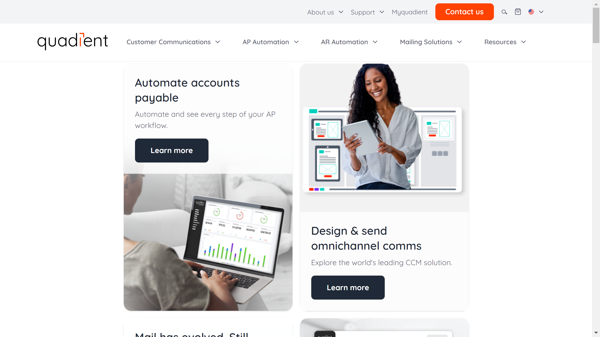

# Quadient

Quadient is a global provider of customer experience solutions specializing in intelligent document automation, customer communications management, mail processing technology, and parcel locker solutions. In 2023 [FormHero](../formhero/index.md) was acquired by Quadient.

## Overview

Quadient (formerly Neopost) offers comprehensive solutions for customer communications management and document processing. The company provides technologies that help organizations create, manage, distribute, and process customer communications across multiple channels while ensuring compliance and personalization.

Founded with over 90 years of history in mail processing, Quadient has evolved into a technology leader focused on helping businesses maintain meaningful connections with their customers through both physical and digital touchpoints. Their solutions bridge the gap between paper and digital communications, supporting organizations in their digital transformation journey.

Quadient serves organizations across various industries, including financial services, insurance, healthcare, utilities, government, retail, and telecommunications. Their technologies enable these enterprises to optimize document-intensive processes, improve customer engagement, ensure regulatory compliance, and reduce operational costs.

## Key Features

- **Customer Communications Management**: Multi-channel document creation and delivery
- **Document Automation**: Intelligent document processing and workflow
- **Mail Processing**: Physical mail preparation and management
- **Digital Signature**: Secure electronic document signing
- **Output Management**: Print and digital delivery optimization
- **Personalization**: Variable data printing and content customization
- **Compliance Management**: Regulatory document handling
- **Interactive Communications**: Two-way customer engagement tools
- **Analytics**: Insights into communication effectiveness
- **Omnichannel Delivery**: Coordinated physical and digital communications

## Use Cases

### Omnichannel Customer Communications

Organizations implement Quadient's Inspire platform to transform their customer communications strategy. The solution centralizes document design and content management, enabling business users to create personalized communications without IT dependency. The platform manages the entire communication lifecycle from creation through approval, production, and distribution across multiple channels (print, email, SMS, web, mobile). Intelligent delivery rules automatically select the optimal channel based on customer preferences, document type, and regulatory requirements. The system maintains a comprehensive archive of all communications for compliance and customer service purposes. This approach improves customer satisfaction through consistent, personalized communications, reduces costs by optimizing channel usage and consolidating systems, accelerates time-to-market for new communications, and ensures regulatory compliance through centralized control of content and formatting across all documents.

### Accounts Receivable Document Automation

Finance departments utilize Quadient's document automation solutions to streamline accounts receivable processes. The system automates the creation, delivery, and processing of invoices and payment-related documents across multiple channels. For outbound communications, the solution generates personalized invoices incorporating customer-specific information, payment terms, and promotional content. For inbound processing, the technology captures payment information from various sources (checks, remittance advice, electronic payments) and automatically reconciles it with outstanding invoices. Integration with financial systems enables straight-through processing while maintaining a complete audit trail for compliance purposes. This implementation reduces days sales outstanding (DSO) by accelerating invoice delivery and payment processing, improves cash flow visibility through real-time payment status updates, enhances customer satisfaction through accurate, professional invoices and payment options, and reduces processing costs through automation of manual tasks.

## Technical Specifications

| Feature | Specification |
|---------|---------------|
| Platform | Quadient Inspire Suite |
| Deployment Options | Cloud, On-premises, Hybrid |
| Communication Channels | Print, Email, SMS, Web, Mobile, Social, Video |
| Document Formats | PDF, HTML, XML, AFP, PCL, PostScript, and more |
| Integration Capabilities | APIs, Connectors for CRM, ERP, ECM systems |
| Composition Engine | High-volume, on-demand, interactive |
| Workflow Capabilities | Visual process design, approval routes, automation |
| Digital Delivery | Email, web portal, mobile app integration |
| Security Features | Encryption, access control, audit trails |
| Compliance Support | GDPR, HIPAA, ADA, Section 508, and industry regulations |

## Getting Started

1. **Communication Assessment**: Evaluation of current document processes
2. **Solution Design**: Configuration based on business requirements
3. **Implementation**: Deployment and integration with existing systems
4. **User Training**: Education for business users and administrators
5. **Continuous Optimization**: Ongoing improvement of communications

## Resources

- [Company Website](https://www.quadient.com/)
