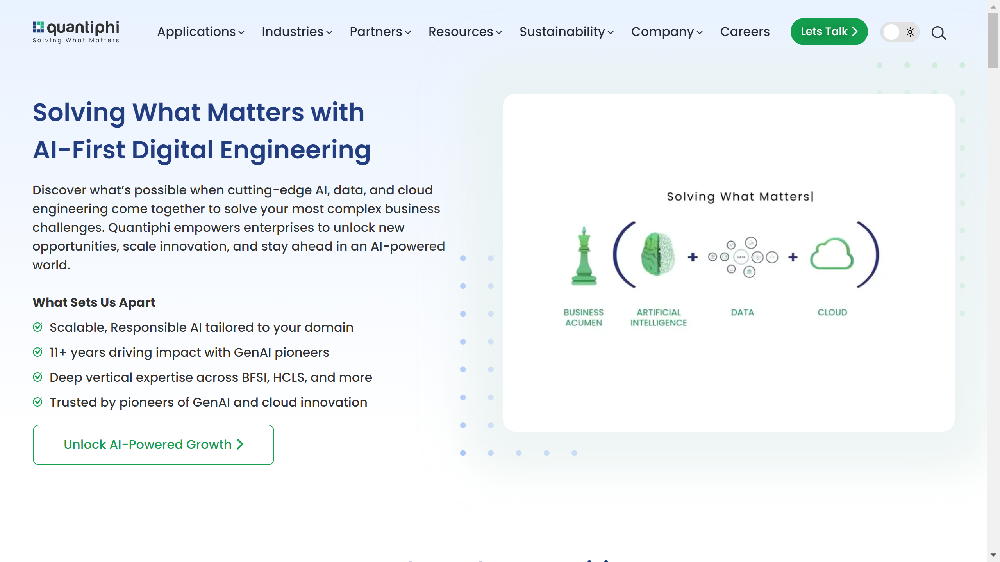

# Quantiphi

Quantiphi is a company that specializes in intelligent document processing and AI-first digital engineering solutions. The company focuses on creating intelligent automation for document workflows.

## Overview

Quantiphi provides intelligent document processing and AI-first digital engineering solutions designed to create intelligent automation for document workflows. Their platform focuses on leveraging advanced AI technology to process, analyze, and manage documents across various business applications with high accuracy and efficiency.

## Key Features

- Intelligent document processing
- AI-first digital engineering solutions
- Document workflow automation
- Intelligent automation platform
- AI-first digital engineering tools
- Document processing automation
- Intelligent data handling

## Use Cases

- Intelligent document processing
- AI-first digital engineering automation
- Document workflow optimization
- Intelligent automation implementation
- Document processing workflows
- AI-first digital engineering optimization
- Intelligent document workflows

## Technical Specifications

Quantiphi's platform specializes in intelligent document processing and AI-first digital engineering solutions, creating intelligent automation for document workflows that leverage advanced AI technology to process and analyze documents with high accuracy and efficiency.

## Company Information

Marlborough, United States

Web: [https://quantiphi.com](https://quantiphi.com/) 