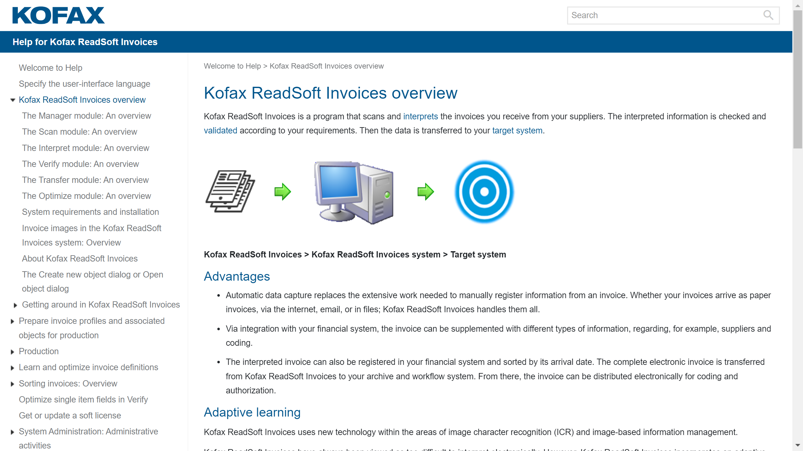

# ReadSoft

ReadSoft, now part of Tungsten Automation (formerly Kofax), is a Swedish-founded document automation provider specializing in invoice processing, accounts payable automation, and forms recognition.

## Overview

ReadSoft, founded in 1991 by two university students in Linköping, Sweden, developed automated document processing solutions for financial operations. Lexmark acquired ReadSoft in 2014, and in 2017, Thoma Bravo combined ReadSoft with Kofax into a single company. Kofax rebranded to Tungsten Automation in 2024, integrating ReadSoft's invoice automation technology into the broader intelligent automation platform.

The solutions combine [OCR](../../capabilities/ocr/index.md), machine learning, and workflow automation to process invoices, purchase orders, and financial forms. ReadSoft's technology served organizations across financial services, manufacturing, healthcare, and public sector, with particular strength in accounts payable automation and ERP integration for SAP, Oracle, Microsoft Dynamics, and other enterprise systems.

## Key Features

- **[Invoice Processing](../../capabilities/extraction/index.md)**: Specialized AP automation with header and line-item extraction
- **[Intelligent Document Capture](../../capabilities/document-understanding/index.md)**: Advanced recognition of diverse document types
- **Template-Free Learning**: Machine learning adaptation to varying invoice formats
- **[Forms Recognition](../../capabilities/ocr/index.md)**: Automated processing of structured forms
- **ERP Integration**: Pre-built connectors for SAP, Oracle, Microsoft Dynamics, Infor
- **Three-Way Matching**: Automated validation against purchase orders and receipts
- **Workflow Automation**: Configurable approval chains with delegation and escalation
- **Multi-Channel Capture**: Processing from email, scan, EDI, supplier portals
- **Exception Handling**: Efficient resolution workflows for discrepancies
- **Analytics & Reporting**: Insights into AP processing performance

## Use Cases

### Accounts Payable Automation

Finance departments automate invoice processing by capturing documents from email, scan, EDI, and supplier portals. ReadSoft extracts vendor information, invoice numbers, line items, tax amounts, and payment terms without requiring templates for each vendor format. The system validates data against ERP master data and purchase orders, routing clean invoices through approval workflows while flagging discrepancies for review.

### Purchase Order Processing

Organizations automate customer order handling by capturing orders from multiple channels and extracting customer details, product codes, quantities, pricing, and delivery requirements. Validation against customer master data and product catalogs identifies issues like discontinued items or pricing discrepancies, with ERP integration enabling automatic order creation.

## Technical Specifications

| Feature | Specification |
|---------|---------------|
| Deployment Options | On-premises, cloud, hybrid |
| Document Types | Invoices, purchase orders, forms, remittances |
| Recognition Technology | OCR, ICR, machine learning, pattern recognition |
| ERP Integrations | SAP, Oracle, Microsoft Dynamics, Infor, others |
| Workflow Capabilities | Configurable approval chains, delegation, escalation |
| Validation Methods | Database lookups, mathematical checks, business rules |
| Processing Capacity | Enterprise-scale high-volume processing |
| Languages Supported | Multilingual document processing |
| Output Formats | Direct ERP posting, XML, CSV, PDF |

## Getting Started

1. **Process Assessment**: Evaluate current AP or document processing workflows
2. **Solution Configuration**: Set up document types and extraction rules
3. **ERP Integration**: Connect with financial systems
4. **Workflow Design**: Configure approval chains and business rules
5. **Deployment**: Launch with user training and support

## Resources

- [Tungsten Automation Website](https://www.tungstenautomation.com/)
- [Tungsten AP Solutions](https://www.tungstenautomation.com/solutions/accounts-payable)

## Company Information

Original Company: ReadSoft

Founded: 1991

Original Headquarters: Linköping, Sweden

Founders: Two university students from Linköping

Acquisition History: Lexmark (2014), Combined with Kofax (2017), Rebranded to Tungsten Automation (2024)

Current Parent: Tungsten Automation Corporation

Industries: Financial services, manufacturing, healthcare, public sector

Specializations: Invoice automation, AP processing, financial document automation
