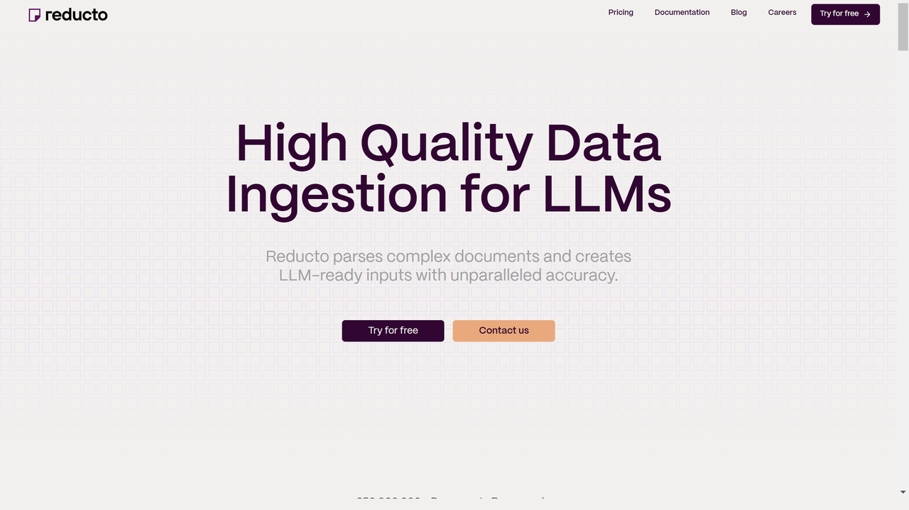
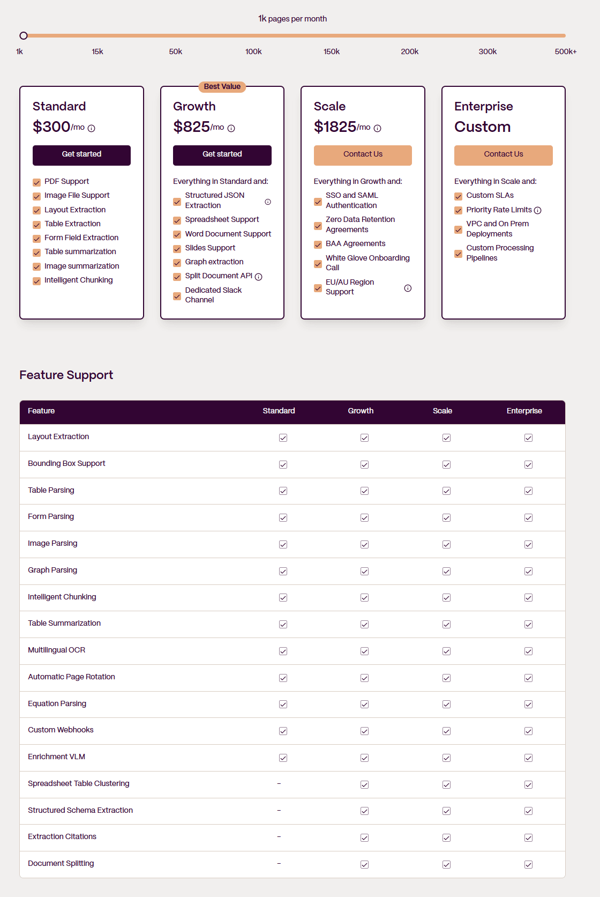
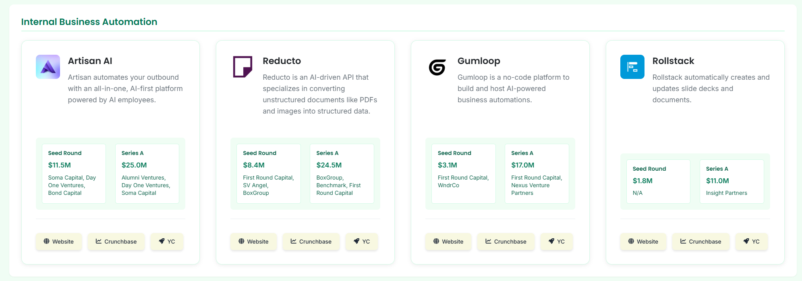
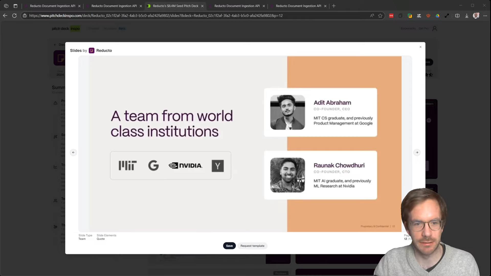

# Reducto.ai

[Reducto.ai](https://reducto.ai) is an advanced document intelligence platform that uses artificial intelligence to automate document processing, data extraction, and analysis, helping organizations transform unstructured documents into actionable business insights.



## Overview

Reducto.ai provides a comprehensive document intelligence platform that combines computer vision, natural language processing, and machine learning to automate the extraction and understanding of information from complex business documents. Their technology helps organizations process large volumes of documents with greater accuracy and efficiency than traditional OCR-based solutions.

Founded with a focus on solving the challenges of document-centric business processes, Reducto.ai has developed sophisticated algorithms that can understand document context, identify relationships between information elements, and extract structured data even from highly variable document formats. Their approach moves beyond simple data extraction to provide true document intelligence that delivers actionable insights.

Reducto.ai serves organizations across various industries, including financial services, healthcare, legal, and supply chain, where document processing is both high-volume and mission-critical. Their solutions help these enterprises streamline operations, reduce manual data entry, accelerate processing times, and make better-informed decisions based on comprehensive document analysis.

## Key Features

- **Intelligent Document Processing**: Advanced data extraction from complex documents
- **Document Classification**: Automatic categorization of document types
- **Contextual Understanding**: Comprehension of document meaning and relationships
- **Machine Learning Automation**: Self-improving algorithms for continual accuracy gains
- **Pre-built Document Models**: Ready-to-use templates for common document types
- **Custom Model Training**: Tailored solutions for industry-specific documents
- **Multi-format Support**: Processing of PDF, images, scans, and native digital documents
- **Integration Capabilities**: Seamless connection with existing business systems
- **Validation Workflows**: User-friendly review and correction processes
- **Analytics & Insights**: Business intelligence derived from document data

## Pricing



## Company



## Transfer of Personal Data

They process and store information in the U.S. and other countries. By using our Services, you authorize them to transfer your personal information across national borders and to other countries where we operate, in accordance with applicable laws and regulations.

https://reducto.ai/terms#:~:text=Transfer%20of%20Personal%20Data

## Video

[ Video about reducto.ai - Review](https://www.youtube.com/watch?v=E6T3Y3ugiV8)

## Use Cases

### Intelligent Invoice Processing

Finance departments implement Reducto.ai to transform their accounts payable operations. The platform automatically captures invoices received through multiple channels (email, EDI, supplier portals) and extracts key information including vendor details, invoice numbers, line items, tax amounts, and payment terms. Unlike template-based systems, Reducto's AI can recognize and process invoices from new vendors without configuration. The extracted data undergoes validation against business rules and ERP master data, flagging exceptions while allowing clean transactions to flow directly to approval workflows. Integration with financial systems enables straight-through processing for matched invoices while maintaining complete audit trails. This implementation reduces invoice processing costs by up to 75%, accelerates processing time from weeks to hours, improves early payment discount capture, and enhances visibility into financial obligations and cash flow forecasting.

### Contract Analysis and Management

Legal and procurement teams utilize Reducto.ai to streamline contract management processes. The solution automatically extracts key clauses, obligations, renewal dates, and commercial terms from various contract types. Natural language processing capabilities identify critical provisions even when expressed in different ways across document sets. The system creates structured datasets from contract repositories, enabling powerful search and analysis functions. Automatic alerts for expiration dates, renewal options, and obligation deadlines help prevent missed opportunities and compliance risks. Integration with contract lifecycle management systems enhances visibility and control throughout the contract process. This approach accelerates contract review by up to 80%, improves risk identification through comprehensive clause analysis, enhances compliance through systematic obligation tracking, and enables better commercial decisions through improved access to contract information.

## Technical Specifications

```aiignore
{
  "options": {
    "extraction_mode": "ocr",
    "ocr_mode": "standard",
    "chunking": {
      "chunk_mode": "section"
    },
    "table_summary": {
      "enabled": true
    },
    "figure_summary": {
      "enabled": true
    },
    "filter_blocks": [
      "Page Number",
      "Header",
      "Footer",
      "Comment"
    ],
    "force_url_result": false
  },
  "advanced_options": {
    "ocr_system": "highres",
    "table_output_format": "html",
    "merge_tables": false,
    "continue_hierarchy": true,
    "keep_line_breaks": false,
    "page_range": {
      "start": null,
      "end": null
    },
    "large_table_chunking": {
      "enabled": true,
      "size": 50
    },
    "spreadsheet_table_clustering": "default",
    "remove_text_formatting": true,
    "filter_line_numbers": true
  },
  "experimental_options": {
    "enrich": {
      "enabled": false,
      "mode": "standard"
    },
    "native_office_conversion": false,
    "enable_checkboxes": false,
    "rotate_pages": true,
    "enable_underlines": false,
    "enable_equations": false,
    "return_figure_images": true,
    "return_table_images": false,
    "layout_enrichment": false,
    "layout_model": "default"
  }
}
```


## Getting Started

1. **Document Assessment**: Evaluation of current document processes and needs
2. **Solution Design**: Configuration based on specific document requirements
3. **Implementation**: Deployment and integration with existing systems
4. **Training & Validation**: Fine-tuning models for optimal performance
5. **Continuous Improvement**: Ongoing optimization of accuracy and efficiency

## Resources

- [Company Website](https://reducto.ai/)
- [Documentation](https://docs.reducto.ai/)
- [Case Studies](https://reducto.ai/customers/)