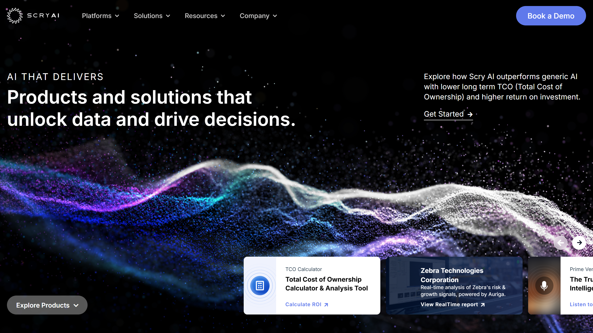

# Scry AI

Scry AI provides intelligent document processing, conversational AI, and IoT platforms for banking, insurance, real estate, energy, manufacturing, and government sectors.

## Overview

Scry AI operates three core platforms: Collatio for intelligent document processing and reconciliation, Auriga for context-aware conversational AI, and Concentio for IoT and edge computing applications. Operating since 2014, the company serves banking, insurance, real estate, energy, manufacturing, government, and smart city sectors with deployments in on-premises and cloud environments. The Collatio platform handles document extraction and reconciliation without templates, processing PDFs, scans, tables, and charts across multiple formats. Specific solutions include accounts reconciliation, financial spreading, digital archives, schematic analysis (SchematicIQ), loan operations, KYC processes, and OCR through Docutwin. Scry AI maintains SOC II and ISO 27001 compliance with client data remaining in secured customer environments.

## Key Features

- **Collatio Platform**: Template-free [extraction](../../capabilities/extraction/index.md) of key-value pairs, line items, and complex structures from unstructured documents
- **Multi-Format Processing**: Handles PDFs, scans, tables, charts, and diverse document formats without pre-configuration
- **Financial Solutions**: Accounts reconciliation, financial spreading, loan operations, and KYC workflows
- **Auriga Conversational AI**: Context-aware interfaces with source traceability for verifiable responses
- **Concentio IoT Platform**: Real-time edge computing and digital twin modeling for operational intelligence
- **Security Architecture**: On-premises deployment options with data isolation and SOC II/ISO 27001 compliance

## Use Cases

### Banking Financial Spreading

Banks process loan applications by extracting financial data from tax returns, bank statements, profit and loss statements, and balance sheets submitted by borrowers. Collatio identifies financial line items across diverse document formats and accounting software outputs, extracting revenue, expenses, assets, liabilities, and cash flow figures without template configuration. The platform handles handwritten annotations, scanned documents, and digital PDFs with equal capability. Extracted data populates loan underwriting systems for credit analysis and risk assessment, while reconciliation features validate consistency across multiple years of financial statements.

### Insurance KYC Automation

Insurance carriers automate know-your-customer processes by extracting identity information, beneficial ownership structures, and regulatory compliance data from customer submissions. The platform processes identity documents, corporate registration certificates, tax forms, and beneficial ownership declarations in various formats and languages. SchematicIQ analyzes organizational charts and ownership diagrams to identify ultimate beneficial owners and control structures. Integration with compliance databases enables automated PEP and sanctions screening, while audit trails document verification steps for regulatory reporting.

### Government Document Digitization

Government agencies digitize historical records and process citizen submissions by extracting structured data from archived documents, permits, applications, and correspondence. Collatio handles degraded document quality, historical formats, and handwritten content common in archival materials. The Digital Archive solution indexes extracted content for search and retrieval, while workflow automation routes documents requiring human review. Real-time processing through Anomalia identifies fraudulent submissions in permit applications and benefit claims through pattern analysis and anomaly detection.

## Technical Specifications

| Feature | Specification |
|---------|---------------|
| Core Platforms | Collatio (IDP), Auriga (Conversational AI), Concentio (IoT) |
| Processing Capabilities | Key-value extraction, line items, complex structures, reconciliation |
| Document Types | PDFs, scans, tables, charts, multiple formats |
| Specific Solutions | Accounts Reconciliation, Financial Spreading, Digital Archive, SchematicIQ, Loan Ops, KYC, Docutwin OCR |
| Additional Products | Anomalia (fraud detection), Smart Claims, Smart Alerts |
| Deployment | On-premises or cloud-based |
| Security | SOC II and ISO 27001 compliant, data isolation |
| Integration | API-ready, ERP/accounting system compatible |

## Resources

- [Website](https://scryai.com)
- [Collatio Platform](https://scryai.com/collatio/)
- [Blog](https://scryai.com/blog/)
- [Use Cases](https://scryai.com/use-cases/)
- [Videos](https://scryai.com/videos/)

## Company Information

Founded: 2014

Contact: [Request Demo](https://scryai.com/demo/)

Notable Clients: Microsoft, Cisco, Wells Fargo, Kaiser Permanente, Credit Suisse
