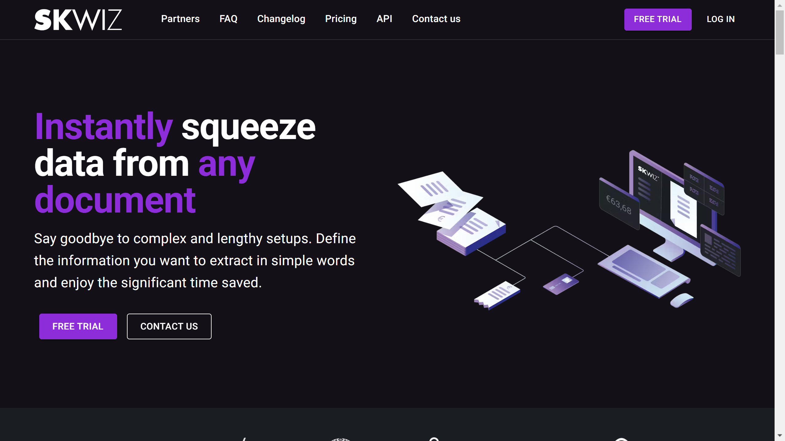

# Skwiz

Skwiz is a generative AI-powered document processing platform offering multi-language data extraction from invoices, identity documents, insurance claims, and business documents through web and API interfaces.

## Overview

Skwiz provides [document extraction](../../capabilities/extraction/index.md) services using large language models including ChatGPT and custom models. The Brussels-based platform processes documents across accounting, HR, construction, and insurance sectors with language-agnostic capabilities. Skwiz supports invoices, passports, ID cards, driver's licenses, insurance claims, purchase orders, and delivery notes. The platform stores data within EU infrastructure with GDPR compliance. Originally launched in 2020 as a cloud invoice extraction API, the company rebuilt the platform around generative AI and relaunched in July 2023.

## Key Features

- **Generative AI Extraction**: Large language model-based data extraction from any document type
- **Document Classification**: Automated document type identification
- **PDF Splitting**: Separates multi-document PDF files
- **Signature Detection**: Identifies and extracts signature regions
- **Barcode Recognition**: Reads and decodes barcodes from documents
- **Drag-and-Drop Interface**: Web-based document upload and verification
- **Custom Templates**: User-defined document structure configuration
- **Multi-Language Support**: Processes documents in any language without retraining

## Use Cases

### Accounts Payable Automation

Accounting departments use Skwiz to extract data from invoices in multiple languages and formats. The platform automatically [classifies](../../capabilities/classification/index.md) invoice types, extracts line items and totals, and exports structured data to accounting systems via API integration.

### HR and KYC Document Processing

Human resources teams process identity verification documents including passports, ID cards, and driver's licenses. The generative AI extracts personal information from international document formats without requiring training data for each document variant.

### Insurance Claims Management

Insurance companies automate claims processing by extracting data from claims forms and medical certificates. Skwiz detects signatures for validation, processes multi-page PDFs with splitting, and routes extracted information through approval workflows with data verification interfaces.

## Technical Specifications

| Feature | Specification |
|---------|---------------|
| AI Technology | Large language models (ChatGPT and custom models), generative AI |
| Document Types | Invoices, passports, ID cards, driver's licenses, claims, medical certificates, purchase orders, delivery notes |
| Recognition Capabilities | Text extraction, signature detection, barcode recognition |
| Classification | Automated document type identification |
| PDF Processing | Multi-document splitting |
| Language Support | Language-agnostic, any language |
| Interfaces | Web platform, REST API |
| Data Storage | EU-based infrastructure |
| Compliance | GDPR compliant |
| Uptime | Claimed 99.99%+ |
| Setup Time | Minutes (per vendor claim) |
| Export | API, web app download |
| Target Industries | Accounting, HR, construction, insurance |

## Resources

- [Website](https://www.skwiz.ai)
- [LinkedIn](https://be.linkedin.com/company/skwiz)
- [FinTech Belgium Member Profile](https://www.fintechbelgium.be/members/skwiz)

## Company Information

Headquarters: Brussels (Sint-Pieters-Woluwe), Belgium

Founded: 2020 (relaunched with GenAI platform in July 2023)
