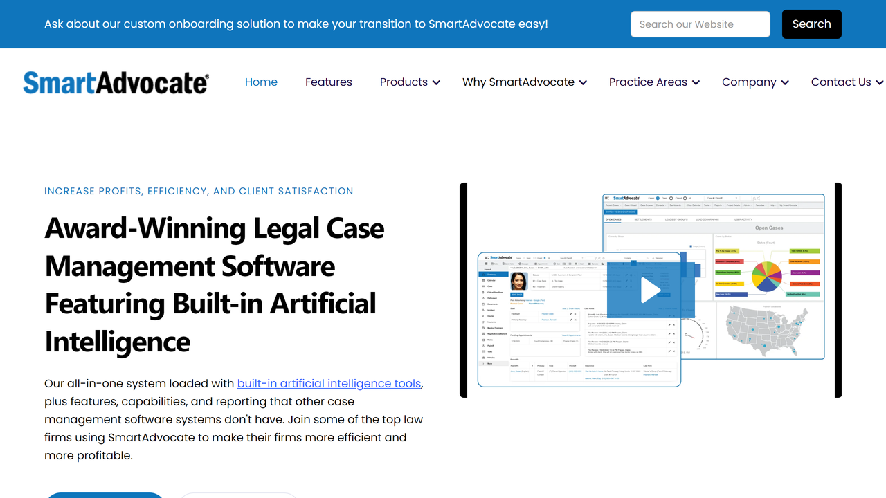

# SmartAdvocate

SmartAdvocate is a New York-based legal case management software provider specializing in personal injury, mass tort, and litigation practice management with integrated document processing capabilities.

## Overview

SmartAdvocate, headquartered in Melville, New York, provides comprehensive case management software developed by attorneys for personal injury and mass tort law firms. Created over a 5-year development period by a national plaintiff's firm that couldn't find suitable market solutions, the platform combines document management, workflow automation, deadline tracking, and client communication tools tailored specifically to litigation practices.

The software supports personal injury, medical malpractice, mass tort, workers' compensation, family law, criminal defense, and corporate legal departments. SmartAdvocate integrates [document processing](../../capabilities/document-understanding/index.md) capabilities with case-specific tracking, automated legal document generation, medical records management, and settlement valuation tools for managing cases from intake through resolution.

## Key Features

- **[Document Management](../../capabilities/document-understanding/index.md)**: Comprehensive storage and organization of case files
- **[Intelligent Document Processing](../../capabilities/extraction/index.md)**: Automated intake and classification of legal documents
- **Document Generation**: Template-based creation of pleadings, demand letters, and correspondence
- **Case Workflow Automation**: Practice-specific procedures for different case types
- **Client Intake Management**: Structured onboarding with automated engagement letters
- **Calendar and Deadline Tracking**: Automated reminders and statute of limitations management
- **Medical Records Organization**: Automated categorization and treatment timeline tracking
- **Settlement Valuation Tools**: Calculation and tracking of damages and settlement offers
- **Client Communication**: Integrated email, SMS, and secure portal capabilities
- **Mobile Access**: iOS and Android applications for remote case access
- **Reporting and Analytics**: Case progression metrics and firm performance insights

## Use Cases

### Personal Injury Case Management

Law firms manage personal injury cases by capturing client information through customizable intake forms that automatically generate engagement letters and HIPAA authorizations. The platform organizes medical records, bills, and treatment reports with automated timeline tracking. Document automation generates demand letters and pleadings using case-specific data, while deadline tracking ensures timely filings and settlement negotiations track offers with itemized damage calculations.

### Mass Tort Litigation Management

Litigation teams handle large plaintiff volumes through specialized mass tort intake workflows that capture client-specific information while identifying common elements. Document processing automatically categorizes medical records, prescriptions, and evidence to support case qualification. The system maintains individual plaintiff details with centralized access to shared discovery materials, while analytics identify trends across plaintiff groups to inform litigation strategy.

## Technical Specifications

| Feature | Specification |
|---------|---------------|
| Deployment Options | Cloud, on-premises, private cloud |
| Client Access | Windows application, web browser, mobile apps (iOS/Android) |
| Document Storage | Integrated document management system |
| Document Formats | PDF, Word, Excel, images, and all major formats |
| Email Integration | Microsoft Outlook, Exchange Server, Gmail |
| Calendar Synchronization | Microsoft Exchange, Google Calendar |
| Security | Role-based access, encryption, audit trails |
| Reporting | Built-in reports, custom report writer |
| Integration | APIs, direct database connections |
| Practice Areas | Personal injury, mass tort, medical malpractice, workers' comp, others |

## Getting Started

1. **Practice Assessment**: Evaluate firm size, case types, and workflow requirements
2. **Configuration**: Customize intake forms, document templates, and workflows
3. **Data Migration**: Transfer existing case files and client data
4. **Training**: Staff education for attorneys, paralegals, and administrators
5. **Go-Live**: Launch with ongoing support and optimization

## Resources

- [Website](https://www.smartadvocate.com/)
- [Features](https://www.smartadvocate.com/features)
- [About SmartAdvocate](https://www.smartadvocate.com/about-us)

## Company Information

Headquarters: Melville, New York, United States

Origin: Developed by national plaintiff's personal injury law firm over 5-year period

Development Team: Personal injury lawyers, paralegals, law firm management consultants, programmers

Target Market: Personal injury, mass tort, medical malpractice, litigation-focused law firms

Practice Areas: Personal injury, mass tort, medical malpractice, workers' compensation, family law, criminal defense, corporate legal

Firm Sizes: Small practices to large multi-office firms
