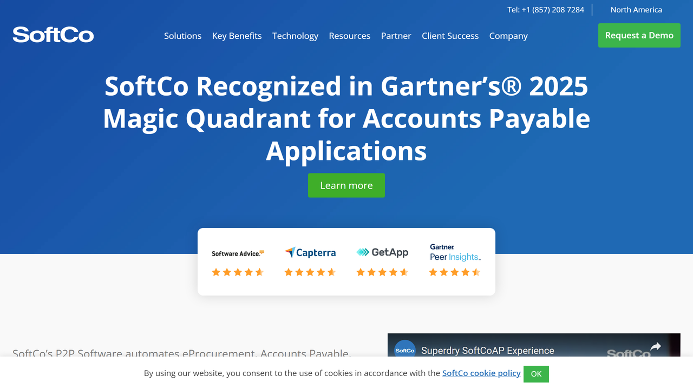

# SoftCo

SoftCo is a global provider of financial automation solutions specializing in procure-to-pay, accounts payable automation, and enterprise document management with intelligent capture capabilities.

## Overview

SoftCo develops and delivers financial process automation solutions with a focus on purchase-to-pay, accounts payable, and document management. The company's SoftCo Platform offers comprehensive capabilities for capturing, processing, approving, and managing financial documents and related workflows.

Founded in 1990, SoftCo has established a strong presence in the financial automation space, serving organizations across multiple industries with a particular focus on enterprise and mid-market companies. Their solutions combine document capture technology with workflow automation to streamline financial operations and improve process efficiency.

SoftCo serves organizations across various sectors including healthcare, financial services, manufacturing, and public sector entities. Their technology helps organizations reduce manual document handling, accelerate financial processes, improve compliance, and gain better visibility into financial operations.

## Key Features

- **Intelligent Document Capture**: Advanced OCR and data extraction capabilities
- **Procure-to-Pay Automation**: End-to-end purchasing and invoice processing
- **Accounts Payable Automation**: Invoice processing and approval workflows
- **Purchase Order Management**: Creation, approval, and matching of purchase orders
- **Document Management**: Secure storage and retrieval of financial documents
- **Workflow Automation**: Configurable approval processes and business rules
- **Supplier Portal**: Self-service capabilities for vendor interactions
- **Mobile Access**: Approvals and process management via mobile devices
- **Analytics and Reporting**: Insights into financial processes and performance
- **Integration Capabilities**: Connections with ERP and financial systems

## Use Cases

### Accounts Payable Automation

Organizations implement SoftCo solutions to transform their accounts payable operations. The platform captures incoming invoices through multiple channels (email, scan, EDI), automatically extracts header and line-item data, and validates this information against purchase orders and receiving documents. The system routes invoices through configurable approval workflows based on amount thresholds, cost centers, and exception conditions, while maintaining a complete audit trail for compliance purposes. Integration with ERP and accounting systems enables straight-through processing for matched invoices while providing real-time visibility into invoice status and payment timing. This approach reduces invoice processing costs by up to 80%, accelerates cycle times from weeks to days, improves supplier relationships through timely payments, and strengthens financial controls through consistent application of approval policies.

### Purchase-to-Pay Transformation

Financial departments utilize SoftCo technology to streamline the entire purchase-to-pay process. The solution manages requisition creation and approval, automates purchase order generation and distribution to suppliers, captures and processes supplier invoices, and facilitates payment execution. Built-in matching capabilities automatically reconcile invoices with purchase orders and receiving documents, identifying discrepancies for review. The supplier portal enables vendors to submit invoices electronically, check payment status, and update their information, reducing manual intervention and inquiry handling. Comprehensive analytics provide insights into spending patterns, supplier performance, and process efficiency. This implementation centralizes purchasing control, captures early payment discounts, improves spend visibility, and strengthens compliance with procurement policies while maintaining comprehensive audit trails for regulatory requirements.

## Technical Specifications

| Feature | Specification |
|---------|---------------|
| Platform | SoftCo Platform |
| Deployment Options | Cloud, On-premises, Hybrid |
| Integration Capabilities | APIs, Pre-built Connectors for Major ERPs |
| Supported Formats | All major document formats (PDF, XML, EDI, etc.) |
| OCR Technology | Advanced OCR with machine learning enhancement |
| Workflow Engine | Configurable, rules-based process automation |
| Mobile Support | iOS and Android applications |
| Security Features | Role-based access, encryption, audit trails |
| Compliance Support | SOX, GDPR, industry-specific regulations |
| Implementation Approach | Professional services and partner network |

## Getting Started

1. **Process Assessment**: Evaluation of current financial workflows and pain points
2. **Solution Design**: Configuration based on organizational requirements
3. **Implementation**: Deployment and integration with existing systems
4. **User Training**: Enablement for administrators and end users
5. **Continuous Improvement**: Ongoing optimization of processes and rules

## Resources

- [Company Website](https://www.softco.com/)
