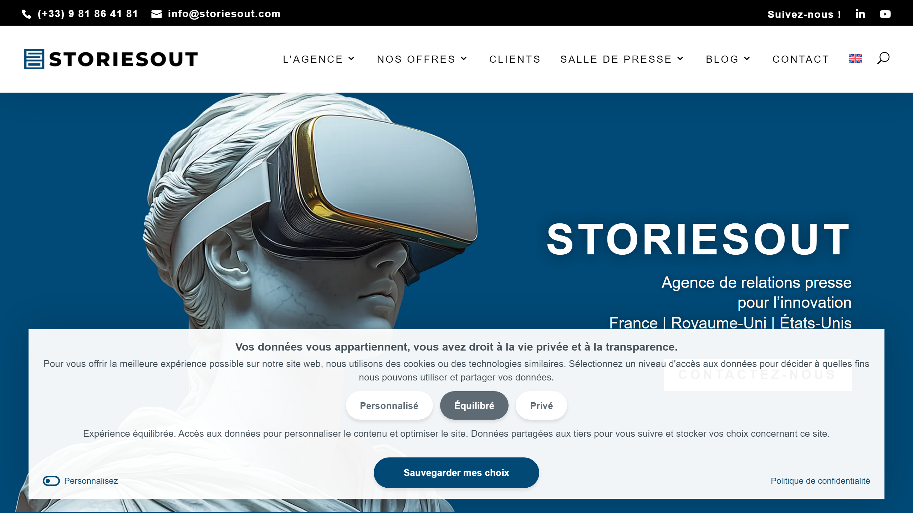

# StoriesOut

StoriesOut is a press relations and communications agency specializing in visibility strategies for innovation sector companies across France, the United Kingdom, United States, and Ireland.

## Overview

StoriesOut is a PR agency founded in 2010, focused on developing visibility and media presence for companies in the innovation sector. The agency operates from Paris and serves clients across multiple countries through its main office and StoriesOutED (English Department). StoriesOut has developed the "3Ps of PR" methodology (Push, Pull, and Place), which helps brands emerge in their markets by capitalizing on news, opinions, and unique positioning. The agency serves sectors including energy, mobility, real estate, finance and investment, B2B technologies, sustainable development, web3, and foodtech.

## Key Features

- **Press Relations Strategy**: Bespoke PR strategies for visibility, awareness, and market positioning
- **3Ps Methodology**: Proprietary Push, Pull, and Place framework for brand emergence
- **Multi-Market Expertise**: Coverage across innovation sectors including fintech, proptech, energy tech, and foodtech
- **International Reach**: Services in France, UK, US, and Ireland through StoriesOutED
- **Media Relations**: Press management and journalist network engagement
- **Marketing Content Creation**: Case studies, white papers, and brochures
- **Communication Strategy**: Community-focused communication strategies
- **Communication Coaching**: Executive communication training

## Use Cases

### Tech Startup Media Visibility

Innovation startups engage StoriesOut to build media presence and brand recognition in competitive markets. The agency develops targeted press strategies, secures media coverage in industry publications, and positions founders as thought leaders through strategic media placements and journalist relationships.

### Corporate Communications for Scale-Ups

Growing technology companies use StoriesOut to manage communications during expansion phases, product launches, and funding rounds. The agency coordinates multi-market press campaigns, creates supporting content materials, and maintains consistent messaging across French, UK, and US markets.

### Innovation Sector Positioning

Established companies entering innovation sectors partner with StoriesOut for repositioning and visibility campaigns. The agency leverages sector expertise and media networks to establish credibility, generate coverage in trade and business media, and differentiate clients within crowded innovation markets.

## Resources

- [Website](https://www.storiesout.com)
- [Press Relations Services](https://storiesout.com/en/press-relations-agency/)

## Company Information

Headquarters: Paris, France

Founded: 2010

Founder: Anne de Forsan

Services: Press relations, media strategy, marketing content, communication coaching

Geographic Presence: France, United Kingdom, United States, Ireland

Notable Clients: Cosmo Tech, Morning, Moten Technology, Mangopay, Lyf
