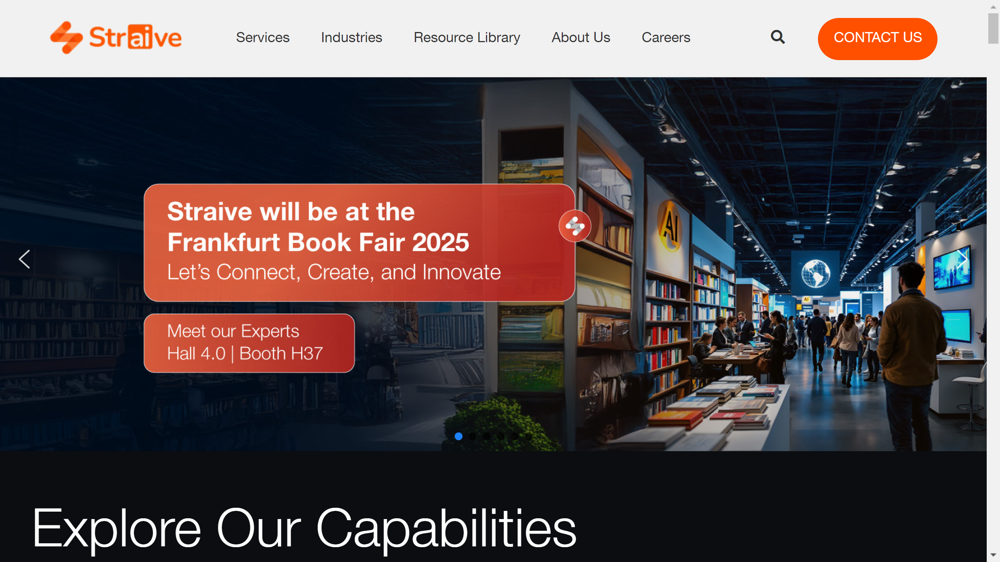

# Straive

Straive is a content technology provider offering intelligent document processing through its cloud-native Straive Data Platform for unstructured data management and AI-powered extraction.

## Overview

Straive provides [document processing](../../capabilities/document-understanding/index.md) through its proprietary Straive Data Platform with microservices-based cloud-native architecture. Formerly SPi Global, the company processes unstructured data from PDFs, emails, Word files, annual reports, sustainability reports, scanned PDFs, images, and diagrams using AI and machine learning. The platform offers customizable data extraction, enrichment, transformation, and delivery modules. Straive operates Straive Innovation Labs for R&D and co-creation with customers. Founded in 1980 in the Philippines as Saztec Philippines Inc., the company rebranded from SPi Global to Straive in April 2021 and was acquired by EQT for $1B in August 2021.

## Key Features

- **Straive Data Platform**: End-to-end microservices-based platform for unstructured data management
- **AI-Powered Extraction**: Automated [extraction](../../capabilities/extraction/index.md), interpretation, and [classification](../../capabilities/classification/index.md) of digitized documents
- **Multi-Format Support**: Processes PDFs, emails, Word files, scanned documents, images, diagrams
- **Domain Expertise**: Specialized teams in BFSI, capital markets, life sciences, chemistry, biomedical, sustainability, legal
- **Customizable Modules**: Configurable extraction, enrichment, transformation, and delivery workflows
- **Straive Innovation Labs**: Dedicated R&D unit for next-generation IDP solutions
- **Data Quality**: AI and ML capabilities for differentiated accuracy and automation levels

## Use Cases

### Financial Services Document Processing

BFSI organizations use Straive for processing annual reports, regulatory filings, and financial statements. The platform extracts structured data from complex financial documents, validates information against domain rules using specialized finance experts, and delivers actionable insights for capital markets analysis.

### Life Sciences Data Extraction

Pharmaceutical and biotech companies process research documents, clinical trial data, and regulatory submissions. Straive's domain experts in chemistry and biomedical fields guide extraction accuracy, transforming unstructured research content into structured datasets for analytics workflows.

### Sustainability Reporting

Organizations automate ESG and sustainability report processing through Straive's platform. The system extracts metrics and disclosures from sustainability reports in various formats, enriches data with industry benchmarks, and delivers standardized outputs for compliance and analysis.

## Technical Specifications

| Feature | Specification |
|---------|---------------|
| Core Platform | Straive Data Platform (SDP) |
| Architecture | Microservices-based, cloud-native with Docker containers |
| Technology Stack | Angular JS, Python, PERL, MongoDB, SQL Server |
| Cloud Deployment | AWS with Docker containers |
| Integration | REST APIs |
| AI Technology | Artificial intelligence, machine learning, cognitive technologies |
| Data Types | Structured, semi-structured, unstructured |
| Document Formats | PDF, email, Word, scanned PDF, images, diagrams, annual reports |
| Processing Modules | Extract, Enrich, Transform, Deliver |
| Processing Capabilities | [Extraction](../../capabilities/extraction/index.md), interpretation, [classification](../../capabilities/classification/index.md), enrichment, transformation |
| Data Connectors | Prebuilt connectors, multiple ingestion paths |
| Output Formats | XML, JSON, CSV, MS Word, RDF, SKOS, OWL |
| Scalability | Automatic scaling with enterprise-grade SLAs |
| Recognition | ISG Product Challenger (IDP, UK 2022), Contender (US 2022) |

## Resources

- [Website](https://www.straive.com)
- [Straive Data Platform Announcement](https://www.straive.com/news/straive-introduces-straive-data-platform-sdp/)
- [ISG Provider Lens Recognition](https://www.straive.com/news/straives-intelligent-document-processing-capabilities-featured-in-ISGs-provider-lens-intelligent-automation/)

## Company Information

Headquarters: Singapore

Founded: 1980 (as Saztec Philippines Inc.)

Former Name: SPi Technologies Inc. (1996), SPi Global (rebranded to Straive April 2021)

Employees: 18,000

Geographic Presence: Philippines, India, USA, China, Nicaragua, Vietnam, UK, Singapore

Acquisition: EQT acquired company for $1B in August 2021

Funding: $353M raised

Previous Ownership: PLDT (until 2017)

Key Acquisitions: LearningMate (2020) 