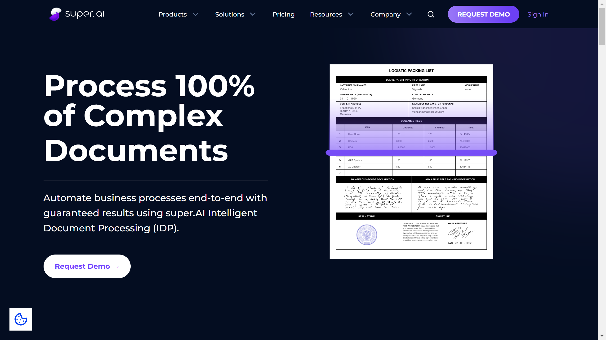

# super.AI

super.AI is an unstructured data processing platform provider offering intelligent document processing with multi-format redaction, human-in-the-loop workflows, and integration of multiple AI models including GPT-4 for processing documents, images, audio, video, and text.

## Overview

super.AI provides the Unstructured Data Processing (UDP) Platform combining [intelligent document processing](../../capabilities/document-understanding/index.md), human-in-the-loop validation, and multi-format redaction capabilities. The San Francisco-based platform processes structured, semi-structured, and unstructured documents including handwritten notes, signatures, logos, and stamped approvals. The UDP Platform integrates multiple AI models including GPT-4 and breaks extraction into manageable tasks routed to software, AI, and human experts. Founded in 2018 as Canotic, super.AI raised $30.13M in Series B funding from Mosaic Ventures, Pioneer Square Labs Ventures, HV Capital, NFX, and East Ventures.

## Key Features

- **UDP Platform**: Unified platform for IDP, HITL, redaction, and processing of documents, images, audio, video, text
- **Multi-Model AI Integration**: Combines GPT-4 and other AI models in single infrastructure
- **Human-in-the-Loop**: Workflows incorporating third-party and in-house experts for data validation and labeling
- **Multi-Format Redaction**: Document, image, audio, and video redaction for regulatory compliance
- **Quality Assurance**: 150+ quality control mechanisms with SLA guarantees
- **Document Understanding**: Processes handwritten notes, signatures, logos, stamped approvals
- **Task Routing**: Breaks extraction into tasks routed to software, AI, and human trainers
- **Any Document Type**: Handles structured, semi-structured, unstructured documents

## Use Cases

### Shared Services Document Processing

Shared services organizations deploy super.AI for processing high volumes of diverse document types. The platform routes documents through AI models for initial extraction, sends uncertain cases to human-in-the-loop workflows, and applies 150+ quality controls to guarantee SLA compliance for client deliverables.

### Regulatory Compliance and Redaction

Financial institutions and government agencies use super.AI for multi-format redaction workflows. The system identifies and redacts sensitive information from documents, images, audio recordings, and videos while maintaining audit trails and ensuring regulatory compliance through automated quality checks.

### Complex Document Extraction

Organizations process complex unstructured documents with handwriting, signatures, and stamps. The UDP Platform combines multiple AI models for initial [extraction](../../capabilities/extraction/index.md), routes uncertain fields to domain experts through HITL interfaces, and validates outputs against business rules before delivery.

## Technical Specifications

| Feature | Specification |
|---------|---------------|
| Core Platform | Unstructured Data Processing (UDP) Platform |
| Processing Capabilities | IDP, HITL, multi-format redaction |
| Data Types | Documents, images, audio, video, text |
| Document Support | Structured, semi-structured, unstructured, handwritten |
| Recognition | Handwriting, signatures, logos, stamped approvals |
| AI Models | GPT-4 integration, multiple AI model support |
| Task Architecture | Breaks extraction into manageable routed tasks |
| Quality Controls | 150+ mechanisms with SLA guarantees |
| Human Integration | Third-party and in-house expert workflows |
| Redaction | Document, image, audio, video |
| Infrastructure | Multi-model AI combination platform |

## Resources

- [Website](https://super.ai)
- [Unstructured Data Processing](https://super.ai/unstructured-data-processing)
- [Intelligent Document Processing](https://super.ai/intelligent-document-processing)
- [Platform Overview](https://super.ai/how-it-works)

## Company Information

Headquarters: San Francisco, California, United States (2193 Fillmore Street)

Founded: 2018

Former Name: Canotic

Employees: 40

Funding: $30.13M Series B (Mosaic Ventures, Pioneer Square Labs Ventures, HV Capital, NFX, East Ventures) 